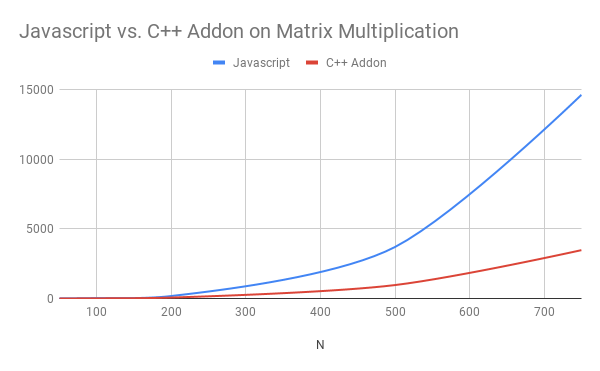
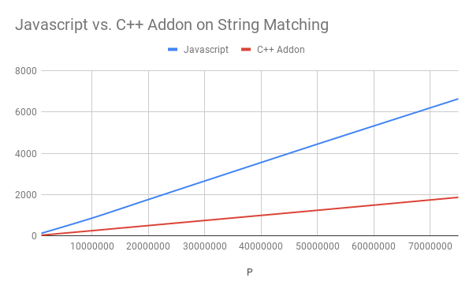
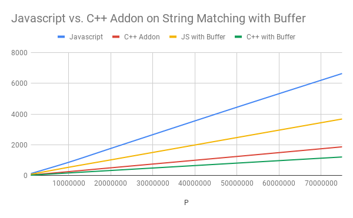
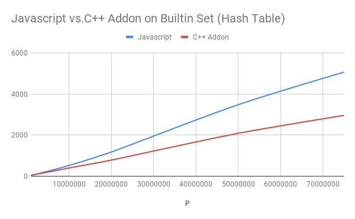

Do you know that you could code C++ and use it in your Node Application? What are the benefits? Does it make you application faster? Is it worth it to do? **No, it isn't.** Don't get me wrong, let me explain 😄.

## C++ Addons
> Node.js Addons are dynamically-linked shared objects, written in C++, that can be loaded into Node.js using the require() function, and used just as if they were an ordinary Node.js module.

So basically, you could code C++ with Node addons framework (I prefer [nan](https://github.com/nodejs/nan) for compability reasons) like the following

```cpp
#include <nan.h>

void Method(const Nan::FunctionCallbackInfo<v8::Value>& info) {
  info.GetReturnValue().Set(Nan::New("world").ToLocalChecked());
}

void Init(v8::Local<v8::Object> exports) {
  exports->Set(Nan::New("hello").ToLocalChecked(),
               Nan::New<v8::FunctionTemplate>(Method)->GetFunction());
}

NODE_MODULE(hello, Init)
```

And use it in your Node application

```js
var addon = require('bindings')('hello');

console.log(addon.hello()); // 'world'
```

So why bother leaving the beautiful, interpreted, high-level world of Javascript and go into the dark, compiled, and low-level world of C++? I thought it must be for performance. Come on, who doesn't know that C++ is one of the fastest language around? So I decided to give it a shot in hope that I would make super-fast code and can publish it in NPM like our fellow cool JS boys do every seconds. So what is the result? Let's jump right into the benchmark. Anyway, all codes are available [in my Github](https://github.com/fairuzi10/node-addons-benchmark) and the data is in [Google Spreadsheets](https://docs.google.com/spreadsheets/d/15oy6BME_C3uDi9Y_-8E_NRg-Sm36LTynSsseFsULGP0/edit?usp=sharing).

## Matrix Exponentiation
For the first experiment, instead of the boring prime-generator-or-so problem, let's just try matrix exponentiation. For the sake of simplicity, let's use naive matrix multiplication in $O(N^3)$ but with [modular exponentiation](https://en.wikipedia.org/wiki/Modular_exponentiation) result in $O(N^3logP)$ algorithm. Before we go to the exponentation, let's do some benchmarking for just multiplication.



As we could see, C++ addon beats plain Javascript implementation by around 380%. Now it's time for exponentiation, let's put $N = 100$ to make things simple (who likes multi-variable function?).


We got a nice logarithmic graph here. It's 430% improvement, better than the previous one. Remember that you could go to [the spreadsheet](https://docs.google.com/spreadsheets/d/15oy6BME_C3uDi9Y_-8E_NRg-Sm36LTynSsseFsULGP0/edit?usp=sharing#gid=109010642) to go through the details.

## String Matching
Let's see another problem we could code using C++ Addons. To make things more interesting, let's play with something we haven't tried before, string. Given two string, count the number of occurrence of the second string in the first one. One could solve this problem in $O(NM)$ but there are faster algorithms too, one of which is $O(N + M)$ rolling hash algorithm. Let's use this one.

To test it, I decided to put $M = \frac{N}{10}$ and because the complexity is $O(N + M)$, it should not affecting the improvement percentage too much for whatever value I put into M. This is what I got.



We got 350% improvement here. Not differed too much compared to our previous benchmark. But if you look closely to [the code](https://github.com/fairuzi10/node-addons-benchmark/blob/master/matching/matching.js#L50), you should notice that my Javascript implementation is not exactly the same as my C++ addon implementation. It turns out that Javascript is quite slow at building string, so I need to made a few modifications to speed up the process. Don't worry, I only count the time needed to run `countOccurrence` so it wouldn't affect the result.

Facing that string problem, I think it's a good idea to try buffer which is well-known for its speed. Not only for C++ addon, I try it for the pure Javascript too. Here is the result.



Comparing C++ addon + buffer with Javascript + buffer, we got 300% improvement which is less than the previous one which might confirm my suspicion about slow Javascript's string performance. If we compare C++ addon + buffer with Javascript without buffer, we got 550% improvement in total.

## Set
OK, we already have 2 classic problems, but what about builtin data structure? Let's give `Set` a try. In Javascript, `Set` actually [implements hash table](https://codereview.chromium.org/220293002/#ps1) so we'll compare it with [C++ unordered_set](https://github.com/fairuzi10/node-addons-benchmark/blob/master/set/schema.cc#L13).



We got 160% improvement here, the smallest of all our benchmark. If you look carefully in [the spreadsheet](https://docs.google.com/spreadsheets/d/15oy6BME_C3uDi9Y_-8E_NRg-Sm36LTynSsseFsULGP0/edit?usp=sharing#gid=238918653) you might notice that in $N = 1.000.000$, Javascript's Set performance even become the winner, the only case we see pure Javascript win over C++ addon in quite high N. So if you want to use some data structures, you're good to go with native ES6 data structures.

## Summary
From all the benchmark we have, we could expect C++ addons improve our Node JS app performance around 300% up to 500%. Is it good enough? I don't think so. With only for a few performance improvements, you need to code in C++, connect it to your Node app, and don't forget to maintain it. With all these burden, you are better off investing your time optimizing the algorithm you use if performance really matters to you. During this experiment, I also came accross [a reference](https://nodeaddons.com/streaming-data-from-c-to-node-js/#example---sensor-data) that supports my opinion.

> Believe it or not, performance isn’t the most common reason we create C++ addons for Node.js.
> Perhaps the most common reason addons are used is their ability to leverage existing C++ code.
> This can be especially critical when interacting with devices - specifically devices that only provide C/C++ API’s.

<hr class="section-divider" />

Before I try the addons, I hope for at least $10\times$ improvement because JS is an interpreted, dynamic-typed language which I thought must be slow. Yes, I look at you, Python. It turns out that Node JS is already fast and even comparable to C++ so we don't have to struggle code in the hard way just to make sure our code run fast. After all, this experiment was a fun. It's interesting to see how fast Node JS is thanks to the great work V8 engine has done. 😄
