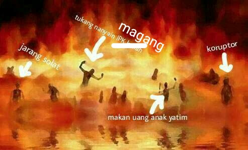
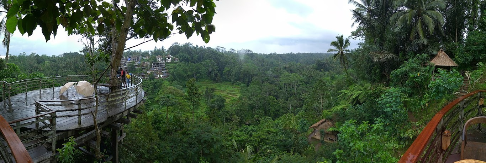
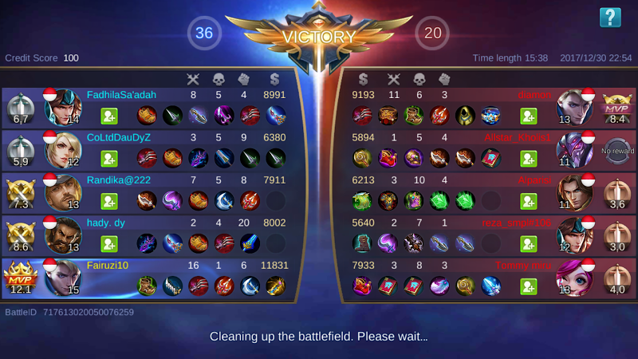
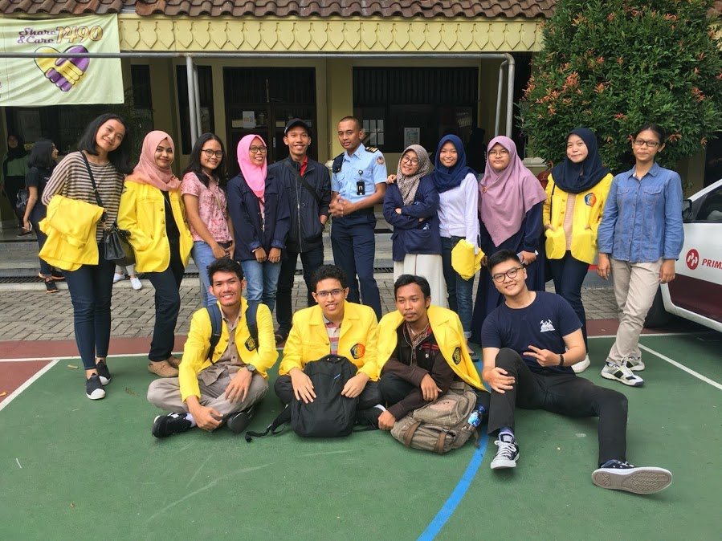
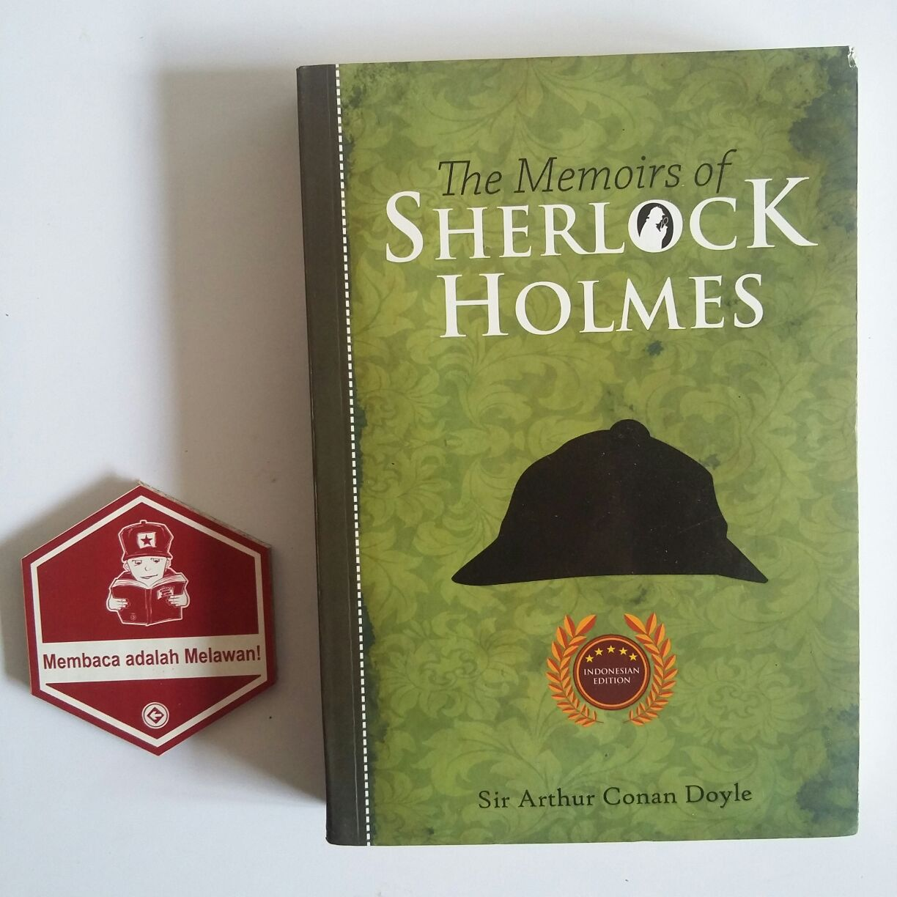
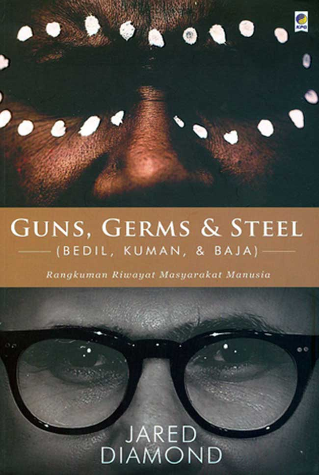

<blockquote class="blockquote">
  Setiap ada pertemuan, pasti ada perpisahan.
  <footer class="blockquote-footer text-right">Anonymous</footer>
</blockquote>

Setelah sebulan berlalu, kini telah sampailah saya pada penghujung liburan yang menyenangkan ini 😭. Mungkin ada dari kalian yang bertanya seperti apa saya menghabiskan liburan seperti teman kita di bawah ini.

Saya menghabiskan liburan dengan gabut karena saya merasa kuliah cukup melelahkan terutama jika ada kegiatan sampai malam padahal masuk dari pagi, bahkan karena kombinasi kegiatan CP dan PMB, pernah dalam beberapa minggu tidak ada 'weekend' 😩. Jadi mari kita lihat bagaimana saya membuang-buang waktu yang berharga di liburan kali ini 😆.

### Membuat Website Ini
Jelas lah ya, ini hasil kegabutan selama liburan. Seperti pada pos Halo Dunia, sebenarnya ada satu lagi proyek yang harusnya diselesaikan namun sepertinya tidak bisa terselesaikan pada liburan kali ini. Baru jadi sistem log in with Facebook dan membuat itu saja butuh 2 hari 😩.

### Pergi ke Bali
Akhirnya saya bisa pergi ke Bali 😆. Saya mengunjungi tempat-tempat wisata indah yang ada di Bali. Waktu saya ke Garuda Wisnu Kencana, saya menemukan tulisan berbahasa Jepang. Saya pikir orang-orang Bali banyak yang wibu seperti Cahya-kun. Namun waktu melihat tari kecak, saya memperhatikan banyak orang Jepang yang berkunjung ke Bali. Saya mau tanya rating Atcodernya tapi takut keder kalo ternyata merah 😢.

Pergi ke tempat luwak.

### Main Mobile Legends
Ketika gabut, saya melihat adik saya bermain mobile legends. Awalnya saya gatau itu anak main apaan, walaupun saya pernah denger mobile legends karena sedang populer zaman now. Setelah itu saya coba bermain dan ternyata seru 😆. Saya yang sudah lama tidak bermain game akhirnya cukup sering bermain ML. Walaupun tidak kecanduan, kalau dipikir-pikir saya lebih memilih ML karena lebih simpel daripada PB ataupun AO yang bakal di re-open bulan Maret ini.

### Bantu-bantu TOKI
Pada awal liburan saya membuat (yang sebenarnya reformat ke bentuk buku) bab pengurutan dan pencarian pada buku TOKI yang saat ini masih dalam tahap review. Lalu Kak William Gozali menawarkan saya untuk masuk Tim Konten TOKI. Tim ini semacam SC namun pada tingkat OSN ke bawah, yang mana pelatnas dan IOI diurus SC. Proyek pertama tim ini adalah website [Olimpiade Komputer](http://olimpiade-komputer.ia-toki.org) yang bertujuan untuk mengumpulkan sumber-sumber belajar untuk OSK/OSP dan OSN. Silakan dilihat jika penasaran 😜. Saya juga "menghidupkan kembali" kujawab dengan menginput soal OSK dan OSP 2017 yang saya baru tahu belum ada sampai saat itu di kujawab.

### Ikut CGTS
Seperti yang saya ceritakan sebelumnya, saya ikut acara Campus Goes to School sebagai alumni, bukan panitia. Tujuannya sebenarnya hanya ingin ~~pamer~~ bertemu teman SMA dan terkesan gabut 😆.

### Membaca Buku
Saya merasa terlalu lama berada di depan komputer. Akhirnya saya membuat target untuk tidak membuka alat elektronik seperti komputer dan HP di atas jam 9 malam. Setelah melaksanakan hal tersebut, saya sadar bahwa saya kurang kerjaan 😆. Akhirnya saya memutuskan untuk membeli buku untuk mengisi waktu luang tersebut. Saya pergi bersama Agilku ke Gramedia Matraman. Buku incaran saya sebenarnya Guns, Germs & Steel dan A Brief History of Time namun karena A Brief History of Time sedang kosong, maka saya membeli Guns, Germs & Steel dan The Memoirs of Sherlock Holmes. Ini pertama kalinya saya membeli buku Sherlock Holmes dan terkesan mencoba-coba.

Buku ini adalah buku terseru yang pernah saya baca 😆. Ketika membacanya, saya seperti dibawa ke dunia lain. Benar-benar bet yang menguntungkan. Saya pasti akan membeli edisi yang lainnya 😆. Buku ini selesai saya baca dalam dua hari.

Buku ini saya mulai baca setelah menyelesaikan Sherlock Holmes. Ketika membacanya, jujur saya tidak seantusias ketika membaca Sherlock Holmes. Tapi buku ini bagus untuk dibaca. Isinya merupakan penjelasan mengapa sebagian orang lebih unggul dari orang lain, yang dipicu oleh pertanyaan seorang Papua mengapa orang Eropa lebih menghasilkan penemuan dibanding orang Papua. Buku ini sendiri memberikan insight-insight baru yang tidak pernah terpikirkan oleh saya sebelumnya seperti betapa dahsyatnya sebuah pandemi menghabiskan kelompok masyarakat (bahkan ada suku yang benar-benar habis tewas karenanya!) dan mengapa bentuk Asia yang merentang dari barat ke timur lebih baik daripada bentuk Amerika yang merentang dari utara ke selatan (saya bahkan heran ketika membaca judulnya). Buku ini terdiri dari 19 bab dan saya sendiri masih sampai di bab 12.

Sebenarnya, ada satu kegiatan lagi sebagai penutup pada liburan kali ini, yaitu TOKI Camp yang mana saya akan berangkat siang ini 😆. Mungkin pos TOKI Camp akan saya buat secara terpisah. See ya!
