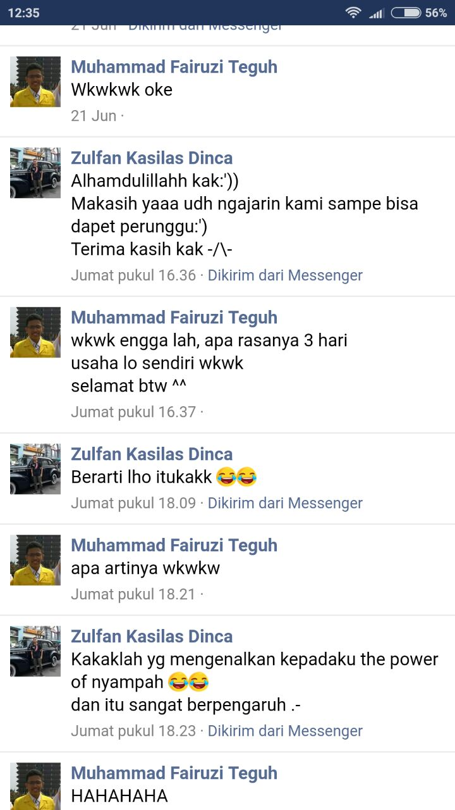

Beberapa hari lalu*, diadakan Try Out PJJ OSN Komputer yang terdiri dari 4 soal. Sayangnya, selain tidak semua peserta mengikuti try out tersebut, ada juga peserta yang mendapat nilai 0 pada suatu soal. Hal ini membuat saya berpikir ke belakang, bagaimana bisa seseorang benar-benar tidak mendapat nilai pada suatu soal. Setelah dipikir-pikir, tentu banyak siswa yang hanya belajar OSN dari TLX atau pelatihan. TLX sebenarnya merupakan sumber yang baik namun jika hanya belajar pada kelas pemrograman dan tidak mencoba mengerjakan soal-soal OSN terdahulu, tentu seseorang tidak akan terbiasa dengan sistem subtask. Selain itu, belakangan ini para pelatih OSN komputer banyak yang menggunakan VJudge yang biasanya tidak menggunakan subtask.

Masih kurangnya kebiasaan untuk nyampah memancing saya membuat pos tentang nyampah, yang mungkin sering dianggap sepele, namun dapat berdampak besar. Nyampah sendiri adalah istilah yang sering saya gunakan yang berarti berusaha mendapatkan poin, walaupun sedikit, pada suatu soal. Mungkin karena tidak sekeren mendapatkan AC, banyak peserta yang tidak memikirkan strategi ini. Jika kamu masih merasa tidak terbiasa nyampah, post ini adalah post yang tepat untukmu!

\* saya baru selesai membuat pos ini berminggu-minggu setelah mulai menulis pos ini karena ~~malas~~ adanya kesibukan magang.

## Motivasi
##### **1. Nyampah itu "wajib" untuk menjadi medalis**
Saya pertama kali "didoktrin" nyampah oleh Indra. Sebagai veteran OSN 2015, dia menceritakan pengalamannya pada hari 1 yang buruk sehingga tidak masuk zona medali. Pada hari 2, Dia memasuki mode "nothing to lose" dan akhirnya fokus untuk nyampah dan karena itu, Dia berhasil membawa pulang medali perunggu. Ceritanya mungkin sepele namun Dia selalu menceritakannya baik saat pelatda maupun di Palembang (saat OSN) sehingga ceritanya meresap ke kalbu saya😆. Jika nyampah pada satu hari dapat membuatmu mendapat perunggu, bagaimana jika dua hari? Ada pandangan unik yang cukup umum dalam OSN Komputer yaitu "Lo nyampah aja di komputer bisa dapet perak". Mungkin ini menjawab pentingnya nyampah dalam OSN.

##### **2. Nyampah dapat membuatmu di atas orang yang sebenarnya lebih jago**
Saya juga pernah mengajar pada suatu pelatda. Sayangnya, ada salah satu peserta yang belum bisa ngoding. Seingat saya, hanya tersisa dua minggu sebelum OSN dilaksanakan dan saat itu Dia bahkan belum mengerti for loop. Walau begitu, sepertinya Dia hebat dalam matematika sehingga tidak heran dapat lolos OSP. Hebatnya, Dia mendapat peringkat 40-an ketika scoreboard di-freeze, mengalahkan peserta yang bisa ngoding! Ternyata, Dia berhasil mendapat beberapa poin pada **semua soal**. Saya rasa, Dia berhasil menjawab semua open subtask dengan "menguli" di kertas. Semangatnya dalam memaksimalkan apa yang Dia bisa mengajarkan kita satu hal. **Jangan pernah meninggalkan soal tanpa mendapat poin**. Oh iya, soal open subtask memang dirancang sedemikian hingga dapat dijawab dengan menghitung manual di kertas dan setahu saya selalu ada open subtask dalam setiap soal. Sayangnya, tetap saja banyak peserta yang sama sekali tidak mendapat poin di suatu soal.

##### **3. Nyampah menjadi "penglaris"**
Selain keuntungan dari perhitungan poin secara matematis, ada keuntungan lain yang didapat dari nyampah. Menurutmu, apa alasan beberapa peserta sama sekali tidak mendapat poin pada suatu soal? Bayangkan kamu sedang menjalani OSN, duduk di depan komputer. Kamu mencoba menjawab soal-soal yang ada, namun entah mengapa terasa sangat sulit. Waktu pun berjalan detik demi detik, menit demi menit, hingga tak terasa OSN telah berlangsung selama 3 jam. Kamu yang belum mendapat poin secara sadar maupun tidak mulai kehilangan kepercayaan diri, hingga akhirnya kontes berakhir dengan penyesalan. Jika takdir dapat diubah, bayangkan jika pada 3 jam pertama kamu sudah mendapat cukup banyak poin. Berdasarkan pengalaman, nyampah (apalagi AC 😉) dapat membangkitkan semangatmu sehingga menjadi katalis yang mendatangkan banyak poin selanjutnya. Berdasarkan pengalaman saya, tidak mendapat poin pada 3 jam pertama (atau bahkan 2) merupakan hal fatal yang berpotensi menghancurkan performamu hingga akhir, termasuk selesai dengan poin 0 yang jika kamu bayangkan sekarang mungkin agak aneh mengingat 5 jam waktu yang cukup banyak. Hal ini cukup menarik dan disebut Kak Wilgoz sebagai "moral" yang dapat dibaca [di sini](http://kupaskode.blogspot.com/2018/06/strategi-kontes-icpc.html).

##### **4. Solusi nyampah bisa jauh lebih mudah dibanding AC walaupun poin berbeda sedikit**
Mari ambil contoh soal [Belanja di Malioboro](https://training.ia-toki.org/problemsets/3/problems/7/). Hanya dengan melakukan simulasi posisi bebek, kita bisa mendapat poin 72 yang tentu tidak sedikit. Bandingkan dengan solusi AC yang membutuhkan observasi khusus dan dapat memakan waktu tidak sedikit hanya untuk mendapat 28 poin sisanya. Selain itu, solusi AC juga belum tentu didapatkan sehingga mungkin lebih baik digunakan untuk menyampah soal lain. Walaupun soal tersebut memiliki solusi brute force dan AC yang berbeda, namun mungkin masih tidak begitu terasa bedanya. Bandingkan dengan soal [Menyiram Sawah](https://training.ia-toki.org/problemsets/2/problems/5/). Tidak sedikit orang yang heran bahwa solusi AC-nya adalah prefix sum, padahal solusi sampahnya (dan lebih intuitif) adalah graf traversal. Katakan kamu cukup pintar untuk mendapat solusi $N = 1$, kamu sudah mengantongi poin 55. Sisanya, mungkin akan sangat sulit didapatkan karena butuh observasi yang dalam dan implementasi yang tidak mudah (dibanding sampahnya). Bayangkan jika kamu mengincar AC dan pada akhirnya tidak mendapat apa-apa pada soal ini!

##### **5. Tidak ada nyampah di ACM ICPC**
Jika kamu lanjut kuliah dan tertarik mengikuti lomba competitive programming, lomba "wajib" yang harus diikuti adalah ACM ICPC. Sistem ICPC ini tidak menggunakan subtask, hanya AC atau tidak sehingga praktis tidak ada nyampah. Kamu akan kangen nyampah pada masa ini 😭.


## Teknik Nyampah
Oke nyampah penting, lalu struktur data atau algoritma apa yang dapat digunakan untuk nyampah? Biasanya, saat mengajar saya akan memberikan soal dengan teknik rekursif serta random yang dapat digunakan untuk mengais poin pada soal output only. Dengan dua teknik ini diharapkan kamu sudah aman dari mendapat 0 kecuali pada soal interaktif yang biasanya subtask-subtask awal dapat diperoleh dengan mudah hanya dengan memainkan game-nya.

Teknik rekursif memiliki kompleksitas eksponensial seperti $O(2^N)$. Karena itu, teknik ini dapat digunakan untuk nyampah subtask dengan $N \leq 20$. Untuk berlatih teknik rekursif kamu dapat mencoba mengerjakan soal [Grup Piala Dunia](https://training.ia-toki.org/training/curriculums/1/courses/11/chapters/52/problems/230/) serta [Preparing Olympiad](http://codeforces.com/problemset/problem/550/B). Sebagai "hint", kamu dapat melihat potongan kode Grup Piala Dunia berikut.

```cpp
// memproses x melawan y
void f(int x, int y) {
    // semua pasang sudah ditandingkan (base case)
    if (x > N) {
        // cek apakah konfigurasi poinnya cocok
    } else {
        // x menang melawan y, poin adalah array global
        poin[x] += 3;
        poin[y] += 0;
        // lanjut dengan x melawan y+1
        f(x, y+1);
        // kembalikan array poin seperti semula
        poin[x] -= 3;
        poin[y] -= 0;
    }
}
```
Tentu ada kasus-kasus yang belum ditangani kode tersebut yang diserahkan kepada kamu sebagai latihan 😉. Saya memberi potongan kode tersebut karena berdasarkan pengalaman, berpikir rekursif seperti itu cukup sulit awalnya. Maksud dari berpikir rekursif adalah memanfaatkan sifat rekursif yaitu: dijalankan -> memanggil fungsi lain -> kembali lagi. Oh ya, jika sifat ini sudah cukup intuitif bagimu, kamu mungkin tertarik mencoba mengerjakan [OSN 2016 1A. Pasar 16 Ilir](https://training.ia-toki.org/problemsets/53/problems/254/).

Teknik selanjutnya adalah random yang dapat digunakan untuk soal output only. Ada dua jenis random yang dapat digunakan, yaitu random nilai dan random urutan. Untuk random nilai dapat menggunakan fungsi rand() sedangkan random urutan menggunakan fungsi random\_shuffle().

```cpp
// contoh random nilai
srand(time(NULL)); // agar hasil random berbeda setiap di-run
int x = rand(); // merandom nilai 0--batas int
int y = rand() % 10; // merandom nilai 0--9
int z = 1LL * rand() * rand(); // merandom nilai 0--batas long long

// contoh random urutan, tetap butuh srand(time(NULL))
while (true) {
    random_shuffle(arr, arr+N);
    // cek apakah urutan optimal atau tidak
}
```

Setahu saya, semua soal output only bisa dijawab dengan random (walaupun tidak sampai AC tentunya 😜) sehingga cukup kerjakan soal-soal OSN terdahulu yang bertipe output only untuk latihan. Penggunaan rand() sepertinya sudah cukup jelas, berbeda dengan random\_shuffle. Mengapa perlu random\_shuffle? Sebagai contoh, mari ambil soal [Matriks Biner](https://training.ia-toki.org/problemsets/52/problems/253/). Idenya sederhana, cukup isi setengah matriks dengan 0 lalu sisanya dengan 1, lalu cari konfigurasi seperti yang diminta. Ada dua pilihan untuk mencari konfigurasi, yaitu dengan next\_permutation dan random\_shuffle. Biasanya, akan terbesit pemikiran bahwa random\_shuffle dapat memberikan kita konfigurasi yang sama berkali-kali sehingga lebih baik menggunakan next\_permutation yang memberikan kepastian konfigurasi yang berbeda. Namun bayangkan jika untuk subsoal 5 yang N dan M-nya masing-masing 10, ada (10\*10)! = 100! yang harus dicek menggunakan next\_permutation! Jika 1 detik = $10^8$ operasi, coba hitung berapa waktu yang diperlukan untuk mencari semua konfigurasi 😉. Dengan random\_shuffle, konfigurasi yang diberikan satu sama lain akan jauh berbeda, tidak seperti next\_permutation, sehingga peluang mendapatkan konfigurasi yang benar akan lebih besar.

Lalu apa hanya teknik tersebut yang dapat digunakan untuk nyampah? Tentu tidak. Bahkan, teknik tersebut seharusnya digunakan sebagai senjata terakhir, karena pasti hanya menghasilkan poin rendah. Biasanya, hanya menggunakan teknik sederhana seperti for loop saja dapat memberimu poin yang cukup besar, bahkan hingga 50+. Jika ada cara yang lebih baik, mengapa saya tidak menuliskan caranya? Karena caranya berbeda-beda tergantung soal (bahkan membutuhkan observasi) berbeda dengan cara ini yang dapat digunakan di banyak soal. **Coba pikirkan dahulu solusi brute force yang lebih baik sebelum menggunakan cara ini**.

## Tantangan
Memiliki mental nyampah tentu juga tidak selalu mudah. Dapat melihat mana soal yang kamu dapat AC atau hanya dapat sampah merupakan sebuah skill yang harus kamu latih. Terlebih lagi scoreboard yang tidak dapat kamu lihat sebelum kontes selesai membuat soal-soal yang mudah menjadi samar. Hal ini pernah terjadi kepada saya saat mengerjakan [OSN 2016 1C. Pos Wisata Sungai](https://training.ia-toki.org/problemsets/53/problems/256/) yang saya sampah sehingga poinnya tidak maksimal. Padahal, setelah kontes berakhir dan saya tahu bahwa itu soal mudah, saya langsung tahu solusinya 😞. Namun sepertinya, memang tidak ada cara lain untuk mengetahui soal mana yang harus di-AC maupun disampah selain dengan banyak berlatih. Karena itu, silakan berlatih dan kembangkan nalurimu untuk mengetahui soal mana yang mudah dan mana yang susah! 😄

## Update
Berikut ini review dari Zulfan yang berhasil mendapatkan perunggu pada OSN 2018 kemarin. Selamat! 😄


