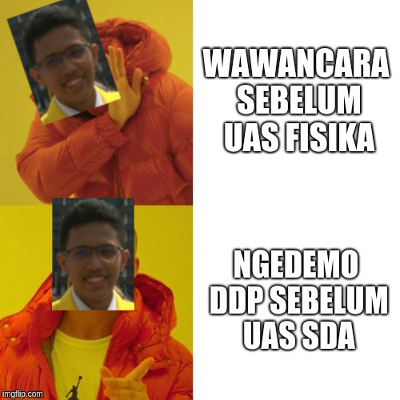
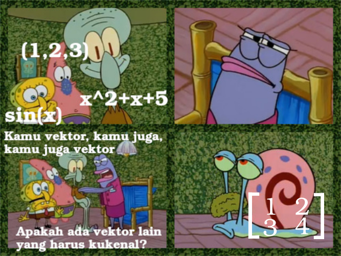
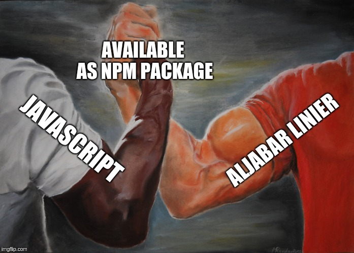
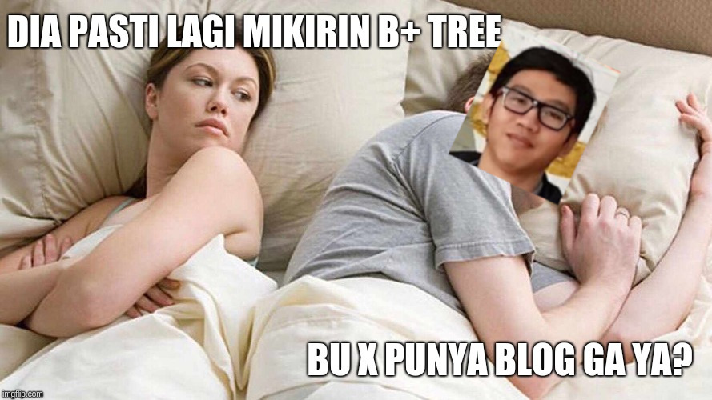
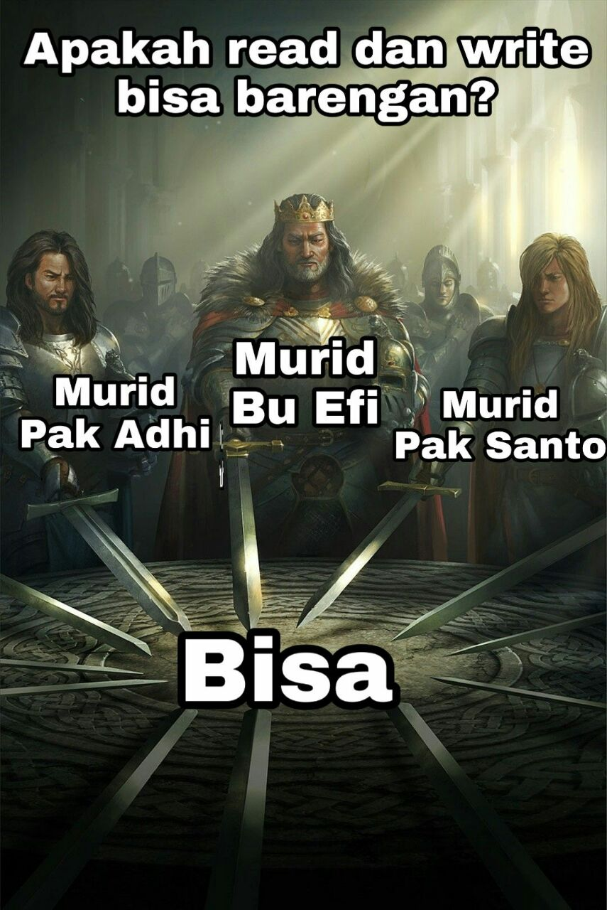
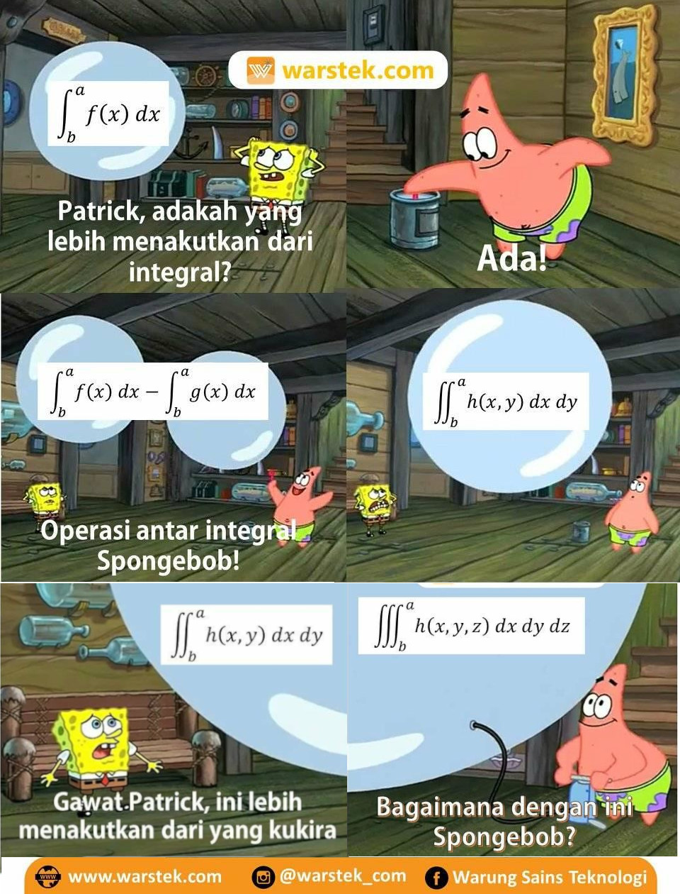
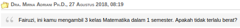
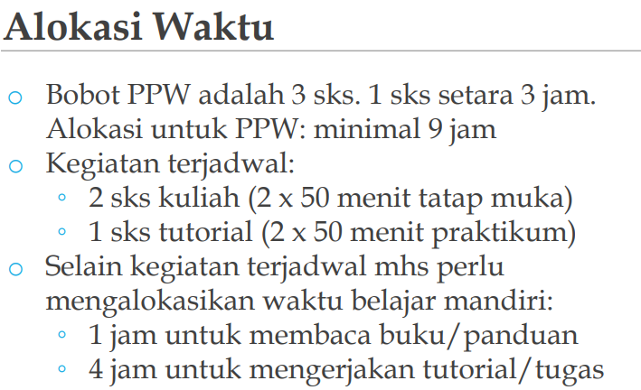
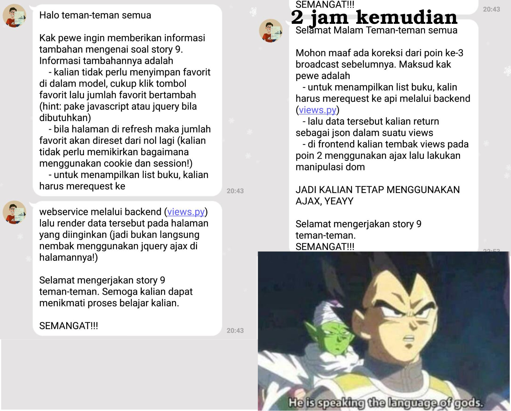
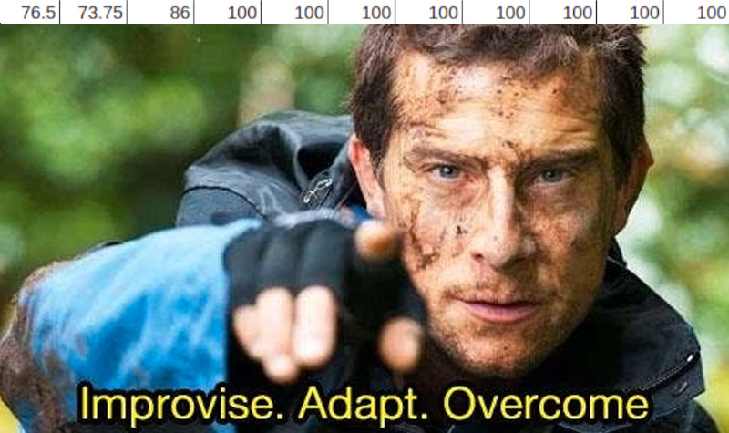

Akhirnya, semester tiga berakhir setelah penantian panjang menunggu dosen memasukkan nilai di SIAK pada detik-detik terakhir 😌. Jika melirik ke belakang, pengalaman semester tiga ini cukup menarik. Mengapa menarik? Karena semester ini sangat berbeda dengan semester sebelumnya, satu dan dua. Apa saja perbedaannya? Mari kita selisik lebih lanjut.

Salah satu hal yang paling berbeda di semester tiga ini tentu mata kuliahnya. Angkatan saya menggunakan kurikulum yang "sedikit" berbeda dengan angkatan di atas saya. Mata kuliah ilmu komputer sendiri ada Fisika Dasar yang merupakan matkul wajib rumpun; Aljabar Linier, Perancangan & Pemrograman Web (PPW) dan Struktur Data & Algoritma (SDA) yang merupakan matkul wajib fakultas; tak lupa Pengantar Organisasi Komputer (POK) dan Matematika Dasar 2 yang merupakan matkul wajib prodi. Untuk prodi Sistem Informasi sendiri matkul wajib prodinya adalah Administrasi Bisnis dan Prinsip-prinsip Sistem Informasi (PPSI). Ya, sudah tidak ada matkul wajib universitas (MPK) lagi yang masih bisa menjadi penyelamat seperti angkatan atas saya 😢. Saya sudah banyak mendengar omongan bahkan sejak masa PMB bahwa semester tiga yang akan angkatan saya jalani akan cukup mematikan. Karena saya adalah mahasiswa ilmu komputer, tentu saya hanya dapat membahas mata kuliah prodi ilmu komputer 😜. Mari kita bahas mata kuliahnya satu per satu.

## Fisika Dasar
Sebenarnya matkul ini mirip fisika di SMA, namun mungkin karena faktor umur (baca: lupa), matkul ini tidak semudah kelihatannya. Kurikulumnya pun berganti cukup sering. Pada kali ini, mekanika mengisi 2 bulan sebelum UTS dan listrik & magnet mengisi 2 bulan selanjutnya. Mekanikanya cukup mudah menurut saya karena benar-benar mengulang SMA. Nilai UTS saya pun cukup baik. Semua berubah ketika Listrik dan Magnet menyerang. Saya nyaris tidak paham apa pun yang diajarkan 😢. Saat itu yang saya bisa ingat dari materi SMA hanya hukum Coulomb dan hukum loop Kirchhoff. Sisanya, hukum Gauss, induksi magnetik, dsb bahkan tidak pernah saya dengar. Entah tidak diajarkan di SMA atau memang saya sudah skip sejak SMA 😅. Pada akhirnya, saya belajar dari buku Halliday yang bisa saya mengerti walaupun cukup lama karena bukunya tebal sekali. Tipikal buku rujukan. Kadang saya berpikir, mungkin kalau usaha saya di Fisika ini diarahkan ke bisnis, mungkin saya sudah menjadi 10 orang terkaya di bawah 20 tahun.

Sialnya, UTS dan UAS Fisika ini berbarengan dengan StatProb, mata kuliah yang saya sodok semester ini. Saat H-1 UAS, bodohnya saya hanya belajar StatProb. Ketika UAS StatProb selesai, saya dengan panik dan buru-buru pergi ke kafe sekre untuk belajar Fisika. Saya yang panik itu akhirnya menjumpai beberapa mahasiswa angkatan saya (yang juga akan UAS Fisika) malah sedang melakukan wawancara kepanitiaan. Luar biasa, untung mereka ga nyodok.

Tapi saya ngedemo DDP beberapa hari kemudian.

Saya sendiri diajar oleh Prof. Wisnu. Beliau pernah berkata bahwa ini adalah pertama kalinya beliau mengajar fisika karena penasaran dengan isu anak Fasilkom buruk fisikanya. Walau baru pertama kali, menurut saya beliau adalah dosen yang cukup enak dalam mengajar. Tentu saya merokemendasikan beliau walaupun beliau pernah berkata kapok mengajar fisi 😆.

## Aljabar Linier
Mata kuliah yang sebenarnya bisa diambil pada semester dua ini baru saya ambil sekarang karena saat semester dua yang lalu, saya mengambil mata kuliah TK TPL. Matkul ini inti isinya adalah sistem persamaan linier dan vektor. Matkul ini dianggap *magic* oleh anak-anak yang sudah nyodok semester lalu, namun bagi saya tidak terlalu *magic* tentu karena saya punya mereka yang sudah tau magicnya 😄. Mengapa magic? Karena ternyata semuanya vektor!\*

\*Saya tahu ini lebay dan salah karena tidak semuanya memenuhi 10 aksioma.

Kalau dibayangkan, mungkin ini sejarah terciptanya matkul ini.  
"Duh gabut nih, ngapain ya"  
\*belajar hal baru\*  
"Wah keren juga ya"  
"Gimana kalo materinya digeneralisir"  
"Apa ya aturan intinya"  
"Oh gini aja"  
"Jadi kalo suatu himpunan memenuhi bla bla bla maka dia disebut X"  
"Lah terus Y apa?"  
"Oh anggota X aja"  
"Hmm menarik juga ya"  
"Jadiin matkul ah"  

Karena matkul yang magic ini, saya dan Indra sering membandingkan dengan hal magic yang lain, ya, Javascript!  
"Kita perlu belajar materi X ini ga sih?"  
\*search X js\*  
"Ga usah, udah ada NPM packagenya"  
Alin 1 - 1 JS.

Baiknya, slide alin cukup bagus buat belajar mandiri. Matkul ini salah satu matkul yang perlu mengerti pembuktian walaupun ga dalem-dalem banget, jadi harus diresapi pas baca slidenya. Harusnya, kalo sering membuktikan sesuatu pakai intuisi bisa survive di matkul ini.

## Struktur Data dan Algoritma
Di matkul yang menyerupai Competitive Programming ini kita diajarkan cukup banyak hal, mulai dari dynamic programming; struktur data seperti queue, stack, heap, binary search tree; hingga Graph Traversal. Bahkan menurut saya, terlalu banyak materinya dan jatuhnya hanya paham sekilas lalu saat ngoding copy-paste kodingan dari slide. Matkul ini pernah memiliki citra buruk semester lalu karena soal-soal yang tidak benar (test case salah, constraint salah, dsb). Pada semester ini, menurut saya cukup baik terima kasih kepada asdos-asdos pengguna tcframe. Hanya ada beberapa (dua atau tiga) lab yang aneh dan hanya satu yang saya tinggalkan tanpa nilai 100 karena sudah malas berurusan sama soal begitu 😪.

Dari materi-materi yang diajarkan, yang saya belum pernah pelajari adalah B+ Tree. Ketika mau UAS, saya, FwP, Tan, dan Cahya panik sendiri mengenai B+ Tree sampai Bu Naya heran. Jadi teringat Pak Fariz yang heran saat panik G 😆. Tentu saja belajar B+ Tree hanya ketika Bu Naya mendekat. Ketika sudah jauh, Cahya langsung mengganti workspace laptopnya dan kami kembali membaca blog-blog dosen.

Hanya bercanda, Cahya ga punya cewe.

## Pengantar Organisasi Komputer (POK)
Matkul lanjutan dari Pengantar Sistem Dijital (PSD) ini kebanyakan membahas kode-kode assembly. Saya merasa matkul ini lebih jelas dibanding PSD yang abstrak, namun entah mengapa nilai POK saya jauh di bawah PSD 😞. Matkulnya cukup mirip dengan PSD, sehingga tidak ada yang jauh berbeda kecuali proyek akhirnya. Proyek akhirnya menggunakan AVR dan saat tugas proyek akhir ini keluar, bahkan kami belum pernah menyentuh AVR 😲. Akhirnya saya bertanya-tanya kepada kating dan menerka-nerka kira-kira apa yang dapat dibuat dengan AVR ini.

Pada saat UAS, terdapat kejadian unik yaitu perbedaan pendapat di antara mahasiswa karena yang diajarkan dosen lain berbeda (atau mungkin otak kami yang tidak sampai, maaf pak, bu). Dari sekian banyak pertanyaan, akhirnya ada juga pertanyaan yang memiliki jawaban yang sama di antara mahasiswa sehingga dijadikan meme.

Sumber: Gagah.

## Matematika Dasar 2
Matkul yang menjadi momok bagi mahasiswa ilmu komputer ini bukan tanpa alasan. Matkulnya abstrak dan materinya cukup banyak, sehingga pada akhirnya saya hanya mengimani kebenarannya tanpa membuktikan/bermain-main dengan teorinya terlebih dahulu. Materi yang dicakup antara lain infinite series, conics and polar coordinates, multivariable functions, dan multiple integrals.

Untuk survive di matkul ini, saya menggunakan buku [Calculus oleh Gilbert Strang](https://ocw.mit.edu/ans7870/resources/Strang/Edited/Calculus/Calculus.pdf). Bukunya sangat bagus, jelas dan **singkat**. Buku yang singkat sangat penting bagi saya karena percayalah, kalian tidak akan punya waktu sebanyak itu untuk belaj 😆.

## Statistika dan Probabilitas
Matkul ini seharusnya diambil pada semester 4, namun saya sodok. Kenapa saya sodok? Karena teman-teman saya begitu hehe.

Diperingatkan pembimbing akademis saya.

Matkul ini mirip sama matdas yang saya imani saja kebenarannya. Bedanya, teori-teori di matkul ini memang sepertinya kesepakatan karena bukti empiris, jadi ya sud 😆. Banyak materinya pun oke, sehingga cukup sering latihan soal dibanding matkul lain. Sayangnya, di kelas saya ini mahasiswanya cukup banyak, 70-an sehingga jika duduk di belakang nyaris tidak dapat apa-apa di kelas itu. Untuk memahami matkul ini, sebenarnya cukup mendengarkan dengan baik di kelas karena cukup jelas. Hanya materi kombinasi-permutasi yang mungkin perlu waktu tambahan belajar karena cukup sulit menjawab pertanyaan-pertanyaannya jika tidak sering berlatih, jadi silakan dipersiapkan mulai dari sekarang 😜. Oh iya, matkul ini seharusnya disebut Probabilitas dan Statistika, bukan sebaliknya. Ga paham? Makanya nyodok 😜.

## Perancangan & Pemrograman Web (PPW)
Nah, inilah matkul yang paling seru untuk dibahas. *Save the best for the last.* Matkul ini adalah matkul yang bisa dibilang full ngoding, ngoding web lebih tepatnya. Tiap minggunya, diberikan tugas berupa story dan challenge. Story dikeluarkan tiap hari Senin dan Challenge dikeluarkan tiap hari Kamis, ketika sesi lab. Untuk mengerjakan Challenge, harus mengerjakan Story sehingga kira-kira ada waktu tiga hari untuk mengerjakan story. Selesai mengerjakan challenge, kita diharuskan mengumpulkan laporan yang disebut *reflection*. Apakah story dapat dikerjakan dalam 1-2 jam seperti tugas-tugas mingguan lainnya? Mari kita lihat asumsinya.

Ya, kami diminta untuk mengalokasikan waktu 5 jam untuk belajar mandiri. Belum tahu anehnya? Story dikeluarkan saat hari Senin (tidak menutup kemungkinan malam) sehingga 5 jam itu dialokasikan saat hari kerja. Mengapa tidak dikeluarkan saja saat Jumat/Sabtu? Entah, hanya Kak Pewe dan Tuhan yang tahu. Jika belum merasa sulit, bayangkan kamu kuliah hingga jam 6, belum lagi ada urusan malamnya (sangat wajar). Bagaimana cara membagi waktunya? Ini belum membahas apakah waktu 5 jam itu cukup untuk mengerjakan story yang diberikan karena tentu pekerjaan-pekerjaan ngoding seperti ini banyak menghasilkan hal tidak terduga. Akhirnya, banyak mahasiswa yang bermalam di Fasilkom saat malam kamis hanya untuk mengerjakan PPW.

Tak hanya itu, permintaan story pun kadang tidak jelas. Hal ini diperparah dengan ketidakkonsistenan jawaban yang diberikan, sebagian besar dari Official Account Line Kak Pewe. Bahkan tidak jarang challenge yang diberikan tidak dimengerti oleh asisten yang bertugas di lab, koordinasi antarpengajar PPW dirasa sangat kurang.

Akhirnya, banyak mahasiswa yang *burn out* bahkan sebelum UTS. Puncaknya, banyak mahasiswa yang memasang foto profil seperti berikut.

Akhirnya, introspeksi terjadi sehingga ada beberapa perubahan. Story yang awalnya dikeluarkan tiap hari Senin akhirnya dikeluarkan tiap hari Jumat. Selain itu, beberapa kali diberikan motivasi dalam bentuk perkataan maupun video-video tentang ketangguhan dalam belajar. Tentu saja ada kritik mengenai foto sehat mental tersebut. Dosen-dosen tentu tidak menyukai kejadian tersebut karena tentu kesehatan mental tentu bukan hal yang main-main apalagi hanya karena suatu mata kuliah.
Bahkan, katanya ada dosen yang hingga tidak dapat tidur karena memikirkannya. Anehnya, foto tersebut juga **digunakan Kak Pewe** sebagai foto profil Official Accountnya, bahkan hingga saat ini. Heran, kan? Inkonsistensi terjadi di mana-mana.

Oh ya, story dan challenge dinilai menggunakan beberapa parameter dengan skala 0-4. Akibatnya, satu saja komponen penilaian kurang akan sangat berasa. Di awal, saya sempat mendapat nilai jelek padahal yang saya kerjakan sudah sesuai dengan permintaan. Berkaca dari pengalaman, saya yakin pasti karena refleksi (dokumen laporan) saya buruk, kurang menjilat 😜. Akhirnya, saya meminta contoh laporan Ardan yang luar biasa bagus untuk saya jadikan contoh. Setelah mengubah di sana-sini, jadilah template saya seperti [berikut ini](https://docs.google.com/document/d/14lEnpYyRbThv2pMDFdQzIEvr-hv4BrIuWKRWcTFa2Qw/edit?usp=sharing). Silakan dimanfaatkan dengan File > Make a copy. Hasilnya tentu sangat memuaskan. Terlalu rajin? Mungkin, namun saya rasa wajar toh saya membuatnya di lab bersamaan mengerjakan challenge sehingga waktu yang saya luangkan untuk membuat refleksi tersebut tidak terlalu banyak, sedangkan teman-teman saya kebanyakan sebelum lab. Lagi pula saya suka membuat laporan seperti ini karena saya suka menulis 😜.

## Pelajaran yang Saya Dapatkan

Dengan beratnya beban di semester tiga ini, saya mendapat beberapa pelajaran yang dapat memuluskan jalan untuk melaluinya. Berikut ini pelajaran yang dapat saya ambil.

### Cari Teman Belajar
Mungkin terdengar klasik, mengapa perlu teman belajar? Tentu karena dengan teman belajar, kita dapat saling melengkapi pada mata kuliah yang dipahami oleh masing-masing, *collaborative learning* kalau kata MPKT 😜. Selain itu, hal yang menurut saya lebih penting adalah untuk saling menjaga agar semangat belajar tetap ada. Jangan salah, demot (kehilangan motivasi) adalah hal yang semakin sering terjadi semakin lama kamu menginjakkan kaki di Fasilkom. Tugas yang tidak terkira banyaknya di saat yang bersamaan saya rasa sudah cukup membuatmu demot. Saya sering melihat teman-teman saya yang akhirnya tidak mengerjakan tugas karena demot ini. Di akhir semester tiga ini, bukan hanya tidak mengerjakan tugas, jumlah mahasiswa yang hadir pun menukik tajam.

Mungkin memiliki teman belajar terdengar hanya untuk orang-orang *ambis*, padahal seharusnya semua mahasiswa punya ini. Saya tahu memiliki nilai yang menjulang setinggi langit bukan hal yang baik untuk dijadikan sebagai satu-satunya tujuan. Namun, bukan berarti demot hingga tidak mengerjakan tugas adalah hal yang dapat dibiarkan. Jika dibiarkan, bukan tidak mungkin kita tidak lulus mata kuliah dan tentunya harus mengambil lagi dan berjibaku kembali dengan tugas-tugas yang seharusnya dapat dihindari. Apa pun tujuan utama kita dalam berkuliah, baik IPK, lomba, berorganisasi, merintis bisnis, dan sebagainya pasti menjadi terganggu jika kita tidak lulus suatu matkul. Sayangnya, *bahkan untuk lulus dengan nilai pas-pasan saja perlu perjuangan*. Menjaga agar tidak terus-terusan demot harus dilakukan setiap mahasiswa.

### Jangan SKS
Sistem kebut semalam (SKS) yang merupakan budaya sejak zaman Roro Jonggrang tentu terdengar menggiurkan. Bagaimana tidak, belajar dengan waktu singkat namun mendapatkan hasil yang sama memuaskan. Namun, saya pernah mengalami kejadian yang membuat saya bersyukur tidak SKS. Saat minggu UTS, materi-materi yang tidak terkira banyaknya ini tentu membuat jenuh. Hari demi hari saya lewati dengan begadang di depan laptop tanpa ada satu pun mata kuliah yang dapat dianggap santai. Di akhir-akhir masa ujian yang kebetulan tersisa matkul MatDas 2 dan SDA, saya benar-benar muak dan rasanya tidak ingin menyentuh laptop lagi. Padahal, saya belum selesai belajar untuk ujian besoknya. Akhirnya, saya memutuskan untuk tidur saja dan berharap ilmu yang sudah saya pelajari tadi dan di kelas setiap harinya cukup untuk membuat ujian saya baik. Hasilnya memuaskan, tentu tidak sempurna namun cukup untuk membuat saya bersyukur karena saya memerhatikan dosen mengajar di kelas dibanding menggila dengan setumpuk materi pada H-1 ujian. Saat UAS, kejadian yang sama terulang dan bahkan lebih parah lagi karena banyak matkul yang materinya berlipat ganda dibanding saat UTS. Sambil menggerutu "Ini kok slidenya ga habis-habis?", saya mematikan lampu dan tidur. Intinya, jangan SKS. Perhatikan dosen di kelas. Mungkin otakmu kuat untuk menyerap segala materi yang ada dalam semalam, namun belum tentu fisik dan mentalmu kuat, atau sebaliknya.

### Sodok Statprob
Awalnya, saya ragu menyodok statprob karena berarti saya memiliki 22 SKS matkul yang tidak dapat dianggap santai. Teman-teman saya yang menyodok statprob kebanyakan karena telah menyodok alin pada semester dua, sehingga hanya mengambil 19 SKS. Setelah menjalani semester ini, saya tidak pernah sekali pun menyesal nyodok statprob. Buat apa menghindari statprob jika yang bikin mati PPW?
Dengan menyodok statprob, kamu juga dapat menggunakan jatah statprob di semester 4 untuk menyodok matkul semester 6 yang [direkomendasikan Kak Ayaz](https://ayazdzulfikar.blogspot.com/2018/12/definitely-not-2018-post.html).

Ya mungkin itu aja untuk pos semester tiga ini. Semoga bermanfaat terutama bagi yang akan menjalani semester tiga di Fasilkom 😄.
