Setelah mengumpulkan niat untuk menulis blog selama 3 minggu, akhirnya saya memutuskan untuk menulis pos ini :joy:.

Seperti yang saya katakan pada pos saya sebelumnya, selama liburan winter kemarin saya hanya bersemedi di rumah sehingga kesempatan mengikuti TOKI Camp ini tentu tidak saya lewatkan karena saya yakin pasti akan mendapat banyak ~~makanan~~ pengalaman.

Sebelum TOKI Camp berlangsung, ada koordinator yang mengkoordinasi keberangkatan. Ada beberapa pilihan di Jakarta yaitu Sirclo, Binus, dan Universitas Indonesia. Universitas Indonesia di Jakarta atau Depok? Entahlah yang penting ibukota negara~. Buat kamu yang tidak tahu maksudnya, mungkin tertarik untuk melihat [Genderang UI](http://www.sci.ui.ac.id/psaf/lagu-genderang-ui/). Saya pun tentu memilih UI karena aksesnya paling gampang dan memang itu kampus saya :stuck_out_tongue_winking_eye:.

Seperti biasa, saya pergi ke Stasiun Duren Kalibata terlebih dahulu. Di sana, ternyata ada sebuah perubahan yang baru saya lihat (karena saya tidak pernah ke UI selama liburan) yaitu ini

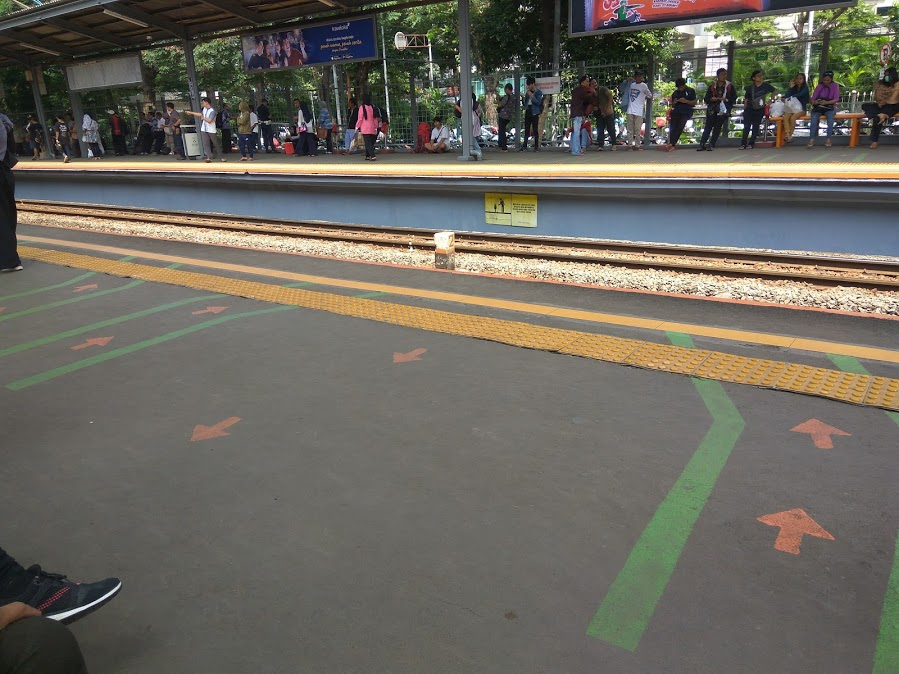

Arahan untuk mendahulukan yang keluar

Saya sendiri tidak begitu melihat perubahan signifikan dengan adanya cat ini karena posisi kereta berhenti tentu berubah-ubah dan kalau benar-benar mengikuti cat ini bisa jadi kita antri di depan gerbong yang bukan pintu :stuck_out_tongue_winking_eye:. Walaupun demikian, sebelum ada cat ini menurut saya antrian keluar dan masuk gerbong sudah teratur. Walaupun sepertinya saya kurang peka terhadap masalah ini karena saya hanya pernah naik kereta di saat jam lenggang. FYI, kereta Jakata-Bogor yang saya tumpangi pada berangkat kuliah selalu sepi karena saat itu yang ramai adalah arah Bogor-Jakarta, begitu pula saat jam pulang saya.

Setelah saya naik kereta, saya turun di Stasiun Pondok Cina. Walaupun judulnya kumpul di UI, karena sedang ada dies natalis dan wisuda yang menyebabkan pintu masuk UI ditutup, maka tempat berkumpul diganti menjadi Margonda City. Ketika saya sampai di sana, hanya beberapa orang yang belum datang. Rencana jalan pada jam 2 pun akhirnya gagal dan kami jalan pada sekitar jam 2:30.

Di perjalanan, kami menghadapi macet yang luar biasa parah di Tol Cikampek karena ada pembangunan (MRT kayaknya) :sweat:. Di sepanjang perjalanan yang sangat lama itu, kami menceritakan banyak hal mulai dari kartu kuning Jokowi yang sedang hangat sejak tadi pagi, SIAK War, dan nilai A- Dhipta pada MPKO Tenis Meja (ya, tenis meja. Kamu tidak salah baca). Di sana saya mengetahui bahwa banyak anak TOKI yang kalah war :cry:, salah satunya Ridho yang baru mengisi pada H+1. Dia menceritakan pengalamannya mendapat posisi 62 dari 50 pada matkul Matematika Dasar 1 dan akhirnya dia mengirim pesan kepada Pembimbing Akademisnya (PA). Akhirnya, kapasitas kelas yang Dia pilih menjadi 65 padahal kelas lain hanya menjadi 55.

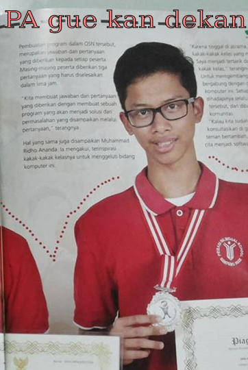

Topik pembicaraan kemudian hanya berputar-putar dengan protes karena timeline line dipenuhi kartu kuning serta tentunya menghina-hina Dhipta. Karena belum sholat Ashar, kami berhenti di rest area. Setelah sholat, namanya juga setan ya (baca: Dhipta) akhirnya kita makan dulu di KFC baru berjalan lagi sekitar pukul 6:20. Pada kali ini sudah tidak ada pembicaraan berarti mungkin karena sudah stress gara-gara macet :sleeping:. Untuk memecah keheningan akhirnya seorang sultan menyetel lagu lewat youtube dengan kuota sendiri. Salah satu lagu yang terputar adalah

`youtube: nty8m_jkvk0`

Akhirnya kami sampai di Wisma TOKI sekitar pukul 8:30. Acara sudah dimulai dengan perkenalan saat kami datang. Setelah perkenalan, kami dipersilahkan makan bakmi lalu mengikuti task force. Jadi di TOKI Camp ini salah satu acara utamanya adalah mengerjakan proyek-proyek TOKI yang dipecah-pecah menjadi beberapa task force yaitu TLX development, scientific committee Pelatnas 2, konten TLX, soal OSP, dan OSP online. Saya sendiri ikut konten TLX yang tugasnya membuat tag serta hint soal-soal OSN.

Task force TLX development.

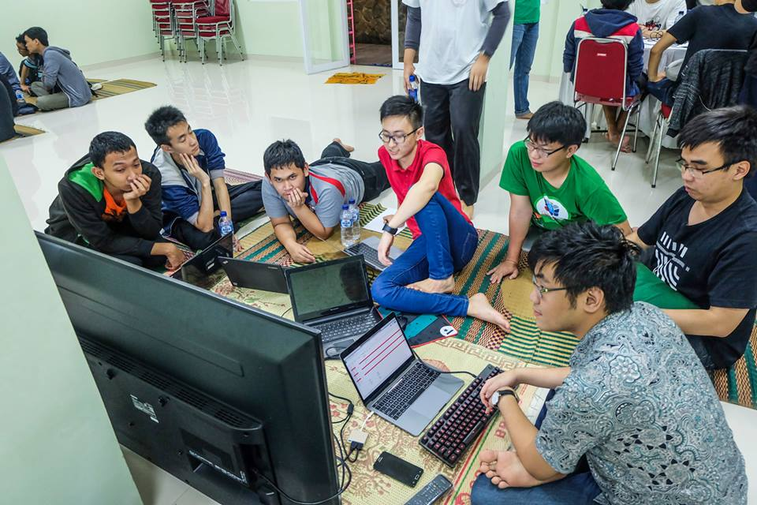

Task force SC Pelatnas 2.

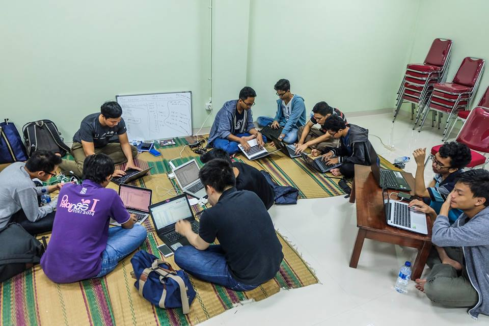

Task force konten TLX.

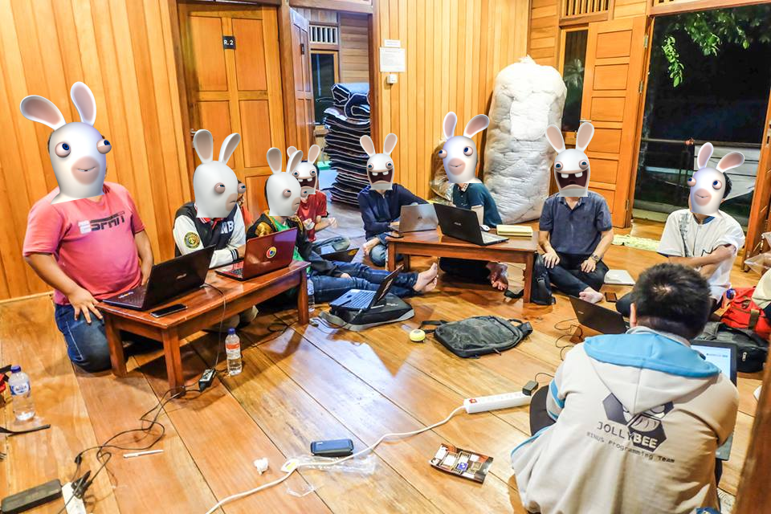

Task force soal OSP. Identitas dirahasiakan demi keamanan.

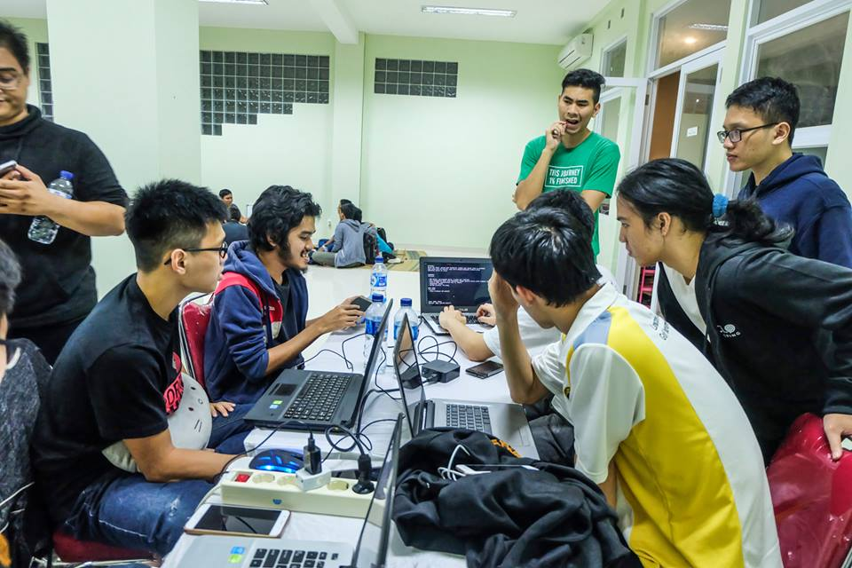

Task force OSP online.

Setelah bekerja selama kira-kira 2 jam, kami pun tidur.

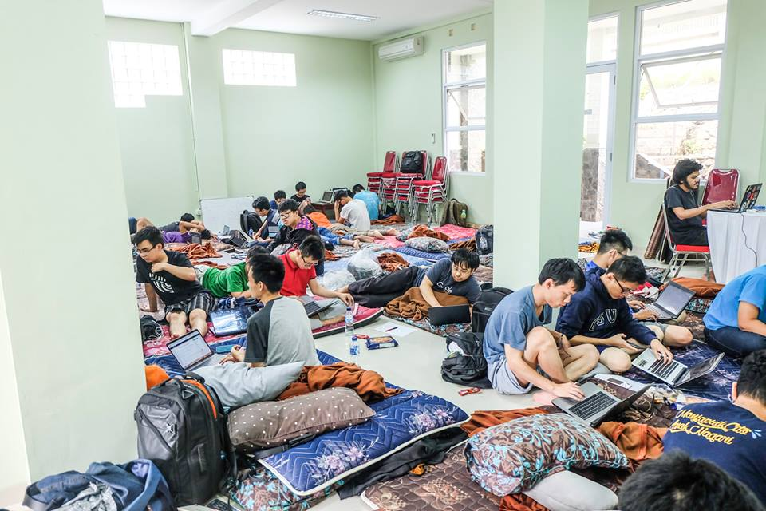

Kondisi wiki ketika digunakan tidur.

Pekerjaan dilakukan keesokan harinya, hingga tibalah pada acara seminar(?) dari sponsor yaitu Bizzy, tiket.com, dan Bukalapak.

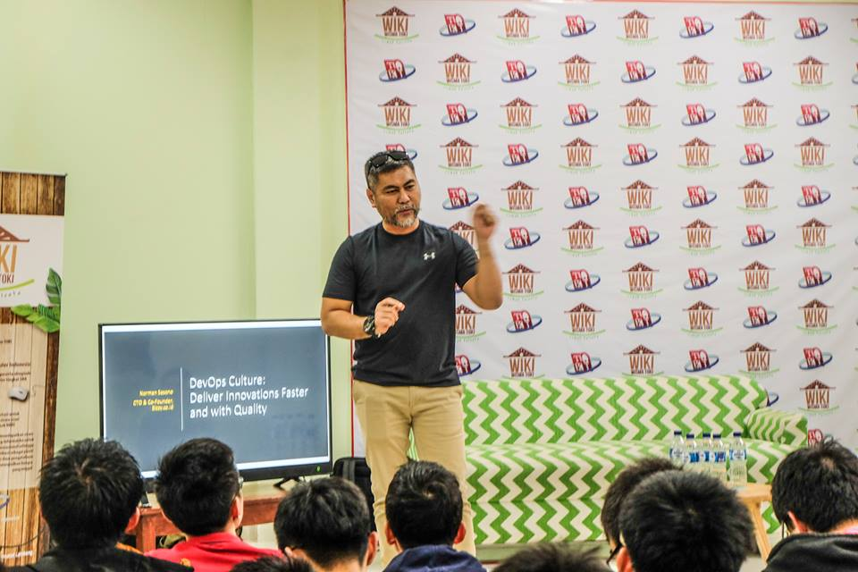

Tentu saja seminar seperti ini sangat membuka wawasan saya dan saya mendapat banyak hal berharga dari sini.

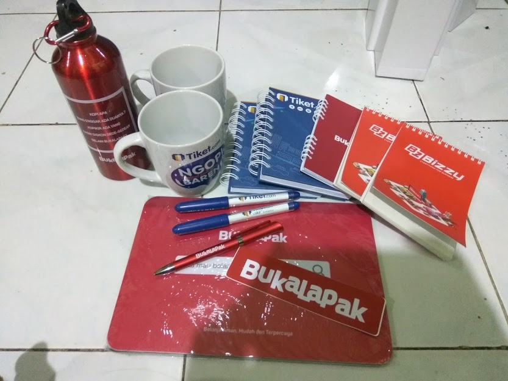

Hal berharga yang saya dapat.

Karena sesi ini merupakan sesi inti dari TOKI Camp (tidak semua orang menginap) maka dilakukan foto bersama setelah sesi ini selesai.

Setelah itu, kami kembali mengerjakan tugas task force hingga malam. Keesokan harinya, tugas task force sudah selesai dan hanya tinggal bersenang-senang yeay :laughing:. Hanya satu hal yang saya kerjakan saat itu. Makan.

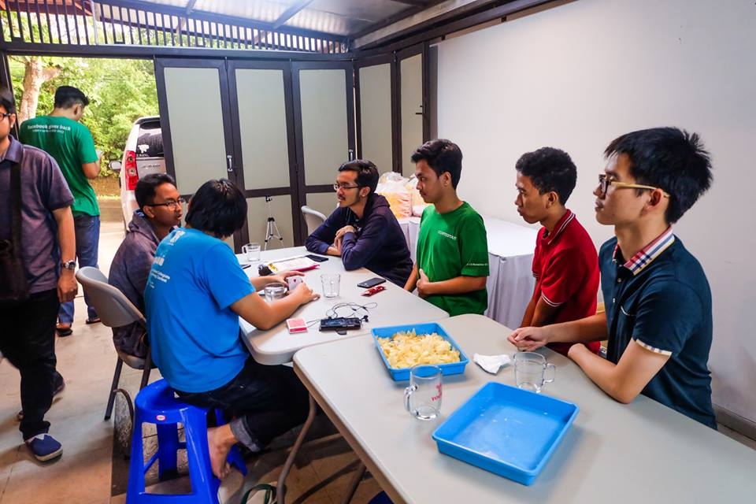

Menunggu makanan siap.

Hari terakhir ini diisi dengan kegabutan dan pada akhirnya, kami makan siang bersama di kafe lo.ka.si. Gokilnya, sinyal telkomsel di sana menyentuh 4G+!

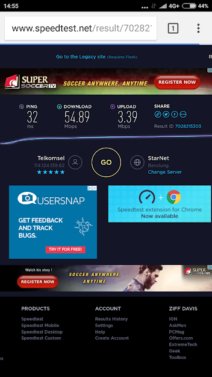

So fast.

Akhirnya, TOKI Camp pun berakhir dan kami pulang dengan kenyang~.
