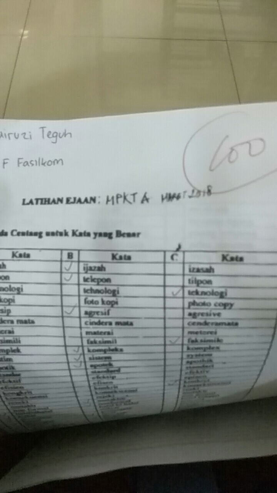
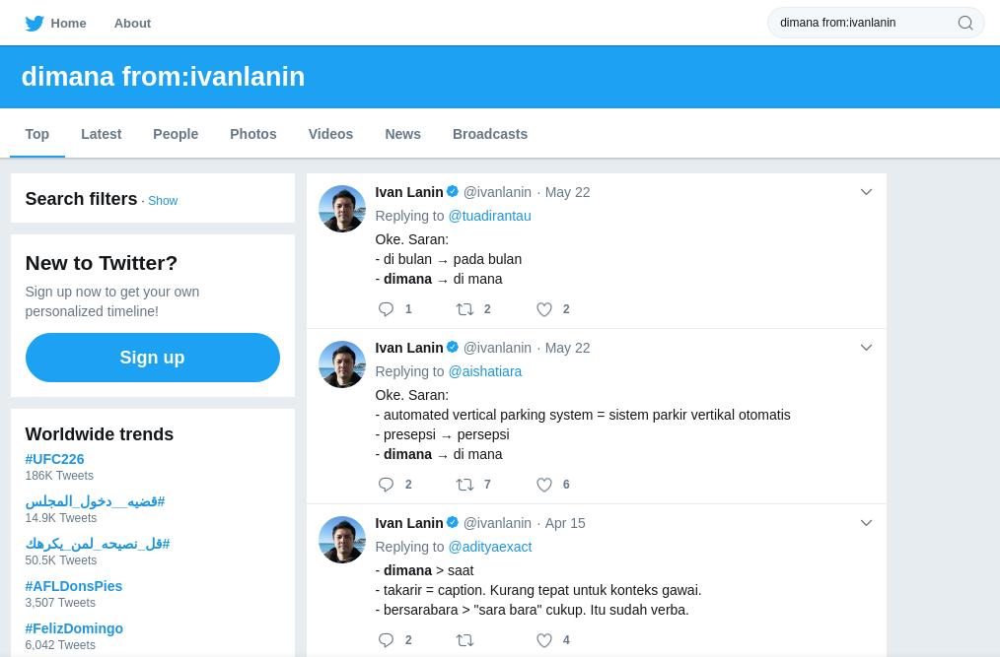

Sewaktu saya semester dua dulu (sok-sok lama padahal baru kemarin :stuck_out_tongue_winking_eye:), saya mengambil mata kuliah wajib UI yaitu MPKT A. MPKT A ini pelajaran yang bukan main pentingnya, 6 SKS! Pelajarannya sendiri tentang sosial, berbeda dengan MPKT B yang saya ambil pada semester 1 yang membahas tentang ilmu alam dan teknologi. Dosennya pun berasal dari berbagai fakultas, dan kebetulan saya mendapat dosen dari Fakultas Ilmu Pengetahuan Budaya UI. Materi yang dibahas beragam, seperti pembangunan karakter, filsafat, logika, etika, dll. Namun mungkin karena latar belakang dosen saya, materi yang sebenarnya dibahas yaitu

10\. Semua  
9\. Materi  
8\. Dibahas  
7\. Sesuai  
6\. Dengan  
5\. Silabus  
4\. Karena  
3\. Sama  
2\. Pentingnya  
1\. Bahasa Indonesia  

Ya, Beliau sering sekali mengajarkan bahasa Indonesia. Selain mengajar di kelas, Beliau juga beberapa kali memberikan kami latihan soal, seperti menentukan kata yang baku. Awalnya, saya bingung ketika harus menjawab soal-soal tersebut karena dari dulu saya tidak pernah dengan mudah menemukan kata baku lewat Google (ya, memang dari mana lagi? Saya kan anak Fasilkom.) Hingga pada akhirnya saya menemukan cara yang cukup dapat diandalkan untuk mengetahui mana kata yang baku sehingga bisa mendapatkan nilai sempurna pada salah satu latihannya :joy:.

    

        
    

Berikut ini merupakan sumber-sumber yang dapat digunakan untuk mengetahui kata baku dalam bahasa Indonesia.

### 1. KBBI Online
Jika yang ditanyakan adalah kata tanpa imbuhan seperti ijasah atau ijazah, tentu mudah untuk mencari mana yang baku dengan menggunakan [KBBI Online](https://kbbi.kemdikbud.go.id/). Cukup cari kata yang menurutmu baku. Jika baku, kita akan dibawa ke halaman penjelasan sedangkan jika tidak, halaman tidak ditemukan atau akan ada tautan untuk pergi ke kata yang baku.

### 2. Twitter Ivan Lanin
Saya pertama kali diberitahu trik ini oleh Sage dan saya rasa sangat bermanfaat. Cukup kunjungi [twitter Ivan Lanin](https://twitter.com/ivanlanin) dan cari kata yang kamu ingin tahu pada kotak pencarian twitter dengan format "[kata yang ingin kamu cari] from:ivanlanin". Bagi yang belum tahu, Ivan Lanin adalah seorang wikipediawan pecinta bahasa Indonesia yang mencoba untuk memopulerkan bahasa Indonesia baku dalam kehidupan sehari-hari. Sehingga, tweet-tweetnya banyak berisi tanya jawab tentang bahasa. Cara yang saya beritahu sebelumnya sebenarnya adalah mencari tweet-tweet Ivan Lanin yang mengandung kata yang dicari sehingga kamu dapat melihat pembahasan tentang kata tersebut. Walaupun tentu tidak lengkap, tapi menurut saya cara ini cukup untuk menutupi kekurangan KBBI Online pada kata-kata dengan imbuhan.

### 3. Buku PUEBI
Jika masih juga belum menemukannya di Twitter Ivan Lanin, cara terakhir yang saya gunakan adalah mengeceknya di [Buku PUEBI](http://badanbahasa.kemdikbud.go.id/lamanbahasa/sites/default/files/PUEBI.pdf). Biasanya, jika sudah sampai tahap ini yang saya cari pasti terdiri lebih dari satu kata atau kata berimbuhan. Jika tidak menemukannya dengan Ctrl + F, terpaksa saya harus mencari aturan penggunaan imbuhan atau partikel yang sesuai. Selain dari buku itu, kita juga dapat mengakses [PUEBI daring](https://ivanlanin.github.io/puebi/) yang lebih ramah gawai.

Bahasa memang merupakan topik yang luas. Mengetahui kata yang baku tentu tidak cukup karena masih banyak topik lain seperti pembentukan kalimat, paragraf, dan lain-lain. Namun dengan cara-cara di atas, diharapkan kita dapat mengurangi kesalahan-kesalahan sederhana dalam bahasa yang sebenarnya dapat dihindari. :wink:
