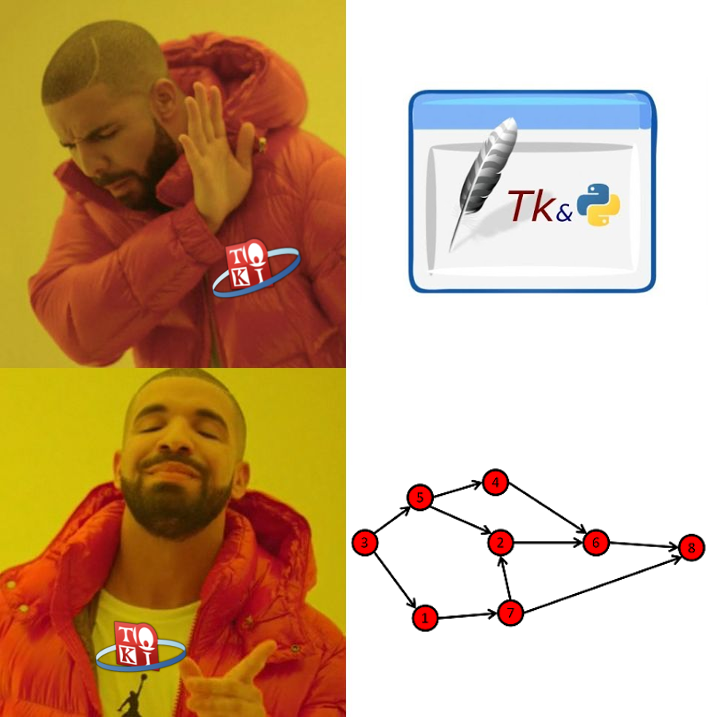

Akhirnya setelah berhari-hari website ini jadi juga 😆. Padahal mau dipublish tanggal 10 tapi karena malas jadi tanggal 12 deh 😢.

Oke, kenapa aku buat website ini? Jadi di Facebook aku melihat Albert-kun share library menarik (bener ga sih library) untuk membuat static web menggunakan React, namanya Gatsby. Karena aku malas belajar Jekyll yang aku ga familiar sama environmentnya (Ruby) maka aku coba-coba saja pakai Gatsby biar rambutku keren #salah. Tujuan dibuatnya website ini adalah agar aku punya web sendiri (ga numpang blogspot) dan aku ada rencana bikin project yang pakai REST dihubungin ke frontend (aku gatau itu namanya apa) yang seperti kita tahu, aku malas bikin design jadi dengan web ini diharapkan setiap aku bikin project tinggal bikin formnya aja yeay.

Apa yang aku dapat setelah membuat web ini? Pada awalnya aku menganggap frontend dan backend itu sama saja (dalam artian aku ga prefer salah satunya). Setelah menyelesaikan web ini, aku benci frontend 😡.

<figcaption class="img-caption">Keheranan Pak Fariz terhadap anak TOKI.</figcaption>

Kadang suka heran juga sama anak-anak yang nanya ke aku ngerjain TP GUI berapa lama, dikira hapal librarynya apa.

Oke sekian saja post kali ini, semoga akan ada post selanjutnya 😆.
