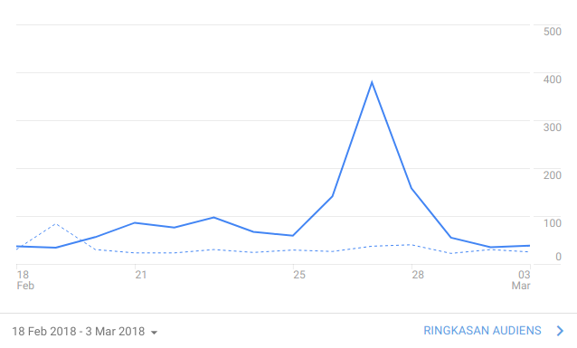
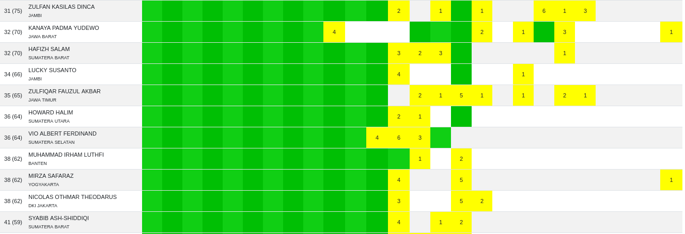
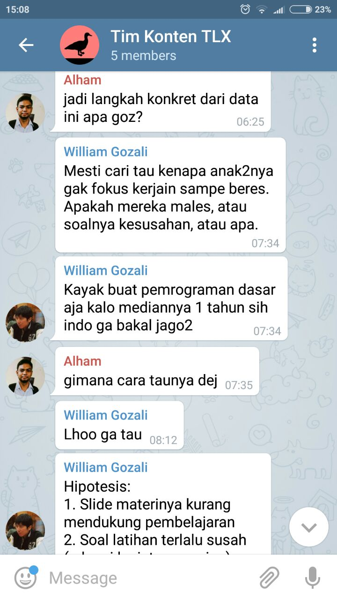
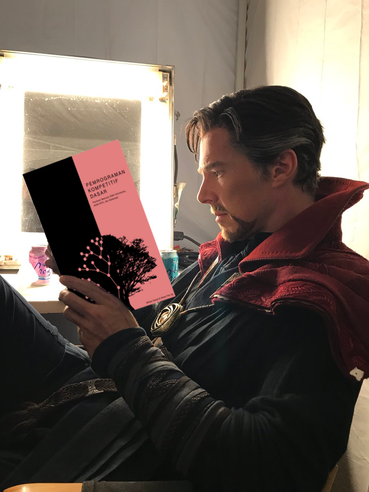
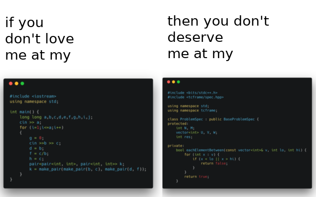

Tak terasa sudah lama saya tidak memperbaharui blog saya 😅. Selama blog saya tidak update, tentu banyak hal yang saya lakukan di dunia nyata salah satunya mengajar OSN baik pada OSK, OSP, maupun OSN. Ketika saya mengajar, ada satu hal yang saya sadari menjadi pembeda antara calon juara dengan yang tidak.

Dahulu, saya ingat pernah membagikan status yang isinya kira-kira para medalis OSN dapat menjadi medalis salah satu faktornya karena baiknya kondisi (seperti sarana dan pelatda) yang mereka dapatkan. Saya membagikan status itu karena saya sendiri merasa saya dapat menjadi medalis salah satunya karena baiknya pelatda DKI Jakarta yang mungkin tidak dimiliki daerah lain. Namun, di status tersebut terjadi tubir karena ada hal sensitif yang dibahas yang kira-kira intinya "sebenarnya ada orang yang berusaha lebih keras dari pada kamu tapi tidak jadi medalis karena buruknya kondisi mereka." Tentu banyak yang tidak setuju karena bagi mereka ini membunuh semangat para siswa yang akan bertanding pada OSN, terlebih lagi status itu muncul seingat saya mendekati OSK 2018.

Silakan baca komik [http://thewireless.co.nz/articles/the-pencilsword-on-a-plate](http://thewireless.co.nz/articles/the-pencilsword-on-a-plate) jika ingin benar-benar mengetahui duduk permasalahannya. Saat itu, saya setuju karena bagi saya terlalu sombong untuk mengatakan saya berhasil menjadi medalis hanya karena usaha saya saja, tidak mempertimbangkan faktor lain seperti Provinsi DKI Jakarta yang benar-benar niat mempersiapkan OSN, konten-konten dari IA-TOKI yang membantu untuk belajar mandiri, dan tentunya dukungan orang tua saya. Namun seiring berjalannya waktu, saya memiliki pandangan sedikit berbeda terhadap komik tersebut terutama tentang "kerja keras".

Sebelumnya, saya ingin flashback sebentar di saat saya mengikuti acara pelatihan/motivasi dari Sigma Academy saat kelas 8 SMP. Dari sekian banyak materi yang disampaikan, ada satu materi unik yang cukup menarik perhatian saya tentang meraih tujuan. Biasanya, orang-orang terutama para motivator pasti menyemangati kita untuk terus bekerja keras karena banyak saingan kita yang akan merebut posisi kita jika tidak. Berbeda dengan orang kebanyakan, Sigma Academy menyampaikan sesuatu yang bertolak belakang. **Sebenarnya, sainganmu dalam meraih tujuan itu sedikit**. Mau masuk SMA X? Sedikit saingannya. Mau kuliah di X? Sedikit saingannya. Saat itu dicontohkan bahwa untuk meraih gelar juara dunia bulu tangkis, sebenarnya hanya beberapa orang yang perlu dilawan, bukan seluruh dunia.

Lalu apa hubungannya dengan OSN? Sebenarnya, jika kamu ingin menjadi medalis, sedikit saingannya! Tidak percaya? mari kita lihat data kunjungan [https://osn.toki.id](https://osn.toki.id) menjelang OSK.

<figcaption class="img-caption">Kunjungan meningkat sangat tajam.</figcaption>

Dari data tersebut, dapat dilihat bahwa banyak sekali peserta OSK yang deadliner! Alasannya tentu beragam, salah satu yang mungkin dan sangat disayangkan adalah baru diberitahu guru menjelang OSK. Artinya, untuk menjadi juara OSK sebenarnya lawanmu bukan saja sedikit (hanya beberapa siswa per sekolah), namun juga sedikit yang melakukan persiapan. Bagi saya, siswa-siswa deadliner ini tidak layak untuk lolos sehingga biasanya saya hanya mempertimbangkan siswa-siswa yang memiliki persiapan, mari kita sebut mereka sebagai "lawan sebenarnya". Dari mereka yang memiliki persiapan, berapa banyak yang telah mencoba soal-soal setidaknya 3 tahun ke belakang? Coba kamu data di daerahmu dan buktikan sendiri bahwa sainganmu sedikit 😄. Itu kan OSK, bagaimana dengan OSN? Tidak jauh berbeda! Mari lihat data dari [https://kawal-pjj.herokuapp.com](https://kawal-pjj.herokuapp.com).

Sebenarnya cukup sulit menentukan batas "memiliki persiapan" pada PJJ ini namun saya coba ambil peringkat 35 sebagai batas karena terlihat sudah cukup banyak mencoba materi pemrograman kompetitif dasar. Oh ya, kira-kira setengah bagian hijau yang di kiri adalah materi pemrograman dasar yang terlalu dasar untuk OSN dan lebih cocok dikatakan latihan untuk OSK/OSP sehingga tidak saya perhitungkan sebagai persiapan OSN. Saat ini, masih ada sekitar 3 minggu sebelum OSN 2018 dimulai. Dengan mempertimbangkan siswa-siswa hebat yang berlatih di OJ lain bukan di TLX dan waktu 3 minggu yang tersisa, mari anggap ada 60 orang yang memiliki persiapan untuk OSN nanti. Jumlah medalis ada 30, artinya, kamu cukup "mengalahkan" satu orang untuk menjadi medalis! (tapi pastikan kamu termasuk yang 60 itu 😄).

Selain kurangnya persiapan, banyak juga siswa dengan persiapan (biasanya mendapat pelatihan) yang sebenarnya tidak tertarik dengan OSN. Dari beberapa alumni TOKI, mungkin saya termasuk yang tidak begitu tertarik untuk "menarik" adik-adik kelas kenalan saya untuk menjadi medalis OSN. Alasannya sederhana, saya tidak ingin capek-capek berusaha menjadikan seseorang medalis jika dia sendiri "tidak ingin" menjadi medalis. Terdengar konyol? Faktanya, banyak teman-teman saya yang melatih adik kelasnya mengeluh bahwa sebenarnya malah mereka yang lebih semangat belajar OSN dibanding adik kelasnya yang sebenarnya "dibantu". Oh ya, jangan salah kaprah, dengan tidak tertarik mengajar adik kelas bukan berarti saya tidak peduli dengan siswa-siswa OSN. Saya sendiri tergabung dalam tim konten TLX karena saya ingin membantu mereka yang walaupun tidak memiliki guru namun ingin menjadi jawara di OSN. Selain itu, tulisan ini sebenarnya merupakan buah kekhawatiran terhadap minat belajar siswa OSN yang masih sedikit 😄.

Oke, lawanmu sebenarnya sedikit, lalu apakah mudah memenangkan OSN? Tidak juga. Sebenarnya, dari lawanmu yang sedikit itu, sebagian besar adalah orang-orang super yang sulit dikalahkan. Kalau melihat contoh juara bulu tangkis dunia sebelumnya, tentu yang menjadi lawan walaupun sedikit adalah atlet-atlet terbaik di negaranya. Namun dengan mengetahui sedikitnya lawan yang harus dikalahkan, setidaknya membuka sudut pandang baru bahwa kita hanya perlu melawan sedikit orang hebat, bukan banyak orang hebat 😜.

Lalu bagaimana dengan sifat para medalis? Apakah mereka bekerja keras untuk mendapatkan medali? Tentu saja! Saya sendiri bersekolah di sekolah umum, bukan khusus olimpiade. Untuk meraih medali, saya berusaha menghabiskan soal OSK & OSP 5 tahun ke belakang dan menyelesaikan materi pemrograman kompetitif di TLX hingga bab Dynamic Programming sebelum Pelatda DKI Jakarta dimulai. Saya sendiri menganggap pelatda sebagai bonus karena dapat berkenalan dengan teman-teman yang hebat sehingga memotivasi saya, bukan sebagai satu-satunya saat saya belajar untuk OSN. Indra, juara umum OSN Komputer 2016 membuat daftar soal yang telah diselesaikannya pada Excel. Pernah melihat anak yang jarang belajar tapi pintar? Mungkin Alfian adalah anak yang paling cocok untuk menyandang gelar itu di angkatan saya. Hampir setiap hari waktu Pelatnas 2 di pagi hari ketika semua peserta menyimak materi Dia malah tidur karena begadang bermain Dota semalaman. Walau begitu, Dia lolos ke Pelatnas 3! Apakah Dia tidak belajar? Tidak juga. Ketika Dia terbangun, Dia langsung ngebut mempelajari materinya dari slide. Sehari sebelum kuis/simulasi, Dia mereview apa yang telah dipelajari sampai saat itu. Walaupun belajarnya singkat, tetap saja Dia belajar. Setiap orang memiliki kecepatan yang berbeda dalam belajar bukan? 😉. Intinya, pintar tanpa belajar/kerja keras hanya omong kosong!

Kembali ke pertanyaan awal, apakah kerja keras cukup untuk meraih medali OSN? Tentu tidak. Selain bekerja keras, kamu tentu harus memiliki sarana yang memadai seperti komputer, internet, serta sumber materi. Untungnya, komputer merupakan salah satu bidang yang peduli terhadap penyebaran materi salah satu contohnya dengan membuat buku Pemrograman Kompetitif Dasar yang dapat diunduh secara gratis [di sini](https://osn.toki.id/arsip/download-pkd).

<figcaption class="img-caption">Belajar PKD.</figcaption>

Oke, cukup promosinya. Jawaban yang serius adalah, seharusnya iya. Saya rasa, asalkan kamu memiliki komputer, internet, dan tentunya semangat yang membara, insyaAllah medali OSN bisa diraih. Mungkin akan ada pemikiran "Bagaimana jika tidak memiliki komputer dan internet? Bukankah sama saja kondisinya seperti komik tadi?" Ya, itu benar. Tapi berdasarkan pengalaman, sebagian besar siswa yang gagal pada OSN disebabkan kurangnya kerja keras mereka sendiri, bukan karena tidak memiliki sarana di atas. Sebagai tambahan, silakan tonton video TED yang cukup baik berkaitan tentang tekad berikut ini. Akhir kata, selamat belajar dan berjuang menjadi yang terbaik!

<iframe src="https://embed.ted.com/talks/lang/id/angela_lee_duckworth_grit_the_power_of_passion_and_perseverance" width="854" height="480" style="position:absolute;left:0;top:0;width:100%;height:100%" frameborder="0" scrolling="no" allowfullscreen></iframe>

