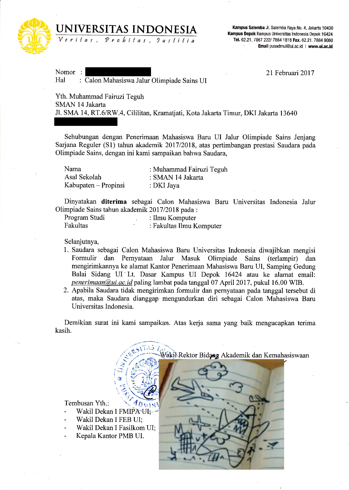

Post kedua bukan sekadar wacana yeay :laughing:.

Kali ini saya akan membahas tentang jalur olimpiade di UI. Kenapa saya membahas ini? ~~Karena saya gabut~~ Karena dulu saya bingung tentang jalur olimpiade untuk masuk PTN (atau bahkan ada atau tidak) dan saya tidak menemukan blog-blog yang membahas demikian. Berhubung sekarang adalah masa-masa maba berkunjung ke sekolahnya untuk ~~pamer~~ promosi PTN, terbesit di benak saya untuk membuat post ini. Siapa tahu di masa depan ada orang-orang seperti saya, yang mencari informasi tentang jalur olimpiade, berkunjung ke blog ini.

*Ilustrasi orang di masa depan*

Pertama-tama, ini adalah cerita pengalaman saya sebagai anak komputer sehingga untuk bidang lain mungkin kurang sesuai sehingga saya akan mencoba memberikan informasi yang saya tahu secara umum terlebih dahulu, silakan dikoreksi jika salah. Ada dua universitas yang memberikan jalur khusus olimpiade, yaitu UI dan UGM. Universitas lain mungkin juga memberikan keringanan namun lewat jalur SNMPTN dengan melampirkan sertifikat dan menghubungi panitia yang bersangkutan. Perlu diperhatikan bahwa ada sebuah PTN di Bandung yang benar-benar tidak peduli terhadap OSN sehingga jika nilaimu tidak terlalu bagus dan kamu mau cari aman, jangan daftar SNMPTN di PTN tersebut karena sudah merenggut ribuan korban jiwa :grin:. Untuk bidang ekonomi, ada surat pernyataan dari FEB UI pada saat registrasi peserta OSN tentang kesediaan masuk FEB UI namun saya tidak tahu berapa orang yang diambil dan saya yakin bukan 90 orang (semua peserta). Untuk bidang kimia saya punya teman yang ditawari program S1 & S2 kimia di UI. Namun perlu diperhatikan bahwa walaupun ada jalur olimpiade ini, tetap saja peminatnya sedikit kecuali komputer karena mungkin anak-anak OSN lebih tertarik ke jurusan-jurusan terapan yang tidak memiliki jalur olimpiade walaupun bidangnya berkaitan (kedokteran dengan biologi, teknik dengan fisika, dll).

Untuk bidang komputer sendiri, kamu dapat mendaftar beasiswa full ke salah satu universitas swasta yang terkenal akan shitposting dan ayam rockynya dengan melampirkan sertifikat tingkat nasional. Selain itu, jika kamu berhasil mencapai tahap pelatnas 2 (16 besar TOKI), kamu akan mendapat undangan untuk masuk Fasilkom UI walaupun tanpa beasiswa. Undangan Fasilkom inilah yang akan menjadi topik bahasan saya kali ini.

Saya pertama kali tahu informasi tentang undangan ini dari Indra saat pelatda OSN DKI Jakarta. Kebetulan saat itu juga sedang ramai SBMPTN sehingga Dia menceritakan jalur tersebut kepada kami teman-teman kamarnya. Saat itu saya belum memikirkan tentang PTN sehingga tidak ambil pusing dengan informasi tersebut. Saat pelatnas 1, bersamaan dengan runtuhnya nilai-nilai saya di sekolah, keinginan untuk mendapatkan undangan tersebut muncul. Sepertinya lolos ke pelatnas 2 sangat worth it karena undangan tersebut. Bahkan, Indra yang simulasinya hancur mulai memikirkan undangan UInya. Oh iya, Indra merupakan veteran pelatnas 2 tahun lalu dan sebenarnya jika sudah pernah mencapai pelatnas 2, seharusnya tetap mendapat undangan walaupun tidak berhasil ke pelatnas 2 di tahun selanjutnya. Tapi ya namanya juga panik ya :stuck_out_tongue_winking_eye:. Akhirnya tibalah penutupan pelatnas 1 dan saya dinyatakan lolos ke pelatnas 2. Saya juga mendapat souvenir topi ITB (karena pelatnas 1 di ITB) sehingga saat itu saya *resmi* menjadi anak UI bertopi ITB. Oh iya, karena informasi lolos ke pelatnas 2 ini diberitahukan saat pelatnas 1 yang diadakan sekitar bulan Oktober, jika kamu tidak lolos sebenarnya masih memiliki banyak waktu untuk memperbaiki nilai sekolah serta belajar SBMPTN.

Saat pelatnas 2, di saat anak-anak lain fokus untuk lolos ke pelatnas 3, saya dan Indra hanya memikirkan UI (tapi dia lolos ke pelatnas 3, trap emang). Saat itu di pagi hari, diadakan latihan seperti biasa. Seperti biasa, saya hanya dapat melihat-lihat kesana kemari meratapi soal-soal yang tidak bisa dikerjakan ini. Akhirnya, ada notifikasi muncul. "Dra, lihat email" ujarku kepada Indra yang berada di depanku. Ya, ada email dari pihak UI mengenai jalur olimpiade. Terlihat belum resmi dan hanya ingin mendata apakah bersedia masuk UI, mungkin untuk pendataan kuota SNMPTN. Selang beberapa hari, akhirnya undangan resmi itu datang.

Pendaftaran ini dimulai beberapa hari sebelum SNMPTN ditutup. Untung saya belum daftar SNMPTN jadi kuotanya bisa dikasih ke orang lain. Jalur inipun cukup unik, sama sekali tidak ada informasi di website-website resmi UI. Kami mengisi data di website SIMAK UI. Setelah itu, cukup tunggu hingga tanggal pendaftaran ulang seperti jalur reguler biasa. Kalau anak reguler membawa rapot, ijazah, dll kami hanya disuruh membawa sertifikat, itupun akhirnya tidak dicek di sana. heran. Setelah itu, cukup menjadi mahasiswa biasa.

Masuk melalui jalur olimpiade memiliki beberapa perbedaan. Pertama, Nomor Pokok Mahasiswa (NPM) kamu akan berurutan dengan TOKI lain sehingga jika kamu sekelas dengan TOKI lain yang absennya sorted by NPM, absen kalian akan berjajar. Tentu jika ada pembuatan grup yang berdasarkan NPM kalian juga akan bersama. Kedua, pembimbing akademis (PA) kalian adalah dekan yang menjabat saat itu. Hal ini mungkin berguna karena ada mata kuliah CP yang bernama TK TPL (pahlawan biasanya pakai nama samaran - Pak Denny) yang prerequisitenya 100 SKS/matkul Struktur Data dan Algoritma namun bisa kalian ambil pada semester 2 jika kamu TOKI. Tentu kamu tidak perlu menjelaskan kamu TOKI jika PAnya sama karena mengambil suatu matkul butuh persetujuan PA.

Oke sekian saja pos kali ini (kok jadi panjang :joy:)!