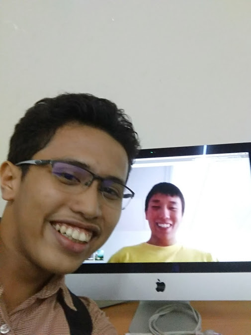
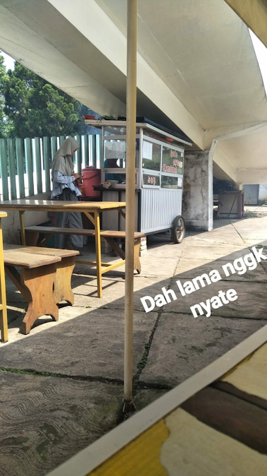
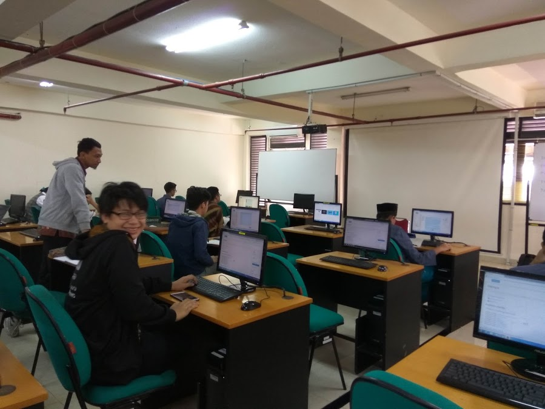
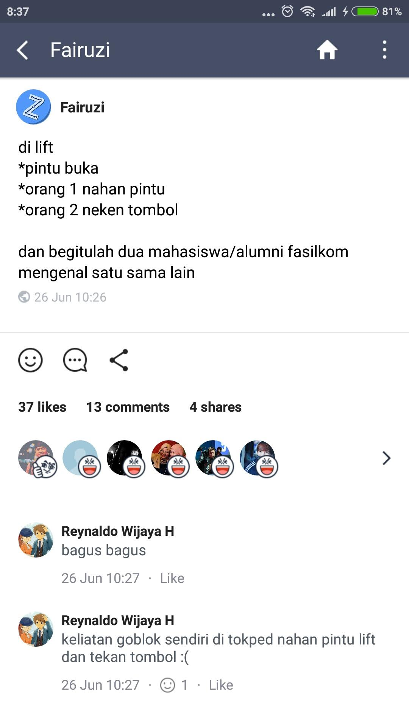

Apa sih bedanya Fasilkom dengan fakultas lain? Bagaimana dengan fakultas ilmu komputer/informatika universitas lain? Pertanyaan tersebut pasti sering muncul dibenak para maba, termasuk saya dulu. Dengan pengalaman menjadi mahasiswa Fasilkom selama setahun ini, saya akan mencoba menjawab pertanyaan tersebut. Tanpa panjang lebar, mari kita lihat seperti apa sih rasanya menjadi mahasiswa Fasilkom UI.

### Pembinaan Mahasiswa Baru (PMB)
Acara Fasilkom yang pertama diikuti maba tentu saja PMB. PMB ini adalah ospek tingkat fakultas yang dimulai dari PSAF hingga bulan November, berarti kira-kira satu semester. Jika dibandingkan fakultas lain yang hanya beberapa bulan atau bahkan hingga satu tahun, durasi PMB Fasilkom bisa dibilang menengah. Berbeda dengan ospek fakultas lain, di PMB ini tidak ada yang namanya perpeloncoan yeay! Saat PMB ini, kamu akan membuat nametag untuk dipakai di lingkungan Fasilkom. Saran saya, nametag ini dipakai mulai masuk UI ketika PSAF agar kamu tidak disangka mahasiswa fakultas lain dan berujung diteriakin :laughing:. Tugas PMB sendiri cukup banyak mulai dari mengenal angkatan, mengenal elemen (dosen, janitor, pedagang kantin, dll) hingga mengenal kating.

    

        
        
Mengenal kating.

    

### Kantin
Katanya, kantin Fasilkom adalah salah satu kantin termurah di UI. Saya sendiri sering bertemu teman saya yang berkuliah di FH, FMIPA, hingga FT di kantin Fasilkom. Di kantin Fasilkom juga ada penjual *yakitori with peanut sauce* yang cukup legendaris, hanya 10.000! Selain menawarkan jajanan murah, di Fasilkom juga terdapat Yoshinoya yang bisa dijadikan tempat hedon :stuck_out_tongue_winking_eye:. Jika makan di Fasilkom, jangan lupa menaruh piringnya di meja biru setelah selesai!

    

        
        
Yakitori with peanut sauce.

    

### Homogen
Ya, mahasiswa Fasilkom itu.... homogen. Ga macem-macem. Kalau kamu pergi ke fakultas lain, kamu akan melihat berbagai macam mahasiswa mulai dari penampilannya, sifatnya, dll. Mahasiswa Fasilkom? Paling wibu.

### Mata Kuliah
Mata kuliah Fasilkom kayak apa sih? Ya.. gitu. Mungkin perlu pos baru untuk menjelaskannya :stuck_out_tongue:. Yang cukup unik adalah kita bisa survive tanpa buku (setidaknya saya setahun ini) thanks to [Scele CS](https://scele.cs.ui.ac.id). Scele ini forum belajarnya anak Fasilkom yang salah satu fungsinya adalah tempat dikumpulkannya slide-slide dosen, jadi kalau dirasa cukup tidak perlu membeli buku ~~dan mencatat di kelas~~.

### Makalah
Kalau di fakultas lain udah muak sama laporan-laporan seperti makalah, Fasilkom malah ga pernah bikin makalah. Beberapa dosen MPKT pasti heran ketika diberitahu itu. ~~Kita kan bikinnya dokumentasi pak.~~

### Lab
Lab di Fasilkom bagus, cukup nyaman digunakan dalam mengerjakan tugas. Kalau tadi saya bilang tidak perlu membeli buku, dengan lab ini kita sebenarnya tidak perlu membawa laptop. Pada semester 1 saya nyaris tidak pernah membawa laptop. Pada akhirnya, saya sering membawa laptop karena ada tugas-tugas lain di luar kuliah yang membuat malas setupnya. Oh ya, Wi-Fi Fasilkom yang terkenal cepatnya itu memiliki sinyal paling bagus salah satunya di lab ini.

Kondisi lab Fasilkom.

### Lift
Pengalaman unik lain yang akan kamu dapatkan di Fasilkom adalah liftnya. Liftnya. Sangat. Cepat. Tertutup. Siap-siap menjadi orang aneh saat menaiki lift di gedung lain :stuck_out_tongue:. Sayangnya, lift unik ini tidak dapat dipastikan nasibnya di gedung baru :worried:

    

        
    

### Organisasi
Saya ga bisa cerita banyak soal ini ~~karena saya pasif~~. Biasanya, anak Fasilkom aktifnya di organisasi internal Fasilkom, bukan tingkat UI. Kamu akan merasakannya ketika demo UKM saat Kamaba, sedikit sekali yang berasal dari Fasilkom. Selain itu, jika teman-temanmu dari fakultas lain ikut organisasi tingkat departemen, Fasilkom tidak ada departemen karena jurusannya aja cuma ada dua :stuck_out_tongue:. Oh ya, di Fasilkom juga tidak ada himpunan.

### Magang
Dibandingkan fakultas lain, magang anak Fasilkom sepertinya lebih menyenangkan :laughing:. Magang ini sepertinya sedang menjadi tren baru mahasiswa Fasilkom. Sebenarnya, ada mata kuliah kerja praktik (magang) yang wajib diambil pada semester 7 namun banyak mahasiswa yang mengambil kesempatan magang sebelum itu, bahkan saat liburan menuju semester 2. Dengan magang, kamu bisa mendapat pengalaman dan pengetahuan yang tidak didapat saat kuliah dan tentunya uang jajan tambahan :simple_smile:.

## Penutup
Menjadi mahasiswa Fasilkom memang merupakan pengalaman tersendiri ~~(ngga sih, homogen)~~. Tentu banyak hal lain yang tidak saya sebutkan di sini karena satu dan lain hal. Namun dengan tulisan ini, diharapkan dapat memberikan gambaran mengenai kehidupan di Fasilkom UI setidaknya yang saya alami :smile:.
