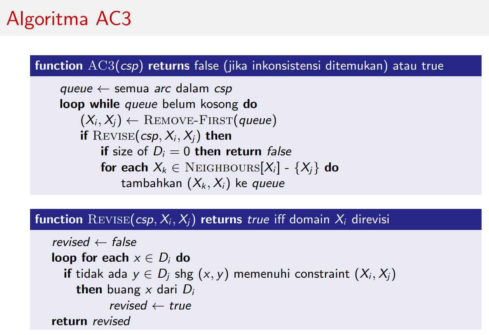

\* bersih-bersih debu \*  
Akhirnya menambah konten blog ini tidak sebatas wacana. Rasanya sudah <strike>malas</strike> tidak sempat mengurus blog ini, namun karena Rey minta dan ada yang nanya secara pribadi ke saya, rasanya mungkin akan lebih berguna untuk orang banyak jika dijadikan blog. Oh ya, maaf jika di pos ini kurang banyak memenya. Kalau mau nyari meme, follow saja Instagram [@kesegaran.fasilkom](http://instagram.com/kesegaran.fasilkom) buatan CS UI 2019. Sepertinya kalau [JangkarAngkatan](https://twitter.com/JangkarAngkatan), [Tarung](https://twitter.com/tarung2017), dan [out of context quanta](https://twitter.com/quanta_anak) digabung tetep kalah. Rasanya mereka lebih baik kamaba terus aja ga perlu kuliah biar ada meme tiap hari 😜. Oke langsung saja ya kita bahas matkulnya satu per satu.

## Basis Data (Basdat)
Matkul ini mempelajari *database*, lebih tepatnya SQL dan pada prakteknya menggunakan **PostgreSQL**. Walau begitu, isi matkulnya **tidak hanya SQL**.
Pertama, kita akan diminta mengubah *requirement* menjadi Entity Relationship Diagram (ERD) atau Enhanced ERD (EERD). Kemudian, ERD tersebut dipetakan menjadi tabel-tabel relasional.
Barulah dari situ bermain-main dengan SQL. Setelah itu juga ada materi lain seperti indexing, normalisasi, dan diakhiri dengan relational algebra.
Jadi, kalau sudah bisa SQL sebenarnya **tidak** aman-aman saja di matkul ini, karena hanya satu dari sekian hal yang dibahas.
Bahkan, ada juga materi SQL yang saya tidak pernah kepikiran misal *inheritance* pada relasi. Mungkin saya kurang jauh mainnya.


<figcaption class="img-caption">Contoh ERD. Sumber: <a href="https://www.smartdraw.com/entity-relationship-diagram/">smartdraw</a>.</figcaption>

Untuk masalah PR, ada **4 PR**. PR-nya tidak terlalu nguli, standar lah ya. Sedangkan untuk lab, basdat ini memiliki skema lab yang unik. Hanya ada **4 lab** dan jadwalnya diberitahu kira-kira seminggu sebelum lab diadakan. Biasanya, saya mengerjakan soalnya **di luar lab** karena sudah dibagikan dan datang ke lab hanya untuk absensi saja karena masuk penilaian. Lab ini membahas hal-hal praktis seperti memindahkan data dari excel ke database dan soal-soal query SQL. Karena itu,
tidak ada membuat ERD, paling hanya menggunakan. Basdat juga memiliki **tugas kelompok (TK)** yang tiap kelompoknya terdiri dari 4 orang. Kebetulan saya sekelompok dengan FwP, Cahya, dan Distra.


TK-nya ada 5, dan biasanya sangat mirip dengan PR. Bisa dibilang, TK itu PR yang dikerjakan bersama-sama 😅.

Yang saya tidak suka dari matkul ini adalah **persentase nilainya** yang tidak proporsional. Bayangkan saja, TK yang sesulit itu total hanya mendapat 12%.
Artinya, tiap TK kurang lebih 12%/5 = 2,4%. Lebih tepatnya, TP 1--3 masing-masing 2% dan sisanya 3%. Bandingkan dengan DDP yang satu TP-nya berbobot 5%. Apakah sesulit itu? Sebenarnya tidak juga. Ingat saya bilang TK sama dengan PR? Sebenarnya tidak sepenuhnya karena di TK terakhir kita diminta untuk mengimplementasikan soalnya sebagai situs siap pakai.
Framework yang digunakan bebas. Namun karena semester lalu sudah menggunakan Django pada PPW, biasanya (kalau tidak semuanya) TK akhir ini dibuat menggunakan Django namun **tidak menggunakan ORM**, jadi menggunakan cursor-cursor db gitu lah.

```python
from django.db import connection
from toysrent.utility import dict_fetch_all

"""
Kode yang melakukan semua query dan memasukkannya ke Object yang sesuai.
Bukan modelsnya Django! Tidak ada from django.db import models!
"""


class Status(object):
    @staticmethod
    def select_all_nama_status():
        with connection.cursor() as cursor:
            cursor.execute("SELECT nama FROM status")
            return dict_fetch_all(cursor)
```
Yang membuat sulit adalah permintaannya yang bahkan **tidak masuk dalam lingkup basdat**, misal membuat modal konfirmasi sebelum menghapus data.
Percayalah, hal-hal minor seperti ini yang bikin lama dan males ngerjainnya. Ada lagi pagination, yang sulit secara backend.
Tapi yang ini masih masuk di nalar lah, mungkin tujuannya agar kita menggunakan SQL limit dan offset. Tapi setidaknya kasih persentase lebih lah, masa 3% doang 🙃.

Selain itu, PR/lab basdat juga **sering direvisi**. Walau begitu, rasanya yang ini saya sudah biasa saja. Entah kenapa rasanya tiap matkul ngoding pasti
rilis tugasnya prematur, jadi biasakanlah dengan cara **mengerjakannya ketika mendekati deadline** 😜. Rasanya mahasiswa Fasilkom deadliner juga karena didesain oleh sistem.

Hal lain yang cukup menonjol dari matkul ini adalah waktunya yang **tidak proporsional**. Hal ini baru terasa ketika kuis dan ujian, jadi hati-hatilah.
Saat UTS, saya mengerjakan soal-soal yang mudah dikerjakan dahulu sehingga nge-*skip* soal menggambar ERD. Di akhir, tersisa 45 menitan dan soal-soal ERD.
Saya kerjakan dengan tenang, karena sepertinya masih dalam kontrol mengingat walaupun tiap soalnya cukup panjang jawabannya, tapi soalnya tinggal dikit.
Dua atau tiga soal gitu lah, saya agak lupa. Ujian berakhir dengan satu soal **tidak terjawab**, kalau tidak salah poinnya 15/110,
yang lain hanya 5/110 atau 10/110. Kayaknya ini matkul pertama yang saya ga selesai karena ga sempat, bukan karena emang bodoh aja ga tau jawabannya.
Sepertinya, nyaris semua orang ga selesai soal yang ini, yang selesai bisa lah dihitung pakai jari.
Belajar dari pengalaman, saat UAS, saya singkirkan penggaris saya, dan saya buat ERD hanya menggunakan pulpen.
Alhamdulillah sempat, dan masih ada waktu sedikit sebelum habis, jadi pas-pasan lah ya. Saran saya, tidak perlu rapih-rapih menjawab soal
di sini, **yang penting selesai**.

Oh ya, matkul ini terkenal sulit di kalangan kating, namun sepertinya di angkatan saya dipermudah.

## Advanced Programming (Adpro)
<blockquote class="blockquote">
  <span class="mb-0">This course will focus on the programming in the large.</span>
  <footer class="blockquote-footer text-right">slide "course overview"</footer>
</blockquote>

Matkul ini membahas tentang konsep-konsep yang cukup *advance* seperti design pattern, refactoring, conccurency, microservice, dan profiling. Karena topik bahasannya seperti itu, mungkin kamu sudah menduga bahwa bahasa yang digunakan di sini adalah... Java.
Menurutku agar bisa *relate* sama matkul ini, setidaknya harus pernah ngoding dalam skala besar sih. Setidaknya, tau apa masalah yang sebenarnya ingin diselesaikan. Tapi sebagai gambaran, kira-kira seperti ini. Jika di DDP 2 kita sudah belajar polymorphism, mungkin kita sadar kalau polymorphism itu
konsep yang cukup *powerful* di bahasa-bahasa *static-typed*. Nah, design pattern ini adalah cara-cara yang sudah *well-known* untuk membuat kode
yang lebih baik dengan memanfaatkan sifat-sifat yang sudah ada seperti polymorphism.

Contoh yang lebih konkret, dulu saya pernah bertanya-tanya kenapa ada `new Scanner(System.in)` di Java, kenapa tidak `new ScannerSysin()` misal.
Nah di sini dibahas karena System.in adalah suatu stream, maka sebenarnya System.in yang katakanlah berasal dari cmd bisa digantikan dengan stream dari string, stream dari file, stream dari bytes, dan sebagainya.
Stream juga tidak hanya bisa di-*scan*, bisa juga di-*write*. Jadi, dengan menggunakan komposisi seperti A(B) misal Scanner(System.in) jika ada N pilihan A
dan M pilihan B, maka ada N + M class yang harus dibuat, sedangkan jika disatukan seperti "ScannerSysin" ada N * M class. Semakin besar N dan M, semakin banyak
class yang harus dibuat. Cukup menjawab lah kenapa dibuat seperti itu ya. Semoga bisa menjawab ini matkul ngapain.

Menurutku, matkul seperti ini baru seru kalo ketemu masalahnya secara langsung ketika ngoding. Mungkin ini bisa menjelaskan kenapa walaupun materinya cukup menarik, kelasnya kurang kondusif. Matkul ini tidak memiliki PR, tapi memiliki lab yang sepertinya tidak akan bisa diselesaikan tepat waktu jika mengerjakan hanya di lab. Lab ini membahas design-design pattern dari buku [Head First Design Patterns](https://www.oreilly.com/library/view/head-first-design/0596007124/).
Lab hanya berlangsung hingga UTS. Setelah UTS, diganti tugas kelompok berlima yang membuat suatu proyek yang mengaplikasikan semua hal yang telah dipelajari.
Proyeknya menggunakan framework **Java Spring**, mungkin ingin mengenalkan pattern MVC (ya, pattern lagi). Di sini paham deh malesnya setup proyek Java
buat tugas yang sekali dipake terus ditinggal. Kalau kata Fata, anak Fasilkom punya hubungan yang kurang baik dengan Java 😂. Saranku sih kalo ada tugas proyek
gini mending langsung cari *working examples*, bisa dari [gothinkster](https://github.com/gothinkster/spring-boot-realworld-example-app), [repo kelompokku](https://gitlab.com/ramadistra/spring), atau yang lebih enak lagi, dari repo <strike>cahya</strike> temen 😛. Salah satu manfaat contoh repo gini adalah kita tidak perlu
mendapat **error-error aneh** saat melakukan setup misal setup test, setup database, dll. Sekalinya error, susah banget buat ngedebug app Spring ini menurutku.
Error messagenya **tidak deskriptif**. Debugging paling ekstrimku waktu itu ngebaca *source code library*-nya kenapa bisa menghasilkan error message yang tidak
deskriptif itu dengan cara nge-*trace* if-if-nya 😑.

Kurikulum yang digunakan di matkul ini sepertinya sering berubah sehingga soal UTS dan UAS-nya tidak bisa diprediksi. UTS saya hancur karena suatu hal konyol,
untung diangkat UAS. Tips untuk menjawab UAS kira-kira baca buku Head First Design Patterns dan tandai beberapa jargon yang terlihat berkilau, bisa nama design pattern, design principle, atau apa lah. Lalu coba jawab soal dengan **mengaitkan** jargon tersebut dengan proyekmu, agar dianggap paham, **tidak hanya menghafal**.

## Operating System (OS)
Untuk matkul ini mungkin pendapatku agak beda mengingat dosenku beda sendiri, **semua kelas lainnya** diajar satu dosen legendaris di matkul ini.
Matkul ini belajar peran-peran dan cara kerja OS, jadi jangan salah kira membuat OS. Beberapa contohnya adalah bagaimana OS menjalankan beberapa *job* secara
*concurrent*, bagaimana OS menyimpan dan mengakses file di disk, bagaimana jika ada dua proses yang mengakses *resource* secara bersama-sama,
bash scripting, dan pointer pada C. Kelas ini menggunakan **GNU/Linux**, mungkin karena Windows tidak open source sehingga tidak bisa dipelajari sedalam GNU/Linux? 😕
Selain tentang OS, matkul ini juga membahas beberapa fakta unik misal copyright vs. copyleft, open source vs. free software, dan masih banyak lagi.

Penilaian di matkul ini cukup unik. Ada 10+1 minggu yang masing-masing mendapat jatah 3% yang terdiri dari 1% notes 1 lembar, login [badak.cs.ui.ac.id](badak) 10 menit, dan bertanya di kelas. Notes akan di-*scan* di awal kelas tiap minggunya dan isinya tidak dilihat, namun akan jadi *cheatsheet* untuk ujian.
Login badak menggunakan SSH, biasanya untuk mencoba kode-kode materi di folder demo atau bermain-main dengan `LS` hingga 10 menit yang bisa dicek menggunakan
command `myabsen`. Bertanya di kelas akan dihitung dan dikonversi jadi nilai, semakin banyak bertanya semakin bagus. Sisanya, di ujian (UTS/UAS) akan
ada soal-soal yang tiap soalnya menguji materi di suatu pekan, sehingga ada 10+1 soal total. Masing-masing bobotnya 6%, berarti 6%*11 = 66%.
Total ada 33% + 66% = 99%. Kemana 1%-nya? Bisa didapat dengan **tugas tambahan** jika di akhir semester mendapat nilai "tanggung" yang bisa mengubah nilai huruf.
Dari persentase tersebut, juga dapat ditebak bahwa di matkul ini **tidak ada PR/kuis**.

Tantangan di matkul ini adalah materinya yang **luar biasa banyak** walaupun cuma kulitnya saja, jadi bingung mau belajar apa. Biasanya saya cuma melihat-lihat
soal-soal ujian tahun lalu dan mencari materinya di slide dinosaurus jika ada (sebenarnya banyak) yang tidak dipahami. Soalnya juga unik, bisa **dijawab** dan
**diperiksa** dengan cepat. Katanya sih soal OS memang didesain seperti itu.


<figcaption class="img-caption">Contoh soal OS.</figcaption>


<figcaption class="img-caption">Contoh soal OS lagi.</figcaption>

## Teori Bahasa dan Automata (TBA)
Waktu PSD dulu, mungkin ingat pernah belajar *state diagram* seperti ini


Kira-kira itu lah yang akan dipelajari di TBA. Kalau tidak salah ingat, harusnya *state diagram* itu persis dengan *finite state machine* di TBA.


Selain belajar **mesin**, kita juga belajar **string/bahasa**. Kalau familiar dengan *regex*, kira-kira kita belajar versi sederhananya.

<figcaption class="img-caption">Contoh bahasa TBA.</figcaption>

Setelah *finite state machine (FSM)*, akan dilanjutkan dengan *pushdown utomata (PDA)* dan *turing machines*.

Ada **6 PR** di matkul ini. Tiap PR-nya, saya jamin **berdarah-darah**. Kalau PR TBA keluar, rasanya weekend pasti habis.
Kabar baiknya, persentasenya bagus. Tiap PR 5%, **setara dengan kuis**. Jadi masih santai lah kalau kuis zonk. Tiap pindah jenis bahasa/mesin, pasti
pengerjaannya lebih lama. PR terakhir tentang turing machine, ada 10 soal + 2 bonus. Di awal, saya mengerjakan 1 soal selama 3 jam.
Ketika sudah cukup terbiasa berpikir seperti mesin, 1 soal bisa dikerjakan selama 1 jam. Bisa dikira-kira lah ya seberapa lama ngerjain tugasnya.
Di sini saya belajar, [1 SKS setara 3 jam](https://twitter.com/nivotko/status/1115179634381840384) itu bukan omong kosong 😢.

Di matkul ini, kita juga diminta menilai PR teman. Menilainya di situs kesayangan kita, [Aren](http://aren.cs.ui.ac.id/tba/).
Tidak semua nomor perlu dinilai, karena ada beberapa yang bisa menggunakan sistem *grader* seperti SDA.

<figcaption class="img-caption">Mahakarya saya yang dinilai oleh <i>grader</i>.</figcaption>

Sama seperti basdat, ujian TBA ini sangat mepet, gak heran jika tidak selesai. Saran saya, kerjakan soal yang mudah **dikoreksi** terlebih dahulu.
Ingat, dikoreksi, **bukan dikerjakan** ya.

Banyak juga yang mencari sumber lain untuk belajar buat matkul ini. Saya sendiri merasa cukup dengan slide Pak Suryana, tapi saya punya referensi
dari Firman kalau [slide Stanford](https://web.stanford.edu/class/archive/cs/cs103/cs103.1142/) bagus, walau saya tidak bisa mengonfirmasinya karena:

1. Waktu belum skip, slide Pak Suryana sudah cukup
2. Waktu sudah skip, sudah tidak ada waktu

## Sistem Cerdas (SC)
Matkul ini salah satu matkul yang saya sodok. Seharusnya, matkul ini diambil di **semester 5**. Di matkul ini, kita belajar tentang *artificial intelligence*, yang kebanyakan tentang algoritme-algoritme "cerdas".

<figcaption class="img-caption">Contoh algoritme SC.</figcaption>

Karena titik beratnya di algo, dalam penjelasannya kebanyakan hanya menggunakan *pseudocode*.

<figcaption class="img-caption">Contoh <i>pseudocode</i> SC.</figcaption>

Seharusnya, ada **8 *worksheet (WS)*** untuk matkul ini. Namun, pada realitanya hanya 7 mungkin karena tidak sempat. Tiap worksheet masih wajar,
biasanya selesai dalam 2--5 jam. Sepertinya hanya ada 1 atau 2 WS yang sangat kuli, sisanya oke walaupun terkadang ada revisi. Selain worksheet,
ada juga **tugas proyek berkelompok** 3/4 orang memilih sendiri baik kelompok maupun topiknya. Kelompok saya memilih topik *machine learning* untuk
memprediksi ke pintu mana yang dituju pemain pada sebuah game.


<figcaption class="img-caption">Proyek SC saya.</figcaption>


<figcaption class="img-caption">Yea I know.</figcaption>

Sama seperti OS, materi SC ini juga **banyak**. Selain itu, menurutku materi yang diajarkan di kelas tidak begitu berguna untuk menjawab soal WS/ujian.
Biasanya, ketika mengerjakan WS saya melihat **contoh solusi** dari kelas SC tahun lalu yang saya *enroll*. Matkul ini tipe-tipe matkul yang ngangguk-ngangguk
di kelas hanya untuk mendapati kalau kita tidak tahu apa-apa di ujian.

## Analisis Numerik (Anum)
Sama seperti SC, ini juga matkul yang saya sodok. Bedanya, matkul ini seharusnya diambil di **semester 6**. Matkul ini membahas hal-hal numerik misalnya
error pada saat melakukan perhitungan floating point, sistem persamaan linear (bisa dibilang algoritmenya alin lah), membuat titik-titik menjadi fungsi
halus dengan interpolasi, menghitung turunan dan integral secara numerik, dan masih banyak lagi. Salah satu materi yang berkesan bagi saya yaitu
$\sqrt { x+1 } - \sqrt { x }$ memiliki **error yang lebih buruk** dibanding
$\sqrt { x+1 } - \sqrt { x } =\frac { (\sqrt { x+1 } - \sqrt { x } )(\sqrt { x+1 } + \sqrt { x } ) }{ \sqrt { x+1 } + \sqrt { x }  } = \frac { 1 }{ \sqrt { x+1 } + \sqrt { x }  }$. Sederhana, ilmu yang sudah dipelajari di SMP, namun tidak terpikirkan dan mungkin kalau belum belajar
*loss of significant digit* tidak intuitif.

Anum pada tahun ini memiliki PR mingguan, sehingga ada total 13 PR. Selain itu, ada juga 4 tugas kelompok (TK) yang dikerjakan berempat dan kelompoknya memilih.
PR-nya **cukup mudah**, dikerjakan berdua dan bisa selesai dalam 1--2 jam. Sepertinya PR termudah dari semua matkul tingkat fakultas. Berbeda dengan PR,
TK-nya yang **cukup susah** dan diberi waktu sekitar **2 minggu**. Biasanya, beberapa hari saya gunakan untuk mencari tau bagaimana cara mengerjakannya lalu dua
atau tiga hari sebelum deadline baru mulai diketik jawabannya. Sama seperti TBA, kalau keluar TK, **weekend pasti habis**. Untung PR TBA dan TK Anum ga pernah
deadline barengan. Oh ya, walau ada 13 PR dan 4 TK, yang diambil nilai hanya **10 PR terbaik** dan **3 TK terbaik**.

Matkul ini salah satu matkul yang nilai kelompoknya paling tinggi. PR berdua, TK berempat, ada juga nilai bonus poster berempat. Salah satu matkul yang gampang
jadi *free rider*, asal ada 1 orang rajin di kelompok. Jadi coba cari teman kalau mau ngambil kelas ini biar ga tarung (2017!). Dulu sih rencananya pasti pengen
bareng temen ya, cuma saya kalah war di satu matkul ini, padahal anak tarung banyak di kelas sebelah 😟.

Matkul ini terkenal **sangat susah** di kalangan kating, tapi mungkin karena tahun ini ada Kak Raja, sepertinya jadi **lebih mudah**.
Kalau kata Fata, anum lebih mudah dari pada matdas 2. Menurutku yang paling membantu PR sih, karena seperti SC, matkul ini rasanya di kelas paham,
tapi pas ngerjain ternyata ga paham-paham banget 😟. Kalau mau liat-liat soalnya, bisa kunjungi
[blog Kak Raja](https://nivotko.wordpress.com/teaching/numerical-analysis-2018-2019/).
Untuk belajar materinya, bisa dari slide di sana atau menggunakan buku legenda anum Fasilkom,
"Komputasi Numerik" karya Prof. Basaruddin yang dapat dibeli di Perpustakaan Fasilkom.
Selain itu, sebelum ujian juga biasanya saya liat soal-soal tahun
sebelumnya di [bit.ly/anumzki](http://bit.ly/anumzki) terima kasih kepada Nida.

<hr class="section-divider" />

Setelah melihat garis besar semua matkul, mari kita bahas hal unik di semester ini.

## Mulai Menjurus
Salah satu hal menonjol yang saya rasakan di semester ini adalah **matkul ilkomnya** yang mulai mendominasi. Hanya ada Basdat dan OS yang merupakan matkul
ilkom + SI, sisanya ilkom. Jika tidak nyodok, mungkin ditambah statprob. Kalau dulu agak bingung membedakan apa yang dipelajari di ilkom/SI, sekarang jelas parah.
Ini juga yang menyebabkan judulnya "Semester Empat Ilmu Komputer", bukan "Semester Empat Fasilkom".

## Big Three
Untuk semester ini, saya memilih TBA, SC, dan Anum sebagai matkul **tersulit**. Uniknya, tiga matkul ini tidak bisa diurutkan kesulitannya karena masing-masing
memiliki sisi kesulitan yang berbeda. TBA dengan PR-nya yang luar biasa **memakan waktu**, SC dengan **materinya yang banyak**, dan
tentunya Anum yang selain karena TK-nya juga **memang matkulnya susah**. Serunya, tiga matkul ini UASnya berturut-turut.

## Semester 3 vs. Semester 4
Susah mana semester 3 dengan semester 4? **Semester 4**. Jauh. Kalau mau dilihat perbandingannya, saya rasa adpro di semester 4 jika benar-benar mengerjakan
tugas kelompoknya, setara dengan PPW di semester 3. Perhatikan bahwa adpro tidak masuk 3 matkul tersulit di semester ini. Rasanya, PPW ini hanya permulaan,
*lower bound* bagi matkul-matkul Fasilkom yang lain. Malu rasanya kalau ingat saya mengeluh di semester 3. Rasanya pos semester 3 mau saya hapus, tapi sayang
juga jadi tak apa lah buat arsip. Tetapi, mungkin penilaian saya ini agak **kurang tepat** mengingat 2 dari 3 matkul tersulit semester ini adalah
**matkul nyodok**. Selain itu, mungkin juga karena...


Di semester 4 ini, rasanya saya sudah masuk tahap *acceptance*. Ada tugas? Ya sudah kerjakan. Dibanding ngeluh, lebih baik skip saja.
Salah satu pengalaman saya waktu TK 4 anum. Waktu itu, kelompok saya sudah pada skip. Iseng, saya kerjakan saja karena terlihat menarik.
Setelah mengerjakan seharian, ternyata cara saya salah. Lalu di kepala saya terngiang kata Kak Raja,

<blockquote class="blockquote">
  <span class="mb-0">Anum kan 3 SKS, kalau gak selesai dalam 6 jam tinggal aja.</span>
  <footer class="blockquote-footer text-right">Kak Raja</footer>
</blockquote>

Kebetulan karena tidak ada anggota lain yang mau mengerjakan dan itu hanya nilai bonus, saya aplikasikan saja ilmu tersebut. Di situ saya sadar,
sebenarnya yang membuat kuliah susah itu **diri kita sendiri**. Tidak mau pusing tugas? Tidak perlu dikerjakan. Tidak mau nilai jelek? Kerjakan tugas.
Tidak mau pusing tugas tapi nilai ga jelek-jelek banget? Coba kerjakan tugas yang *impactful* saja, biasanya yang berkaitan dengan ujian agar nilai ujiannya bagus.
Kalau kuliah di Fasilkom, pasti sering sekali mendengar keluhan orang tentang kuliahnya yang **pasti hanya seputar tugas**.
Padahal, masih banyak hal lain yang patut disyukuri.

<figcaption class="img-caption">Satu dari sekian banyak hal.</figcaption>

## Di luar ekspektasi
Secara mengejutkan, nilai semester 4 ini di luar ekspektasi saya dan banyak teman saya. Mungkin karena saking gilanya sampai *underestimate*?
Nilainya lebih bagus dibanding apa yang saya bayangkan. Bahkan, di Instagram ada beberapa teman saya yang pos ini.

<figcaption class="img-caption">Suka aku sama teman-temanq yang pamer ni.</figcaption>

<hr class="section-divider" />

Sekian pos saya untuk semester 4 ini. Semoga membantu mempersiapkan semester 4-mu!

<div class="img-potrait">

</div>
<figcaption class="img-caption">Menatap masa depan yang cerah bersama Fasilkom.</figcaption>
