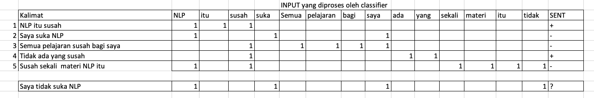

    
    <figcaption class="img-caption">Bersih-bersih debu karena blog sudah lama tak disentuh.</figcaption>

Halo semua, saya kembali 😁

Maaf baru kembali update blog ini.
Pasca semester enam, saya mencoba berbagai kegiatan mulai dari kerja praktik, lomba PPL Gemastik, menjadi koordinator asdos SDA, serta mengambil tugas akhir (skripsi).
Semua kegiatan tersebut mulai menyita waktu saya sejak liburan, alhasil saya tak sempat menulis pos semesteran seperti yang biasanya saya lakukan 😅 .

<iframe width="560" height="315" src="https://www.youtube.com/embed/lFyNqRNHkt0" frameborder="0" allow="accelerometer; autoplay; clipboard-write; encrypted-media; gyroscope; picture-in-picture" allowfullscreen></iframe>
<figcaption class="img-caption">Kondisi yang sebenarnya.</figcaption>

Terima kasih juga atas dukungan teman-teman untuk meneruskan blog ini, terharu ada yang tertarik membaca blog ini 🥺 .
Padahal awalnya, blog ini saya buat hanya untuk menuliskan pikiran-pikiran aneh saya 🤯 .

<figcaption class="img-caption">Permintaan pembaca.</figcaption>

Oke tanpa perlu panjang lebar lagi, berikut ini pengalaman saya selama menjalani semester enam!

## Metodologi Penelitian & Penulisan Ilmiah	(MPPI)

**Kelompok:** Mata Kuliah Wajib Fakultas  
**Jumlah SKS:** 3  
**Prasyarat:** MPKT A, MPKT B 

    
    <figcaption class="img-caption">Bermain paper.</figcaption>

Mata kuliah ini mengajarkan kita bagaimana melakukan riset ilmiah.
Materi mata kuliah ini sebagian besar membahas tentang metodologi riset.
Di matkul ini, kita akan dibiasakan untuk membaca paper.
Kelas MPPI saya cukup menarik karena diajar Bu Mia (Laksmita), ga salah pilih kelas memang 😃 .

Tugas-tugas matkul ini tentu saja tentang paper.
Tugas-tugas tersebut membahas tentang paragraph development, critique paper, dan review paper.
Selain tugas tersebut, di akhir juga ada mini research yaitu proyek berkelompok untuk melakukan riset.

Matkul ini menurut saya cukup unik dibanding mata kuliah yang lain.
Bahasa Inggris cukup umum digunakan di mata kuliah ini.
Mungkin karena banyak paper bagus, walau dari Indonesia, ditulis dalam bahasa Inggris?
Selain itu, tentu saja MPPI ini adalah matkul yang cukup dalam membahas tentang penulisan, hal yang sangat jarang dibahas di matkul lain.
Di saat matkul lain membahas kodingan yang bikin pusing, MPPI ini membahas penulisan yang alhamdulillah...

    
    <figcaption class="img-caption">Emang semua bikin pusing.</figcaption>

## Data Science and Analytics (DSA)

**Kelompok:** Mata Kuliah Wajib Program Studi Ilmu Komputer  
**Jumlah SKS:** 3  
**Prasyarat:** Statistika dan Probabilitas, Basis Data  

    
    <figcaption class="img-caption">Bermain data.</figcaption>

Seperti namanya, mata kuliah ini membahas tentang... data.
Nyaris seluruh materi mata kuliah ini adalah algoritma-algoritma machine learning sederhana.
Beberapa materi mata kuliah ini adalah Principal Component Analysis (PCA); klasifikasi menggunakan Naive Bayes, k Nearest Neighbor, dan SVM; regresi Ridge dan Lasso; serta hierarchical dan k Means Clustering.

Tugas dari matkul ini tentu saja ngoding.
Terdapat empat tugas individu yang dikerjakan menggunakan Jupyter notebook.
Biasanya, saya menggunakan [Google Colab](https://colab.research.google.com/) karena bisa diatur sehingga ada kucingnya 😆 .

<figcaption class="img-caption">Google Colab.</figcaption>

Menurutku matkul ini cukup santai.
Kodingannya tidak begitu sulit karena menggunakan _library_ siap pakai.
Matematikanya juga tidak begitu sulit karena tidak terlalu diperdalam, diasumsikan sudah dipelajari di matkul lain seperti alin dan anum.
Oh ya, di kurikulum terbaru, matkul ini dilebur dengan Sistem Cerdas dan menjadi matkul baru yaitu Kecerdasan Artifisial &
Sains Data Dasar.

## Logika Komputasional (Logkom)

**Kelompok:** Mata Kuliah Pilihan Bidang Minat Ilmu Komputer  
**Jumlah SKS:** 3  
**Prasyarat:** Sistem Cerdas  

    
    <figcaption class="img-caption">Bermain logika.</figcaption>

Mata kuliah peminatan yang satu ini fokus membahas logika baik secara matematik maupun secara komputasional sehingga dapat berjalan secara efisien dan memiliki kegunaan praktis.
Jika ingat _propositional logic_ yang sempat dibahas di matematika diskret, maka kira-kira topik seperti itu yang dibahas di mata kuliah ini.
Tentu saja karena logic merupakan fokus mata kuliah ini, pembahasannya lebih dalam dibandingkan di matematika diskret.
Selain itu, ada juga materi baru seperti modal logic, SAT solver, dan lambda calculus.

Mata kuliah ini saya ambil karena sangat santai, cocok untuk melepas penat dari mata kuliah lain yang tugasnya tidak habis-habis.
Hanya ada tugas akhir berkelompok yang menyelesaikan masalah dengan sebuah SAT Solver yaitu [MiniSat](http://minisat.se/).
Sebenarnya, menurut BRP bisa ada beberapa PR namun ternyata hingga akhir hanya ada 1 PR saja yang dirilis ketika belum memasuki masa PJJ.
Walau begitu, ada beberapa worksheet yang bisa dikerjakan secara mandiri untuk membantu pemahaman materi dan mempersiapkan ujian.

Mata kuliah logika lain yang cukup serupa adalah Pemrograman Logika (pemlog).
Sebenarnya saya lebih mengincar pemlog karena juga ingin ngoding.
Sayangnya, jam pemlog saat itu bertabrakan dengan MPPI yang tidak saya sodok sebelumnya sehingga pilihan saya hanya logkom saat itu.

## Layanan & Aplikasi Web (LAW)

**Kelompok:** Mata Kuliah Pilihan Bidang Minat Ilmu Komputer  
**Jumlah SKS:** 3  
**Prasyarat:** Jaringan Komputer, Perancangan & Pemrograman Web  

    
    <figcaption class="img-caption">Bermain arsitektur.</figcaption>

Awalnya, saya tidak tahu mata kuliah apa ini sebelum diajak Navi.
Karena terdengar seperti matkul ngoding, saya ambil saja ketika masa _add drop_.
Ternyata, sangat mudah mengetahui topik matkul ini jika namanya diterjemahkan ke bahasa Inggris.

Layanan web = webservice.

Di PPW, kita sudah belajar tentang webservice dalam bentuk RESTful.
Jadi kira-kira isi matkul ini... ngoding backend.
Tugas-tugasnya sebagian besar tentang ngoding backend.
Mungkin perlu dibuat frontend tetapi bukan inti soalnya, cukup sederhana aja.
Misal membuat tampilan progress bar di materi message queue + websocket.

Tugasnya terdiri dari beberapa tugas pemrograman.
Pada saat saya mengambil LAW ini, terdapat 3 tugas pemrograman dan 1 tugas akhir.
Lama waktu pengerjaannya lumayan, satu tugas biasanya saya selesaikan dengan membagi pengerjaan dalam beberapa hari.
Selain tugas, sebenarnya juga ada _code on the spot (COTS)_ yaitu ngoding di kelas langsung ketika diberi tugas.
Tentu saja COTS ini menjadi hilang ketika PJJ.

Yang menarik dari matkul ini adalah bahasa pemrograman yang digunakan bebas.
Kesempatan ini saya gunakan untuk mencoba Golang.
Selain itu, saya juga belajar banyak hal baru seperti NGINX, gRPC, message queue, WebRTC, dan banyak materi _backend_ lainnya.
Praktek di mata kuliah ini juga cukup seru.
Deployment difasilitasi menggunakan server khusus yang dapat diakses menggunakan OpenVPN.

Saya belajar cukup banyak dari matkul ini.
Ilmu NGINX ternyata banyak saya gunakan di semester itu juga, saat mengerjakan PPL.
Message queue banyak saya gunakan saat magang.
Jika tertarik dengan backend development, matkul peminatan ini wajib diambil.

## Natural Language Processing (NLP)

**Kelompok:** Mata Kuliah Pilihan Bidang Minat Ilmu Komputer  
**Jumlah SKS:** 3  
**Prasyarat:** Teori Bahasa & Automata, Sistem Cerdas  

    
    <figcaption class="img-caption">Bermain kata.</figcaption>

Mata kuliah yang dikenal juga sebagai mata kuliah Pengolahan Bahasa Manusia ini merupakan matkul cabang peminatan kecerdasan artifisial.
Saya mengambil mata kuliah ini karena masih tertarik mengeksplor cabang kecerdasan artifisial.
Pilihan lain yang cukup populer tentu saja matkul Machine Learning (ML).
Namun karena menurut saya kedua matkul ini lumayan berat, saya hanya berani ambil satu saja.
Ternyata, sebagian besar mahasiswa yang mengambil NLP ini juga mengambil ML.
Setahu saya, hanya saya dan FwP yang mengambil NLP namun tidak mengambil ML.
Mungkin karena niat saya hanya mengeksplor ya belum yakin untuk fokus di bidang ini sehingga masih mengambil matkul di bidang lain yang tidak mudah juga seperti LAW.
Tapi kalau dipikir-pikir saat ini, memang sepertinya jika mengambil NLP sebaiknya juga mengambil ML jika sudah yakin ingin menekuni bidang ini.

Alasan lain saya mengambil mata kuliah ini karena sepertinya cukup mirip dengan matkul information retrieval yang saya ambil semester lima lalu.
Lalu apa sih perbedaan IR dan NLP?
Sebenarnya saya sudah pernah menjelaskan di [pos semester lima](https://fairuzi10.com/blog/semester-lima-fasilkom/), namun menurut saya masih terlalu _vague_.
Saya ingin mencoba menjelaskan kembali perbedaannya.
Mengutip dari [sebuah jawaban Quora](https://www.quora.com/What-are-the-differences-between-Natural-Language-Processing-NLP-and-Information-Retrieval-IR), NLP berusaha memahami (_understanding_) dan meng-generate (_generation_) bahasa manusia, sedangkan IR berusaha mendapatkan informasi yang relevan sesuai dengan informasi yang dibutuhkan.

Informasi yang dicari oleh IR banyak yang berupa teks, sehingga cukup bersinggungan dengan NLP.
Walau begitu, banyak juga informasi yang bukan berupa teks.
Karena itu, IR juga mempelajari cabang non-teks misalnya _geographical information retrieval_.
Anggaplah kita ingin membangun sebuah sistem _search engine_ seperti Google, pemrosesan teks tentu saja diperlukan.
Namun, ilmu non-teks juga diperlukan, misalnya untuk membangun fitur _image search_.
Karena IR berfokus untuk mencari informasi yang relevan, maka banyak topik-topik seputar pemrosesan _query_.
Beberapa di antaranya adalah relevance feedback, pembuatan indeks beserta pembobotannya, serta evaluasi sistem dengan memperhatikan urutan.
Topik-topik tersebut tidak dibahas di NLP.

Di sisi lain, fokus NLP adalah bahasa manusia.
Slide berikut sepertinya cukup deskriptif untuk menjelaskan hal tersebut.

NLP membahas topik yang tidak dipelajari di IR, misalnya _tree_ untuk merepresentasikan struktur sebuah kalimat.
Berikut contoh yang diambil dari [buku Jurafsky](https://web.stanford.edu/~jurafsky/slp3/).

    
    <figcaption class="img-caption">Dependency tree dan parse tree.</figcaption>

Materi lain yang sangat menarik menurut saya adalah _word embedding_.
Word embedding adalah representasi kata dalam vektor bilangan ril.
Vektor ini uniknya menyimpan arti semantik dari kata tersebut.
Misalnya, raja adalah sebutan untuk seorang pria pemimpin kerajaan.
Padanan yang tepat untuk raja bagi wanita adalah ratu.
Maka jika menggunakan word embedding, formula berikut berlaku: 
$\vec{raja} - \vec{pria} + \vec{wanita} \approx \vec{ratu}$.
Jika tertarik membaca lebih lanjut mengenai word embedding ini, silakan baca [jawaban Quora oleh Victoria Lestari berikut](https://id.quora.com/Apa-metode-penambangan-teks-sehingga-kata-kata-dengan-konteks-serupa-seperti-cinta-dan-hati-diberi-label-dalam-kelompok-yang-sama/answer/Victoria-Lestari).

Tugas dari mata kuliah ini sendiri cukup banyak.
Terdapat empat tugas berkelompok (TK), sebuah proyek akhir, dan beberapa worksheet.
Setiap TK cukup berat, harus dicicil pengerjaannya dalam beberapa hari.
Rasanya NLP ini satu-satunya matkul yang tugasnya jarang benar-benar saya selesaikan.
Biasanya ada soal-soal bonus yang tidak sempat dikerjakan 😂 .

Hal menarik tentang NLP di luar kelas adalah kegiatannya yang cukup aktif.
Riset di bidang ini cukup aktif di Fasilkom.
Untuk melihat daftar publikasi maupun info lain, dapat mengunjungi [situs lab IR-NLP Fasilkom](https://ir.cs.ui.ac.id/new/publications.php).
Selain itu, lab IR-NLP baru-baru ini juga mulai mengadakan _talk_ rutin dua mingguan.

    
    <figcaption class="img-caption">IR-NLP Talk.</figcaption>

Lalu bagaimana pengalaman saya selama mengambil NLP?
Pertama, tentu saja seru, terlihat lah ya dari panjangnya penjelasan saya pada bagian NLP ini.
NLP ini juga matkul yang akhirnya saya ambil sebagai topik tugas akhir (skripsi) saya.
Bagaimana dengan nilainya?
Sayangnya nilai di matkul ini agak sulit, bahkan sempat dibahas oleh Pak Mahen di awal pertemuan 😂 .
Lalu apakah NLP mudah?
Sayangnya juga tidak.
Konsep yang dibahas di NLP lumayan susah, walau mungkin biasa saja jika dibandingkan dengan matkul AI lain.
Tugas yang terkadang membutuhkan kode juga sulit dibuat.
Walau paham konsepnya, tidak mudah membuat kode NLP, terutama dengan _pressure_ deadline-deadline tugas lain di semester enam.
Tugas ngulinya pun cukup memakan waktu, misal melakukan anotasi di proyek akhir.
Agak sulit merekomendasikan matkul ini di semester enam terutama karena DAA, Anum, dan PPL juga diambil di semester yang sama pada kurikulum terbaru.
Kombinasi DAA, Anum, PPL, dan NLP rasanya cukup sakti juga, yang capek mikir ada, yang capek nguli ada, yang keduanya juga ada.
Kalau untuk semester delapan mungkin cocok, tapi malah jadi agak sulit dibuat menjadi topik tugas akhir ya, bingung juga 🙃 .

## Proyek Perangkat Lunak (PPL)

**Kelompok:** Mata Kuliah Wajib Program Studi Ilmu Komputer  
**Jumlah SKS:** 6  
**Prasyarat:** Rekayasa Perangkat Lunak, Basis Data  

<iframe width="560" height="315" src="https://www.youtube.com/embed/XUhVCoTsBaM" frameborder="0" allow="accelerometer; autoplay; encrypted-media; gyroscope; picture-in-picture" allowfullscreen></iframe>
<figcaption class="iframe-caption">
    Lagu yang cocok untuk membaca bagian ini.
</figcaption>

Mata kuliah ini sepertinya sudah menjadi legenda di Fasilkom. Well, setidaknya di jurusan ilmu komputer. 
Bagi anak sistem informasi, mata kuliah yang setara dengan PPL adalah propensi.
Seperti namanya, di PPL kita akan bekerja dalam proyek pengembangan perangkat lunak.
Mata kuliah ini juga ada [akun instagram resmi](https://www.instagram.com/pplfasilkomui/) loh, silakan intip jika penasaran.
Contoh kode proyek PPL dapat dilihat di [repositori GitLab CS](https://gitlab.cs.ui.ac.id/ppl-fasilkom-ui/2020/ppl-c).

Prakteknya pada tiap tahun sepertinya berubah-ubah, namun saya akan coba mendeskripsikan apa yang terjadi pada saat semester ini ketika saya mengambilnya.
Kita diminta untuk membentuk kelompok berisikan lima orang.
Setelah itu, diberikan daftar client beserta proyek yang tersedia dan tiap kelompok akan memilih satu proyek berbeda dari daftar tersebut.
Pembuatan kelompok dan pemilihan proyek dibebaskan.
Biasanya, di grup jurusan akan ada yang mengkoordinasi pembentukan kelompok dan pemilihan proyek sehingga mempermudah untuk melihat orang-orang mana saja yang sudah mendapat kelompok dan proyek-proyek mana yang sudah diambil.
Keren sekali memang teman-teman aktifku ini, bangga 🥺 .

Tiap kelompok akan mengerjakan proyek didampingi dengan scrum master dan product owner.
Selain itu, ada juga asdos devops per kelas yang akan membantu masalah infrastruktur serta asdos kelas yang membantu melakukan individual review.
Scrum master, asdos devops, dan asdos kelas merupakan mahasiswa Fasilkom layaknya asdos biasa pada mata kuliah lain.
Sedangkan product owner bukan, namun telah diberikan pelatihan mengenai scrum.
Mungkin product owner ini diharapkan mampu menjembatani komunikasi antara mahasiswa Fasilkom dan client yang mungkin tidak begitu teknikal.

Karena PPL ini terdiri dari 6 SKS, terdapat 2 pertemuan dalam satu pekan yang masing-masingnya terdiri dari 3 SKS.
Namun, biasanya pertemuan yang digunakan hanya satu saja, misalkan untuk kelompok saya pada hari Selasa.
Jadi, kelompok-kelompok di tiap kelas dipisah menjadi dua yaitu yang kelas di hari Selasa dan yang kelas di hari Kamis.
Satu sprint berlangsung selama dua pekan.
Terdapat 5 sprint, sehingga kurang lebih 10 minggu.
Agar lebih mudah menjelaskan, ambil contoh penerapan pada kelompok saya.
Sprint review dilakukan pada hari Selasa bersama dosen dan client.
Setelah itu, pada waktu yang berdekatan sesuai dengan kesepatakan bersama scrum master dan product owner, dilakukan sprint retrospective dan sprint planning.
Daily stand up dilakukan dua kali seminggu, misal hari Senin dan Kamis.
Selain kegiatan terkait sprint, terdapat juga individual review pada hari Selasa ketika tidak ada sprint review.
Jadi tiap hari Selasa bergantian antara sprint review, individual review, sprint review, individual review, dan seterusnya.

Detail penilaian PPL cukup rumit.
Kalau kata Pak Ade, kita tidak perlu memusingkan skema penilaian, cukup lakukan yang terbaik saja.
Memang dosen pemfung saya semester lalu ini selalu keren 🤩 .
Tapi kira-kira penilaian PPL seperti berikut.
Penilaian dilakukan baik secara individu maupun berkelompok.
Mungkin bisa dikatakan penilaian individu pada individual review dan penilaian kelompok pada sprint review.
Saya kurang tahu mengenai penilaian kelompok bagaimana sistemnya, sepertinya dosen, client, scrum master, dan product owner memberi nilai pada masing-masing sprint.

Penilaian yang cukup jelas adalah individual review.
Agar lebih terbayang, silakan lihat [spreadsheet individual review berikut](https://docs.google.com/spreadsheets/d/1vFYxxwq4x3GD7VGTAtNQmwdms6LiymTQq-Ju86nQU5s/edit?usp=sharing).
Terdapat tiga aspek yang dinilai: cognitive, hardskills, dan softskills yang masing-masing dinilai dengan skala 1-4.
Bagian cognitive dinilai dengan artikel blog post dengan platform bebas seperti Medium.
Kita diminta untuk menulis total 10 artikel, berarti sekitar 2 artikel pada tiap sprint namun dengan batas maksimal setor 3 artikel per sprint.
Terdapat 6 topik wajib (_mandatory_) dan 4 sisanya dapat dipilih bebas (_elective_). 
Link artikel yang dibuat kemudian kita setor sebagai komentar pada spreadsheet penilaian dan akan dibaca oleh dosen.
Pada sesi individual review, kita akan ditanya tentang topik tersebut maupun diberi masukan dan tentunya akan dinilai.
Jika masih ada yang bisa diperbaiki, maka kita dapat memperbaikinya dan nilainya akan disesuaikan pada individual review selanjutnya.
Jika artikel dan pemahaman saat individual review sangat baik, maka maksimal kita akan mendapat nilai 3 dari 4.
Untuk mendapat nilai 4, maka kita harus menghubungi dosen _expert_ untuk topik tersebut, bisa dibilang individual review dengan dosen tersebut.
Bagian kedua adalah hardskills yang dinilai oleh asdos kelas.
Bagian ini menilai kode yang kita buat apakah sesuai dengan _best practice_. 
Kita hanya perlu menunjukkan bagian-bagian kode yang sesuai, lalu asdos akan memberi nilai untuk setiap aspek.
Salah satu tool yang digunakan pada bagian ini adalah [SonarQube](https://www.sonarqube.org/) untuk mengecek isu-isu pada kode secara otomatis.
Bagian ketiga adalah softskills yang dinilai oleh dosen.
Kita hanya perlu bercerita tentang pengerjaan pada sprint saat itu yang berkaitan dengan aspek yang dinilai.

    
    <figcaption class="img-caption">Kejadian di suatu malam yang cerah.</figcaption>

Selain penilaian tersebut, PPL juga memiliki beberapa award.
Award-award ini dapat dilihat pada [akun Instagram PPL](https://www.instagram.com/pplfasilkomui/).
Pada tiap sprint, terdapat beberapa award yaitu Man of The Sprint, Product of The Sprint, dan Best Articles.
Di akhir, terdapat exhibition yang memamerkan produk-produk PPL.
Tentu saja di exhibition ini terdapat beberapa kategori _award_ juga.
Award-award ini diumumkan di akun Instagram, sedangkan _exhibition_ juga dibuat [video awarding moment-nya](https://youtu.be/2uPamOv7G8A).
Saya sendiri sempat mendapat award [best article](https://www.instagram.com/p/B_oriXXB-kV/), ngga nyangka 😭 . 

    
    <figcaption class="img-caption">Mendapat best article PPL.</figcaption>

    
    <figcaption class="img-caption">Beneran ngga nyangka, bukan merendah.</figcaption>

Di awal semester, kelas matkul ini menjelaskan tentang apa yang akan dilakukan selama satu semester ini, belajar tentang hal baru seperti _sprint planning_, tak ketinggalan juga _guest lecture_.
Karena di awal cukup santai, sehingga saya juga bertanya di mana sulitnya.
Ketika sprint berlangsung, barulah pertanyaan tersebut terjawab.

Tantangan pertama PPL adalah tugasnya yang sangat berat.
Tiap minggu pekerjaan kita akan dinilai.
Pada individual review, sekitar dua artikel kita akan dinilai.
Membuat dua artikel itu tidak mudah, bahkan bagi saya yang punya blog ini.
Selain itu, kode juga dinilai pada bagian hardskills oleh asdos kelas.
Seperti yang dapat dilihat pada spreadsheet, aspek yang dilihat cukup banyak.
Ngodingnya juga diwajibkan TDD, yang mana bikin test-nya kadang lebih sulit dibanding bikin fiturnya.
Pada sprint review pun pekerjaan juga tidak lebih mudah.
Ada satu bagian yang tidak selesai, maka fitur tidak bisa di-deliver ke client.
Baik individual review maupun sprint review terasa seperti tugas besar.
Tugas-tugas besar tersebut selalu menemani selama 10 pekan.
Ini lah mengapa banyak ucapan PPL itu bukan 6 SKS.
Setuju.
Ga heran Kak Ayaz punya bagian khusus PPL di [blognya](http://ayazdzulfikar.blogspot.com/2018/12/definitely-not-2018-post.html).

Tantangan kedua matkul ini adalah infrastrukturnya.
PPL mengharuskan kita menggunakan [GitLab CS UI](https://gitlab.cs.ui.ac.id).
GitLab runner yang disediakan untuk menjalankan CI/CD terbatas, sudah ketebak kan apa yang terjadi ketika menjelang sprint review.
Untuk masalah ini, solusi umum yang dilakukan oleh banyak kelompok adalah menggunakan GitLab runner sendiri.
Jadi satu kelompok patungan untuk menyewa server yang akan digunakan untuk menjalankan GitLab runner, lalu dihubungkan dengan GitLab CS.
Masalah lain adalah server deployment-nya yang berada di Fasilkom jika tidak disediakan oleh client.
Jika menggunakan server Fasilkom, untuk melakukan koneksi ke luar, kita harus mengatur proxy ke `http://proxy.cs.ui.ac.id:8080`.
Sederhana, tetapi setiap tools yang membutuhkan komunikasi ke luar harus di-set seperti itu, sehingga cukup ribet.
Belum lagi tools yang belum support proxy, misalnya bagi saya waktu itu Netlfiy CLI.
Tentu saja masalah proxy ini tidak akan terjadi jika menggunakan server lain.
Masalah infrastruktur ini sangat menjengkelkan.
Saya pernah kumpul di hari Sabtu dengan kelompok saya untuk mengerjakan PPL, namun yang saya kerjakan seharian hanyalah masalah infrastruktur ini.
Iya sih kalau jadi engineer daily life-nya ya seperti itu, tapi kalau untuk kuliah, bayangkan berapa tugas yang bisa saya kerjakan jika tidak ada masalah infrastruktur ini.
Untuk masalah GitLab runner, saya ga akan mikir dua kali untuk bayar demi menghindari masalah ini.
Untuk server deployment, jika aplikasi yang dibuat tidak membutuhkan spesifikasi tinggi, juga bisa di-deploy pada server GitLab runner.
Jika butuh spesifikasi tinggi, sangat _worth it_ sih untuk meminta server ke client.
Sangat disarankan menghindari masalah infrastruktur ini.
Waktu yang berharga dapat digunakan untuk mengerjakan tugas lain dibanding mengurus masalah infrastruktur yang bahkan tidak masuk penilaian.

<iframe width="560" height="315" src="https://www.youtube.com/embed/2OMGEYZZEh8" frameborder="0" allow="accelerometer; autoplay; clipboard-write; encrypted-media; gyroscope; picture-in-picture" allowfullscreen></iframe>
<figcaption class="iframe-caption">
    Mari beralih ke PPL premium.
</figcaption>

Client dan requirement-nya juga menjadi tantangan tersendiri di mata kuliah ini.
Ketika mendapat daftar client beserta proyeknya, coba pilih yang sesuai.
Misal bagi saya, saya akan melihat siapa client-nya, apa proyek yang akan dibuat, dan seperti apa tech stack-nya.
Saya akan menghindari proyek yang masih kurang jelas requirement-nya karena mendefinisikan requirement juga merupakan pekejraan tambahan tersendiri yang tidak mudah.
Saya juga akan menghindari proyek yang membutuhkan tech stack sulit, misalnya mobile sekaligus web.
Selain itu, detail requirement pada tiap sprint juga harus diperhatikan, jangan sampai terlalu susah dikerjakan teknisnya.
Kunci pada bagian ini adalah komunikasi yang baik kepada setiap stakeholder.
Stakeholder ini mungkin tidak terlalu mengerti hal teknis, sehingga cara menyampaikannya juga harus dipikirkan.
Dulu kelompok saya pernah dibantu Bu Hening dalam hal ini, terima kasih bu 🙏 .

Tantangan lain dari PPL adalah sistemnya yang berkelompok ditambah dengan tugasnya yang berat.
Satu saja yang _skip_, siap-siap saja ada drama.
Untung saja kelompok saya aman sentosa, terima kasih kelompok Mantan Aab dan Navi yang sudah merekrut saya 🙏 .
Saran untuk bagian ini sih berkelompok dengan orang yang cocok.
Selain itu, lebih baik jika punya keahlian yang beraneka ragam.
Misal ada yang jago devops, ada yang jago ngoding, ada yang jago design, dan lain-lain.
Salah satu alasannya karena pasti akan ada pekerjaan ekstra yang tidak bisa dihindari.
Kalau tidak orang yang suka bagian itu, siapa yang mau ngerjain?
Misal bagian infrastruktur tadi, kalau tidak ada yang suka devops, siapa yang mau mengerjakan padahal masuk nilai juga tidak?
Kalau tidak dikerjakan, proyek juga tidak jalan.
Terima kasih kepada Mas Gio yang sudah carry kelompok saya di bagian ini 🙏 .

Begitulah PPL.
Sebenarnya saya belajar cukup banyak dari matkul ini.
Pengalaman dengan kelompoknya juga cukup berkesan.
Yang jadi masalah, PPL itu seharusnya jelas bukan ✨ 6 SKS ✨ .
Cape pol.

Mata kuliah bukanlah satu-satunya hal yang dapat dibahas di semester ini.
Semester enam cukup berkesan bagi saya karena dua hal.
Pertama, tentu saja karena semester enam ini seharusnya merupakan semester terberat di Fasilkom.
Walau saya belum bisa membayangkan bagaimana bisa ada semester yang lebih berat dari semester-semester sebelumnya, tapi rasanya percaya aja karena selama kuliah memang semester di depan pasti lebih berat lagi.
Hal lain yang cukup mengagetkan adalah adanya pandemi COVID-19.
Berikut ini ulasan saya untuk dua hal tersebut.

## Pandemi COVID-19

Di hari Jumat yang random menjelang UTS, tiba-tiba terdengar kabar UI akan melaksanakan Pembelajaran Jarak Jauh (PJJ).
Padahal, saat itu tugas dari berbagai matkul sedang banyak-banyaknya.
Karena transisi PJJ ini, terdapat dua pekan masa tunda sebelum memasuki masa PJJ.
Akhirnya, hari-hari yang penuh dengan tugas itu tiba-tiba menjadi sepi.
Walaupun tetap melanjutkan nugas, namun bebannya berkurang drastis karena tidak ada kelas dan tugas tambahan, sehingga terasa sangat aneh.

    
    <figcaption class="img-caption">Ilustrasi masa tunda.</figcaption>

Saya juga mulai mencari hiburan lain, misalnya langganan Netflix dengan teman-teman.
Emang dah dikasih tugas banyak ngeluh dikasih kebebasan ngelunjak 😫 .

<iframe width="560" height="315" src="https://www.youtube.com/embed/Mui8Em65hl0" frameborder="0" allow="accelerometer; autoplay; clipboard-write; encrypted-media; gyroscope; picture-in-picture" allowfullscreen></iframe>
<figcaption class="img-caption">Akibat langganan Netflix di kala PJJ.</figcaption>

Ngga deh bercanda, tetep ngerjain PPL kok pak/bu 🙏 .

    
    <figcaption class="img-caption">Netlify > Netflix demi PPL.</figcaption>

## Semester Terberat

Dengar-dengar, semester enam ini semester terberat di Fasilkom.
Ternyata benar, setelah menjalani semester enam, memang sangat berat.
Kalau dipikir-pikir alasannya, tentu saja karena ada ✨ PPL ✨ .
Seperti yang dijelaskan sebelumnya, tugas PPL selalu ada tiap minggu bergantian antara individual review dengan sprint review.
Tugas-tugas ini merupakan tugas yang berat.
Belum lagi ditambah dengan tugas-tugas matkul lain.
Alhasil, setiap minggu adalah minggu yang hectic.
Padahal seumur-umur di Fasilkom, belum pernah ada minggu yang hectic terus-terusan.
Tugas memang selalu ada, tapi kebanyakan tidak berat, _tinggal_ dikerjakan saja.
Beberapa matkul punya tugas besar yang cukup berat, tugas semacam inilah yang jika terkumpul beberapa di suatu minggu, akan menjadi minggu yang hectic.
Untungnya, minggu hectic ini tidak terjadi berturut-turut.
Mungkin minggu ini hectic, minggu depan tidak, minggu depannya lagi hectic, dan seterusnya.
Kecuali di semester enam ini.
Bersyukur banget udah nyodok anum sebelumnya, ga kebayang bakal gimana kalau belum.
[Tweet Sage](https://twitter.com/sagehs/status/1250475533734825984) berikut mencerminkan kondisi semester enam dengan cukup baik.

    
    <figcaption class="img-caption">Kondisi tugas semester enam.</figcaption>

Saya menyadari bahwa semester enam saya tidak beres ketika saya mengerjakan tugas sampai malam setiap hari berturut-turut.
Biasanya, malam saya nugas hanya ketika ada deadline saja.
Malam lainnya paling nongkrong di sekre, kumpul Ristek, main, atau apalah, bukan mengerjakan tugas matkul terus-terusan.
Bahkan, saya pernah baru tidur setelah subuh karena begadang mengerjakan artikel PPL.
Mungkin bagi mahasiswa lain begadang seperti itu biasa.
Namun bagi saya yang bukan _night owl_, begadang seperti ini tidak pernah saya lakukan sebelumnya, bahkan ketika menyelesaikan skripsi di semester selanjutnya.
Dengan kata lain, manajemen waktu saya pertama kalinya berantakan di semester ini.
Walau begitu, kalau dipikir-pikir sekarang saya juga masih belum tau bagaimana caranya bisa lebih baik dari itu.
Rasanya memang tugas-tugas pada semester enam sulit dikerjakan dengan waktu 24 jam sehari.
Andai tidak ada masa tunda PJJ dan masa libur lebaran, saya tidak tahu apa yang akan terjadi.
Di masa tunda dan libur lebaran inilah saya mereview materi-materi yang saya agak skip dan saya pikir susah.
Di situ saya sadar, kalau ternyata materi-materi tersebut biasa saja. Materi-materi tersebut sebelumnya tidak bisa masuk otak saya karena saya mengantuk sehingga tidak fokus saat kelas.
Kelelahan saya ini tentu saja karena saya mengerjakan ✨ PPL ✨ .

Hal lain yang mengingatkan saya akan sulitnya semester ini adalah ketika saya tidak perform di DDP 2, matkul asdosan saya.
Saat itu, saya bersama Sage dan Salman menjadi koordinator asdos DDP 2.
Di awal, saya cukup rajin untuk datang ke lab maupun me-review soal-soal yang akan dirilis.
Semua hal itu berubah ketika sprint PPL berjalan.
Boom 💥 .
Sekalipun saya tidak pernah melakukan itu lagi hingga PJJ tiba.
Barulah ketika sprint 4 yang mana hasil kelompok saya mulai cukup baik, saya dapat kembali aktif mengurus DDP 2.
Walau saya sangat merasa bersalah di fase skip ini, saya juga bingung harus apa dengan kondisi waktu itu.
Terima kasih kepada Sage dan Salman yang mengisi keskipan saya pada fase ini 🙏 .

Demikian pengalaman semester enam saya yang berat, berkesan, dan tentu saja tidak ingin saya ulangi.
Semoga bermanfaat bagi teman-teman yang akan menjalani semester enam! 😄