Bertemu lagi di pos semesteran!

Pos ini didedikasikan untuk teman saya yang banyak maunya.

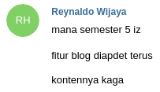
<figcaption class="img-caption">Tuntutan masyarakat.</figcaption>

Langsung saja, mari kita bahas semester yang sudah _sangat ilkom_ ini. Di semester ini, saya mengambil 3 matkul normal, 1 matkul nyodok, dan 2 matkul peminatan.

## Rekayasa Perangkat Lunak (RPL)

**Kelompok:** Mata Kuliah Wajib Program Studi Ilmu Komputer  
**Jumlah SKS:** 3  
**Prasyarat:** DDP 2, Basis Data

Di matkul ini kita belajar bagaimana merancang sebuah perangkat lunak. Isi matkul ini yaitu _software development process_ (Waterfall, Scrum, dkk); berbagai jenis diagram yaitu _use case diagram_, _class diagram_, _sequence diagram_, dan _interaction diagram_; serta _software testing_. Ada 2 tugas individu, 4 tugas kelompok berisi 7 orang yang terkadang diminta untuk dipresentasikan, serta kuis 3 kali. Tugasnya biasanya seputar membuat diagram. Menurut saya, tugas matkul ini yang paling ringan dibanding mata kuliah yang lain, namun sering kali bingung mengerjakannya karena dari sekian pilihan cara menjawab, tidak tahu mana yang benar. Mungkin saja karena _nature_ soalnya memang _open-ended_. Dengar-dengar, pada tahun sebelumnya ada tugas akhir ngoding seperti PPW di matkul ini namun pada tahun ini tidak ada tugas ngoding sama sekali.

## Jaringan Komputer (Jarkom)

**Kelompok:** Mata Kuliah Wajib Program Studi Ilmu Komputer  
**Jumlah SKS:** 4  
**Prasyarat:** Sistem Operasi, DDP 1

Matkul ini membahas bagaimana internet bekerja. Ada pembagian 5 layer pada jaringan yaitu _application layer_, _transport layer_, _network layer_, _link layer_, dan _physical layer_. Jarkom ini kurang lebih membahas masing-masing layer secara mendalam kecuali _physical layer_. Sebagai gambaran, kita akan belajar bagaimana komputer mendapat IP address, bagaimana data yang kita kirim mendapatkan jalannya ke komputer tujuan, bagaimana jika ada komputer baru yang ditambahkan ke jaringan, dan lain-lain.

    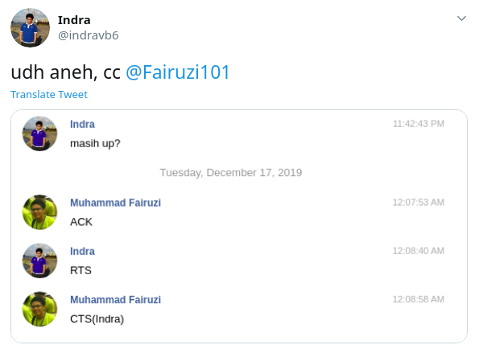
    <figcaption class="img-caption">Chat secara jarkom.</figcaption>

Ada lima tugas individu ditambah 1 tugas di lab secara berkelompok. Tugasnya kebanyakan menggunakan aplikasi simulator yaitu _packet tracer_ dan diakhiri dengan lab yang meminta kita melakukan _setup network_ secara fisik. Persentase tugas sangat besar, 40%, jadi jangan sampai _skip_. Tantangan di matkul ini adalah **banyaknya materi** yang diajarkan. Satu slide bisa mencapai 100 halaman dan pada tiap halaman terdapat informasi yang tidak bisa dianggap remeh. Rasanya jarkom ini memberikan informasi ke mahasiswa menggunakan UDP. Tidak paham? Makanya ambil jarkom. Oh ya, matkul ini cukup mirip dengan Jaringan Komunikasi Data (Jarkomdat) yang diambil anak Sistem Informasi.

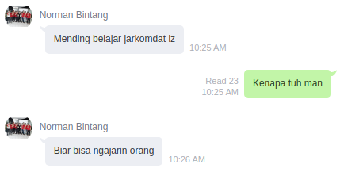

<figcaption class="img-caption">Norman the <i>cool kids</i>.</figcaption>

    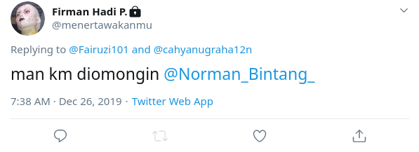
    <figcaption class="img-caption">Maaf man.</figcaption>

## System Programming (Sysprog)

**Kelompok:** Mata Kuliah Wajib Program Studi Ilmu Komputer  
**Jumlah SKS:** 3  
**Prasyarat:** Sistem Operasi, Struktur Data dan Algoritma

Mata kuliah ini membahas tentang sistem operasi (khususnya Linux) serta Raspberry Pi. Matkul ini kira-kira memperdalam OS pada sebelum UTS, lalu membahas Raspberry setelahnya. Uniknya, kelas Sysprog ini diadakan di lab, bukan kelas biasa. Ada 7 PR pada matkul ini dan setelah UTS, ada 1 proyek akhir berkelompok 5 orang yang menggunakan Raspberry Pi. Tidak ada UAS pada matkul ini, jadi bisa fokus mengerjakan proyek akhir. Karena tidak ada UAS, kita bisa menyelesaikan proyek akhir ini secepatnya lalu tidak perlu masuk kelas lagi. Terdengar indah, tapi sulit menjadi kenyataan. Sama seperti Jarkom, nilai tugas Sysprog ini juga tidak main-main, 35% untuk PR dan 35% untuk proyek akhir. Jangan sampai _skip_. Sama seperti Jarkom juga, materinya cukup banyak namun Sysprog ini lebih ke _random_, seperti menguji pengetahuan umum tentang Linux. Untuk Raspberry Pi-nya sendiri dipinjamkan namun kita harus membeli sensor-sensornya sendiri. Semakin banyak sensor semakin bagus karena yang dinilai adalah pemanfaatan _hardware_ (lebih tepatnya GPIO).

<iframe width="560" height="315" src="https://www.youtube.com/embed/MFQjy9zE3qA" frameborder="0" allow="accelerometer; autoplay; encrypted-media; gyroscope; picture-in-picture" allowfullscreen></iframe>
<figcaption class="iframe-caption">
    Contoh proyek kelompok teman saya yang sangat banyak "tempelan" layaknya Frankenstein.
</figcaption>

Biasanya nilai UTS akan hancur dan dibantu oleh nilai proyek ini, jadi harus dimanfaatkan sebaik mungkin. Jangan deadliner karena sangat banyak _surprise_ di proyek ini, setidaknya itu pengalaman saya. _Compile_ kernel gagal, _script_ tiba-tiba gak jalan, dan sebagainya sampai harus begadang menjelang deadline.

    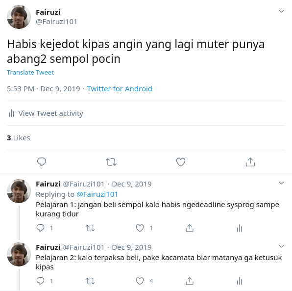
    <figcaption class="img-caption">Efek begadang sysprog.</figcaption>

## Desain dan Analisis Algoritma (DAA)

**Kelompok:** Mata Kuliah Wajib Program Studi Ilmu Komputer  
**Jumlah SKS:** 4  
**Prasyarat:** Struktur Data dan Algoritma

Matkul ini seharusnya diambil di semester 7, namun saya sodok. Isinya pembuktian kebenaran suatu algoritma, analisis kompleksitas (termasuk Master Theorem), _NP hardness_ (reduksi-reduksi), dan materi-materi algoritma lainnya. Matkul ini cukup mirip dengan SDA, bedanya adalah matkul ini tidak banyak membahas struktur data dan tidak ada sesi lab seperti SDA. Di tahun ini, ada 3 PR yang dikerjakan berdua dan 2 tugas yang dikerjakan berkelompok 4 orang. Tugas 1 sebelum UTS merupakan tugas soal biasa sedangkan tugas setelah UTS membahas sebuah algoritma yang dibebaskan pemilihannya, lalu dipresentasikan. Beberapa contohnya adalah All Source Shortest Path (ASSP), Maximum Flow, Hashing, dan Fourier Form Transform (FFT). Karena materinya sangat luas, jadi bingung sendiri waktu ujian belajar apa. Untung ternyata cuma masuk soal bonus. Matkulnya cukup seru terutama karena bukunya [Jeff Erickson](http://algorithms.wtf) yang bagus.

    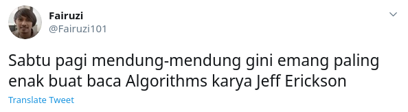
    <figcaption class="img-caption">Saatnya membaca buku algorithms karya Jeff Erickson.</figcaption>

## Pemrograman Fungsional

**Kelompok:** Mata Kuliah Pilihan Bidang Minat Ilmu Komputer  
**Jumlah SKS:** 4  
**Prasyarat:** Struktur Data dan Algoritma

Sesuai namanya, mata kuliah peminatan yang satu ini belajar tentang _functional programming_. Jika pernah ngoding JavaScript, pasti familiar dengan `.map`, `.filter`, dan `.reduce` yang memang merupakan bagian dari _functional programming_. Nah di matkul ini, kita belajar lebih banyak hal tentang _functional programming_ misalnya _pure function_, _higher order function_, _partial evaluation_, _lazy evaluation_, monad, dan teman-temannya.

    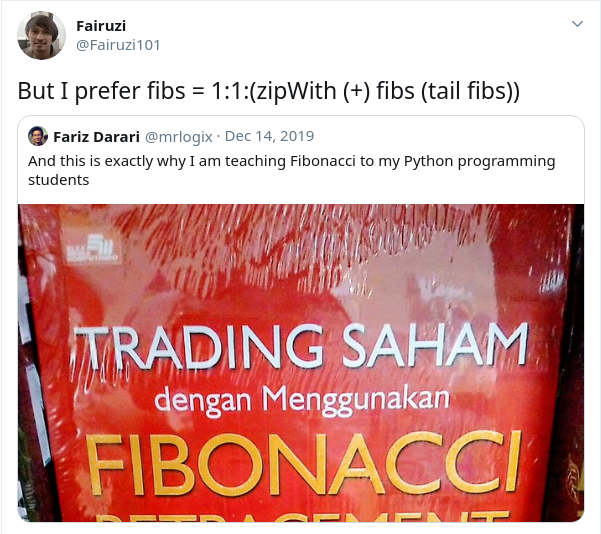
    <figcaption class="img-caption">Generator fibonacci di Haskell.</figcaption>

Setelah UTS, ada tugas akhir berkelompok yang dibebaskan topiknya namun harus mengimplementasikan _functional programming_. Kelompok saya memilih untuk membuat situs menggunakan Haskell sebagai _backend_ dan [ReasonReact](https://reasonml.github.io/reason-react/) sebagai _frontend_. Ya, saya juga bingung kenapa kelompok saya masokis sekali.

Matkul ini materinya sangat luas, mulai dari belajar Haskell hingga React. Saya sendiri merasa terlalu banyak materi yang diajarkan. Saya masih belum paham benar mengenai konsep-konsep yang menarik di _functional programming_ seperti monad dan lambda calculus karena hanya dibahas sekilas. Materi seperti React dan Redux yang tidak terlalu saya harapkan malah cukup sering dibahas. Saya sebenarnya lebih tertarik akan materi teoritis dari _functional programming_ sendiri, karena materi aplikatifnya sudah banyak di luaran sana karena populernya _framework-framework_ JavaScript. Tapi itu mungkin saya saja, jika kamu suka ngoding, mungkin ini matkul yang menarik. Pak Ade Azurat yang mengajar matkul ini juga baik dan suka memberikan kata-kata mutiara.

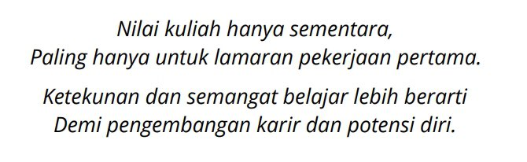
<figcaption class="img-caption">Tingkat kebijaksanaan yang aku impikan.</figcaption>

## _Information Retrieval_ (IR)

**Kelompok:** Mata Kuliah Pilihan Bidang Minat Ilmu Komputer  
**Jumlah SKS:** 3  
**Prasyarat:** Struktur Data dan Algoritma

Matkul ini pertama kali saya tahu ketika seleksi tim inti ICPC pada semester 3. Setelah selesai kontes, kating Omega ngedeadline tugas IR yang saat itu menggunakan [DP LCS](https://www.geeksforgeeks.org/longest-common-subsequence-dp-4/). Tugasnya menggunakan bahasa Perl, jadi cukup sering terdengar "Loh bisa gitu?".

<blockquote>
    “Makanya dengerin di kelas, Windi”
    <footer class="blockquote-footer"><cite title="Firman Hadi Prayoga">Firman Hadi Prayoga</cite></footer>
</blockquote>

Kelas IR ini diajar oleh Bu Mirna, Dekan Fasilkom. "Menarik juga ini matkul" pikir saya saat itu. Akhirnya, di semester 5 saya ambillah matkul ini. Secara garis besar, matkul ini belajar bagaimana cara membuat _search engine_ seperti Google. Bagaimana mengurutkan hasil pencarian, bagaimana membuat ringkasan dari sebuah dokumen, bagaimana menjawab sebuah pertanyaan, dan sebagainya.

    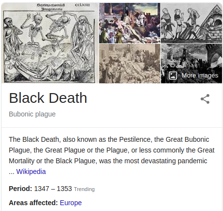
    <figcaption class="img-caption">Contoh ringkasan.</figcaption>

    
    <figcaption class="img-caption">Question answering.</figcaption>

Ada empat tugas ngoding di matkul ini. Menurut saya, tugas matkul ini paling bisa dinikmati di antara tugas lainnya. Nilai tugasnya juga bagus-bagus, penolong nilai ujian yang hancur karena susahnya bukan main. Tapi santai saja jika ingin mengambil matkul ini, karena yang kita cari adalah ilmu, bukan nilai, kan? Ga juga sih, saya penasaran aja gimana rasanya diajar Bu Dekan hehehe.

    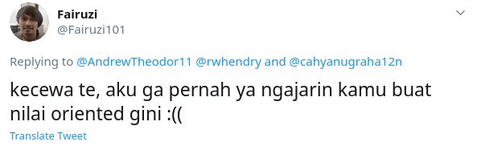
    <figcaption class="img-caption">Aku bijak bgtt,,,,</figcaption>

Matkul ini juga erat kaitannya dengan _Natural Language Processing_ (NLP). Kira-kira IR ini mencakup apa saja yang dilakukan dalam memproses teks dan cara melakukannya dengan sederhana sedangkan NLP memperdalam dengan teknik yang lebih baik. Jadi, jika punya minat ke NLP mungkin bisa mempertimbangkan mengambil matkul IR ini.

<blockquote>
    “IR itu lo cuma ekstrak-ekstrak doang, kalo NLP lo paham konteksnya”
    <footer class="blockquote-footer"><cite title="Degoldie Sonny">Degoldie Sonny, sering cabut kelas</cite></footer>
</blockquote>

<blockquote>
  <strong>Update 19 Juli 2020:</strong> Tak disangka kelas IR tahun ajaran 2019/2020 ganjil ini adalah kelas IR <a href="https://www.cs.ui.ac.id/index.php/berita-duka-dekan-mirna-adriani/">terakhir</a> yang Bu Mirna ajar. Semoga ilmu beliau selalu dapat bermanfaat dan beliau mendapat tempat terbaik di sisi-Nya.
  

    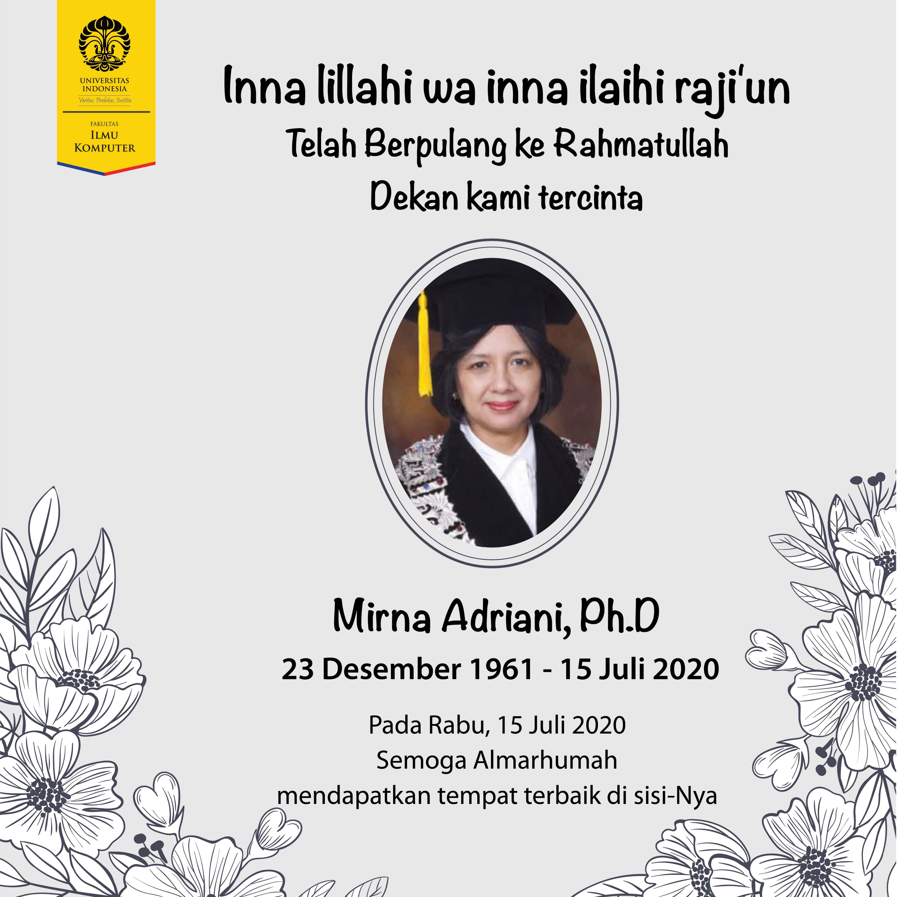
  

</blockquote>

Akhirnya selesai juga. Nyesel juga baru bikin pos ini sekarang, capek ngegali foto/tweet lama. Ga lagi-lagi deh nunda-nunda kayak gini. Demikian catatan mengenai perjalanan semester 5 saya yang semelelahkan bolak-balik gedung lama-gedung baru Fasilkom. Sampai jumpa di pos selanjutnya!

    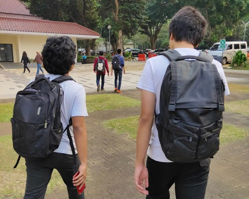
    <figcaption class="img-caption">Jalan sehat gedung lama-gedung baru.</figcaption>

