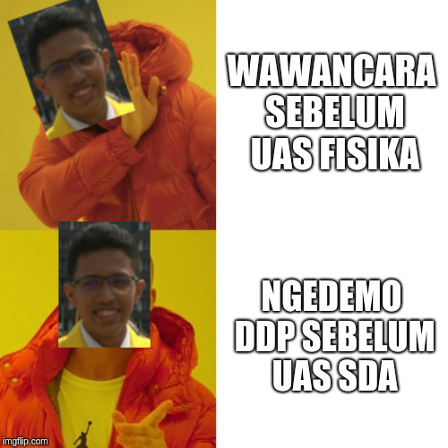
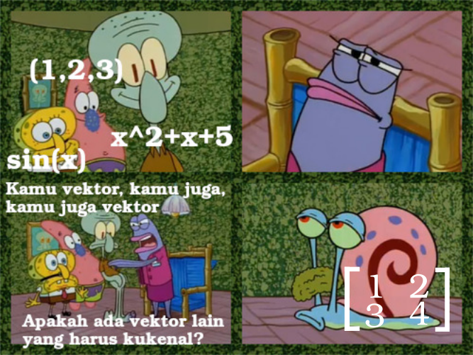
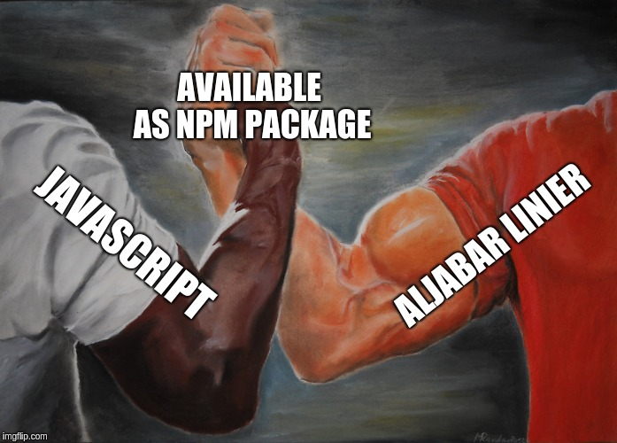
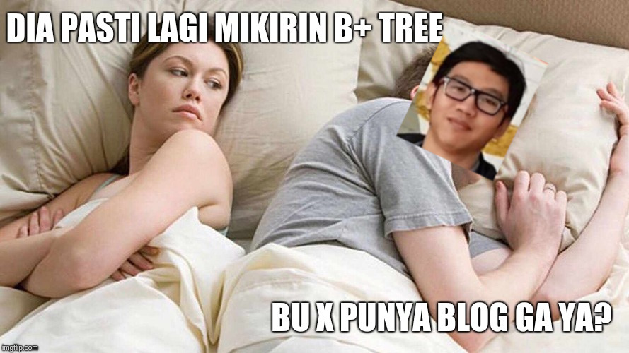
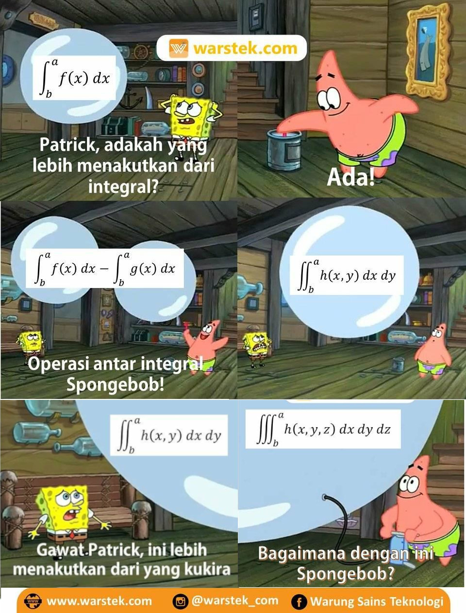
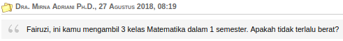
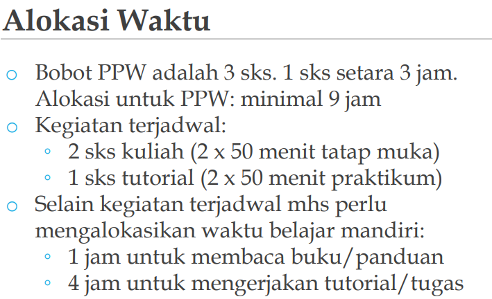
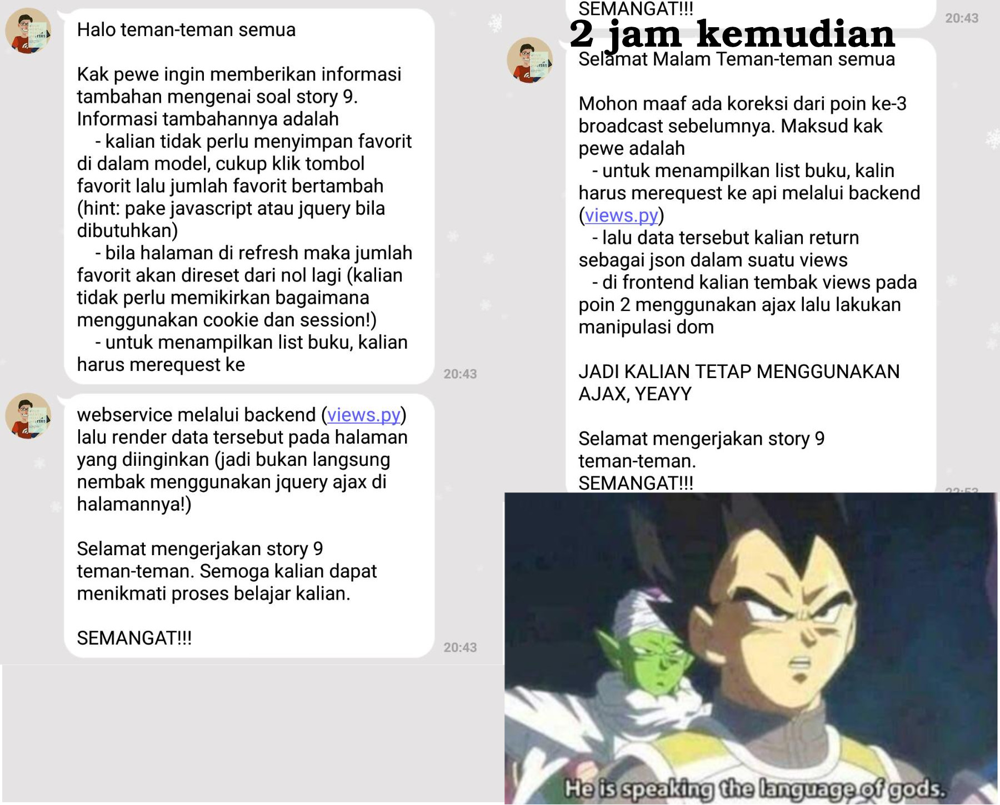

Tahun baru, pos baru yeay :smile:

Jika melirik ke belakang, salah satu pengalaman menarik saya yang dapat dibahas tentu pengalaman semester tiga saya di Fasilkom. Mengapa menarik? Karena semester ini sangat berbeda dengan semester sebelumnya, satu dan dua. Apa saja perbedaannya? Mari kita selisik lebih lanjut.

Menurut saya, hal yang paling berbeda di semester tiga ini hanyalah mata kuliahnya. Kegiatan ekstra lain seharusnya tidak banyak berubah. Mata kuliah ilmu komputer sendiri ada Fisika Dasar yang merupakan matkul wajib rumpun; Aljabar Linier, Perancangan & Pemrograman Web (PPW) dan Struktur Data & Algoritma (SDA) yang merupakan matkul wajib fakultas; tak lupa Pengantar Organisasi Komputer (POK) dan Matematika Dasar 2 yang merupakan matkul wajib prodi. Ya, sudah tidak ada matkul wajib universitas (MPK) lagi :cry:. Untuk prodi Sistem Informasi sendiri matkul wajib prodinya adalah Administrasi Bisnis dan Prinsip-prinsip Sistem Informasi (PPSI). Karena saya adalah mahasiswa ilmu komputer, tentu saya hanya dapat membahas mata kuliah prodi ilmu komputer :stuck_out_tongue_winking_eye:. Mari kita bahas mata kuliahnya satu per satu.

## Fisika Dasar
Sebenarnya matkul ini mirip fisika di SMA, namun mungkin karena faktor umur (baca: lupa), matkul ini tidak semudah kelihatannya. Kurikulumnya pun berganti cukup sering. Pada kali ini, mekanika mengisi 2 bulan sebelum UTS dan listrik & magnet mengisi 2 bulan selanjutnya. Mekanikanya cukup mudah menurut saya karena benar-benar mengulang SMA. Nilai UTS saya pun cukup baik. Semua berubah ketika Listrik dan Magnet menyerang. Saya nyaris tidak paham apa pun yang diajarkan :cry:. Saat itu yang saya bisa ingat dari materi SMA hanya hukum Coulomb dan hukum loop Kirchhoff. Sisanya, hukum Gauss, induksi magnetik, dsb bahkan tidak pernah saya dengar. Entah tidak diajarkan di SMA atau memang saya sudah skip sejak SMA :sweat_smile:. Pada akhirnya, saya belajar dari buku Halliday yang bisa saya mengerti walaupun cukup lama karena bukunya tebal sekali. Tipikal buku rujukan. Kadang saya berpikir, mungkin kalau usaha saya di Fisika ini diarahkan ke bisnis, mungkin saya sudah menjadi 10 orang terkaya di bawah 20 tahun.

Sialnya, UTS dan UAS Fisika ini berbarengan dengan StatProb, mata kuliah yang saya sodok semester ini. Saat H-1, bodohnya saya hanya belajar StatProb. Ketika UAS StatProb selesai, saya dengan panik dan buru-buru pergi ke kafe sekre untuk belajar Fisika. Saya yang panik itu akhirnya menjumpai beberapa mahasiswa angkatan saya (yang juga akan UAS Fisika) malah sedang melakukan wawancara kepanitiaan. Luar biasa, untung mereka ga nyodok.

Tapi saya ngedemo DDP beberapa hari kemudian.

## Aljabar Linier
Mata kuliah yang sebenarnya bisa diambil pada semester dua ini baru saya ambil sekarang karena saat semester dua yang lalu, saya mengambil mata kuliah TK TPL. Matkul ini inti isinya adalah sistem persamaan linier dan vektor. Matkul ini dianggap *magic* oleh anak-anak yang sudah nyodok semester lalu, namun bagi saya tidak terlalu *magic* tentu karena saya punya mereka yang sudah tau magicnya :simple_smile:. Mengapa magic? Karena ternyata semuanya vektor!\*

\*Saya tahu ini lebay dan salah karena tidak semuanya memenuhi 10 aksioma.

Kalau dibayangkan, mungkin ini sejarah terciptanya matkul ini.  
"Duh gabut nih, ngapain ya"  
\*belajar hal baru\*  
"Wah keren juga ya"  
"Gimana kalo materinya digeneralisir"  
"Apa ya aturan intinya"  
"Oh gini aja"  
"Jadi kalo suatu himpunan memenuhi bla bla bla maka dia disebut X"  
"Lah terus Y apa?"  
"Oh anggota X aja"  
"Hmm menarik juga ya"  
"Jadiin matkul ah"  

Karena matkul yang magic ini, saya dan Indra sering membandingkan dengan hal magic yang lain, ya, Javascript!  
"Kita perlu belajar materi X ini ga sih?"  
\*search X js\*  
"Ga usah, udah ada NPM packagenya"  
Alin 1 - 1 JS.

Baiknya, slide alin cukup bagus buat belajar mandiri. Matkul ini salah satu matkul yang perlu mengerti pembuktian walaupun ga dalem-dalem banget, jadi harus diresapi pas baca slidenya. Harusnya, kalo sering membuktikan sesuatu pakai intuisi bisa survive di matkul ini.

## Struktur Data dan Algoritma
Di matkul yang menyerupai Competitive Programming ini kita diajarkan cukup banyak hal, mulai dari Dynamic Programming hingga Graph Traversal. Bahkan menurut saya, terlalu banyak materinya dan jatuhnya hanya paham sekilas lalu saat ngoding copy-paste kodingan dari slide. Matkul ini pernah memiliki citra buruk semester lalu karena soal-soal yang tidak benar (test case salah, constraint salah, dsb). Pada semester ini, menurut saya cukup baik thanks to asdos-asdos pengguna tcframe. Hanya ada beberapa (dua atau tiga) lab yang aneh dan hanya satu yang saya tinggalkan tanpa nilai 100 karena sudah malas berurusan sama soal begitu :sleepy:.

Dari materi-materi yang diajarkan, yang saya belum pernah pelajari adalah B+ Tree. Ketika mau UAS, saya, FwP, Tan, dan Cahya panik sendiri mengenai B+ Tree sampai Bu Naya heran. Jadi teringat Pak Fariz yang heran saat panik GUI :joy:. Tentu saja belajar B+ Tree hanya ketika Bu Naya mendekat. Ketika sudah jauh, Cahya langsung switch workspace dan kami kembali membaca blog-blog dosen.

Hanya bercanda, Cahya ga punya cewe.

## Pengantar Organisasi Komputer (POK)
Matkul lanjutan dari Pengantar Sistem Dijital (PSD) ini kebanyakan membahas kode-kode assembly. Saya merasa matkul ini lebih jelas dibanding PSD yang abstrak, namun entah mengapa nilai POK saya jauh di bawah PSD :disappointed_relieved:. Matkulnya cukup mirip dengan PSD, sehingga tidak ada yang jauh berbeda kecuali proyek akhirnya. Proyek akhirnya menggunakan AVR dan saat tugas proyek akhir ini keluar, bahkan kami belum pernah menyentuh AVR :astonished:. Akhirnya saya bertanya-tanya kepada kating dan menerka-nerka kira-kira apa yang dapat dibuat dengan AVR ini.

Pada saat UAS, terdapat kejadian unik yaitu perbedaan pendapat di antara mahasiswa karena yang diajarkan dosen lain berbeda (atau mungkin otak kami yang tidak sampai, maaf pak, bu). Dari sekian banyak pertanyaan, akhirnya ada juga pertanyaan yang memiliki jawaban yang sama di antara mahasiswa sehingga dijadikan meme.

TODO: meme gagah

## Matematika Dasar 2
Matkul yang menjadi momok bagi mahasiswa ilmu komputer ini bukan tanpa alasan. Matkulnya abstrak dan materinya cukup banyak, sehingga pada akhirnya saya hanya mengimani kebenarannya tanpa membuktikan/bermain-main dengan teorinya terlebih dahulu. Materi yang dicakup antara lain infinite series, conics and polar coordinates, multivariable functions, dan multiple integrals.

Untuk survive di matkul ini, saya menggunakan buku [Calculus oleh Gilbert Strang](https://ocw.mit.edu/ans7870/resources/Strang/Edited/Calculus/Calculus.pdf). Bukunya sangat bagus, jelas dan **singkat**. Buku yang singkat sangat penting bagi saya karena percayalah, kalian tidak akan punya waktu sebanyak itu untuk belajar :joy:.

## Statistika dan Probabilitas
Matkul ini seharusnya diambil pada semester 4, namun saya sodok. Kenapa saya sodok? Karena teman-teman saya begitu hehe.

Diperingatkan pembimbing akademis saya.

Matkul ini mirip sama matdas yang saya imani saja kebenarannya. Bedanya, teori-teori di matkul ini memang sepertinya kesepakatan karena bukti empiris, jadi ya sudah :joy:. Banyak materinya pun oke, sehingga cukup sering latihan soal dibanding matkul lain. Sayangnya, di kelas saya ini mahasiswanya cukup banyak, 70-an sehingga jika duduk di belakang nyaris tidak dapat apa-apa di kelas itu.

Biasanya, saya ingin belajar suatu hal karena ada meme yang tidak saya mengerti. Untuk itu, berikut meme-meme yang berhubungan dengan statprob.

TODO: meme

Oh iya, sebagai pelengkap, matkul ini seharusnya disebut Probabilitas dan Statistika, bukan sebaliknya. Ga paham? Makanya nyodok :stuck_out_tongue_winking_eye:.

## Perancangan & Pemrograman Web (PPW)
Nah, inilah sebenarnya inti dari pos ini. Save the best for the last. Matkul ini adalah matkul yang bisa dibilang full ngoding, ngoding web lebih tepatnya. Tiap minggunya, diberikan tugas berupa story dan challenge. Story ini dikeluarkan tiap hari Senin dan Challenge dikeluarkan tiap hari Kamis, ketika sesi lab. Untuk mengerjakan Challenge, harus mengerjakan Story sehingga kira-kira ada waktu tiga hari untuk mengerjakan story. Selesai mengerjakan challenge, kita diharuskan mengumpulkan laporan yang disebut *reflection*. Apakah story dapat dikerjakan dalam 1-2 jam? Mari kita lihat asumsinya.

Ya, kami diminta untuk mengalokasikan waktu 5 jam untuk belajar mandiri. Belum tahu anehnya? Story dikeluarkan saat hari Senin (tidak menutup kemungkinan malam) sehingga 5 jam itu dialokasikan saat hari kerja. Mengapa tidak dikeluarkan saja saat Jumat/Sabtu? Entah, hanya Kak Pewe dan Tuhan yang tahu. Jika belum merasa sulit, bayangkan kamu kuliah hingga jam 6, belum lagi ada urusan malamnya (sangat wajar). Bagaimana cara membagi waktunya? Ini belum membahas apakah waktu 5 jam itu cukup untuk mengerjakan story yang diberikan dengan asumsi telah membaca suatu modul saat liburan. Akhirnya, banyak mahasiswa yang begadang di Fasilkom saat malam kamis hanya untuk mengerjakan PPW.

Tak hanya itu, permintaan story pun kadang tidak jelas. Hal ini diperparah dengan ketidakkonsistenan jawaban yang diberikan, sebagian besar dari Official Account Line Kak Pewe. Bahkan tidak jarang challenge yang diberikan tidak dimengerti oleh asisten yang bertugas di lab, koordinasi antarpengajar PPW saya rasa sangat kurang.

Masih kurang? Penilaiannya juga kejam. Website yang sudah terdeploy dengan baik, sudah mengikuti permintaan, bahkan bisa mendapat nilai di bawah 70. 
