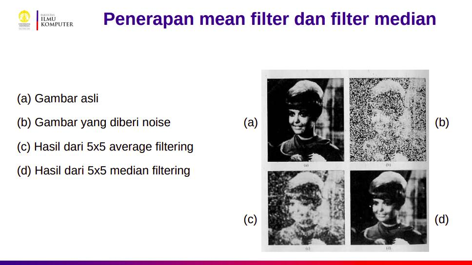

Pos semesteran terakhir di Fasilkom!
Mohon maaf karena keterlambatannya, satu tahun sejak saya lulus tapi baru tiga bulan sejak saya ambil ijazah kok 🤪.
Sudah lama sekali tidak update sampai untuk run blog-nya aja bermasalah sad 🥲.
Tapi tak apa, kuliah juga masih PJJ kan hehe (padahal udah ada yang blended, maksa).
Libur dua pekan terasa seperti dua tahun, memang waktu itu relatif ya 😌.

    
    <figcaption class="img-caption">Mengenang covid Maret 2020--Maret 2022</figcaption>

Mohon maaf juga kepada pembaca karena pressure yang kalian berikan tidak bisa mengubah kemalasan saya untuk menunda penulisan blog hingga satu tahun lamanya.
Memang consistency is the key 😎. 

<figcaption class="img-caption">Pressure dari pembaca 😣</figcaption>

Tanpa menunda lagi, mari kita bahas semester terakhir saya di Fasilkom ini!

## Kerja Praktik (KP)

**Kelompok:** MK Wajib Program Studi Ilkom (Update: menjadi MK Pilihan)  
**Jumlah SKS:** 3 (Update: menjadi 4 SKS)  
**Prasyarat:** 100 SKS

Mata kuliah ini merupakan mata kuliah wajib pada angkatan saya yang menjadi mata kuliah pilihan pada kurikulum 2020.
Secara garis besar, isi mata kuliah ini adalah kerja praktik/magang beserta beberapa *paperwork* yang harus dikerjakan.
Magang seperti apakah yang dimaksud?
Apakah magang apa saja?
Tentu tidak semudah itu ferguso.
Topik pada magang/KP dibatasi pada bidang ilmu Fasilkom.
Untungnya, tidak ada perbedaan topik KP bagi jurusan sistem informasi atau ilmu komputer.
Jadi kalau merasa salah jurusan, bisa ambil magang jurusan sebelah 😜.
Selain itu, magang dilaksanakan selama 6-10 minggu.
Jadi magang tidak bisa digunakan pada mata kuliah KP jika kurang dari 6 minggu dan jika lebih dari itu, cukup diambil 10 minggu saja.
Magangnya pun dilakukan secara *full time* (40 jam kerja per minggu) atau *part time* dengan durasi menyesuaikan sehingga menyamai *full time* 6-10 minggu.

Bagaimana dengan perusahaan tempat kita magang?
Apakah ditetapkan Fasilkom?
Untungnya (atau sayangnya?) tidak.
Jadi kita dibebaskan untuk memilih perusahaan mana untuk menjadi tempat kita magang.
Biasanya, pencarian magang untuk anak Fasilkom cukup mudah.
Sayangnya, periode magang saya ini dilakukan di pertengahan tahun 2020 ketika covid masih baru saja menyerang.
Karena pencarian magang dilakukan beberapa bulan sebelumnya, bahkan sebenarnya periode pencarian magang ini tepat ketika covid baru masuk ke ~~Depok~~ Indonesia sehingga penuh ketidakpastian.
Alhasil, banyak perusahaan yang tidak membuka program magang pada periode ini.

> However, we regret to inform you that we will not be continuing our internship program, therefore we decided to discontinue your recruitment process as well.

Apakah mata kuliah KP tidak jadi dilaksanakan?
Untungnya tidak, Fasilkom membantu mahasiwanya menyediakan beberapa program magang dengan bekerja sama dengan beberapa pihak dan berkoordinasi dengan angkatan Tarung.
Saya sendiri alhamdulillah mendapat kesempatan magang di [OY!](https://www.oyindonesia.com/) sehingga tidak mengikuti program magang dari Fakultas.
Terima kasih abang-abang OY! yang baik hati 😭.
Pada angkatan selanjutnya, alhamdulillah kondisinya sudah jauh lebih baik sehingga Fasilkom tidak perlu menyediakan program magang sendiri.
Atau tidak lebih baik ya tapi karena KP jadi ga wajib aja 🤪.
Tapi seharusnya jauh lebih baik sih karena di angkatan Quanta banyak banget (mayoritas?) ikut [Magang Kampus Merdeka (MKM)](https://kampusmerdeka.kemdikbud.go.id/program/magang) sehingga harusnya kesempatan yang ada sudah jauh lebih banyak dibanding masa-masa awal covid.

Setelah mendapat magang, kita bisa mulai menyiapkan beberapa *paperwork* untuk mata kuliah KP.
Karena sebagian besar dokumen harus dikerjakan ketika periode magang, maka kelas Scele dibuka sebelum liburan tiba.
Dengan demikian, kita bisa melihat-lihat dokumen apa saja yang harus disiapkan.
Walau kelas Scele dibuka sebelum liburan tiba, saran saya sih cari saja tempat magang jauh sebelum itu karena salah satu hal umum yang membuat sulit mendapat magang itu telat daftar 😶.
Oke kembali ke dokumen yang harus dipersiapkan:
- Kerangka Acuan Kerja Praktik (KAKP): rencana apa yang akan dilakukan pada saat magang dan harus sesuai dengan bidang ilmu Fasilkom
- Log KP: Catatan per minggu apa saja yang dilakukan dan ditandatangani oleh pihak perusahaan
- Laporan KP: laporan akhir tentang apa saja yang dikerjakan saat menjalani magang

Dari ketiga laporan ini, sebenarnya yang cukup *tricky* adalah KAKP terutama jika magang di startup karena harus ada rencana per minggu apa yang akan dilakukan, bertentangan dengan kultur kerja di startup yang serba sat set sat set.
Untungnya, KAKP ini tidak harus 100% akurat namun diusahakan perubahannya pada laporan seminimal mungkin.

Karena inti dari mata kuliah ini adalah magang, maka sebagian besar pekerjaannya telah selesai sebelum masa perkuliahan tiba.
Ketika masa perkuliahan, yang dilakukan *hanya* membuat presentasi singkat 15 menit dan membuat dokumen laporan KP.
Dengan demikian, isi kelasnya hanyalah melihat-lihat presentasi teman yang lain.
Lumayan lah dapat gambaran tentang work culture di beberapa tempat buat jadi pertimbangan saat mencari kerja nanti 🤣.
Oh ya, kelas Scele KP periode yang telah usai juga tidak dikunci sehingga berkas-berkas presentasi dan laporan dapat dibaca oleh mahasiswa yang ingin mengambil KP.
Mungkin tertarik membaca bagian saran untuk mahasiswa atau presentasi milik kakak tingkat yang magang di tempat yang kamu inginkan.
Setelah mata kuliah ini usai, tidak berarti pekerjaan selesai.
Laporan KP perlu dicetak sebagai salah satu syarat pengambilan ijazah.
Well, setidaknya pada angkatan saya karena mata kuliah KP diwajibkan.

Lalu karena mata kuliah ini menjadi pilihan, apakah saya merekomendasikannya?
Menurut saya mata kuliah ini recommended jika kamu sudah tidak punya minat dengan mata kuliah lain 🤣.
Mengikuti program magang juga biasanya dilakukan anak Fasilkom, dengan atau tanpa mata kuliah KP.
Lumayan untuk nambah pengalaman dan uang jajan 💸.
Paperwork yang dikerjakan cukup banyak dibanding mata kuliah lain, tapi jauh lebih mudah dibandingkan dengan tugas akhir.
Kelasnya pun cukup santai karena hanya menonton presentasi teman.
Karena itu, effort yang dikeluarkan seharusnya hanya untuk paperwork, lumayan kan untuk nambah-nambah SKS jika butuh 🤣.

## Pengolahan Citra (Pengcit)

**Kelompok:** MK Pilihan Bidang Minat Ilkom  
**Jumlah SKS:** 3  
**Prasyarat:** Aljabar Linier, Matematika Dasar 2, Struktur Data & Algoritma

Mata kuliah peminatan ini adalah mata kuliah yang tidak saya ambil tahun lalu.
Alasannya?
Kalau saya ambil, akan jadi satu-satunya matkul di hari Jumat, dan saya mager pulang-pergi total 2 jam dari Jakarta hanya untuk itu 🤪.
Indahnya masa kuliah tatap muka 🥲.

Materinya pun cukup banyak walau di kelas sepertinya hanya dibahas dasarnya saja.
Kalau niat, independent reading-nya bisa banyak banget, misalnya *state of the art* untuk materi tersebut.
Rasanya mirip NLP bedanya yang satu belajar bahasa yang satu gambar 🥲.
Beberapa materi yang cukup menarik untuk di-highlight misalnya filtering, segmentation, matching, dan object detection.
Semoga paham lah ya tanpa dijelasin lebih lanjut, pictures speak louder than words 😉. 

    
    <figcaption class="img-caption">Filtering.</figcaption>

    
    <figcaption class="img-caption">Segmentation.</figcaption>

    
    <figcaption class="img-caption">Matching.</figcaption>

    
    <figcaption class="img-caption">Object detection.</figcaption>

Komponen penilaiannya 45% tugas lab sebanyak 6 kali, 5% partisipasi, dan 50% proyek akhir.
Ya, tidak ada UTS maupun UAS di matkul ini, setidaknya di semester ini 😜.
Untuk tugas lab-nya sendiri dikerjakan berdua, sedangkan untuk proyek akhir dikerjakan berkelompok empat orang.
Baik tugas maupun proyek akhirnya bisa dikerjakan di Google Colab, jadi ga perlu punya resource dewa juga.
Kalau ada library yang sudah support operasi yang diinginkan, bisa digunakan juga tidak perlu code dari scratch.
Cocok lah ya untuk yang baru mau eksplor bidang ini.
Tugasnya pun cukup mudah, seingat saya pasti bisa dikerjakan < 3 jam.
Terima kasih kepada bahan bacaan tutorial lab yang sangat jelas.
Sedangkan untuk proyek akhirnya baru agak menantang, terutama untuk bagian deep learning-nya karena sedikit dibahas dikelas dan tidak ada lab dengan topik tersebut, jadi harus banyak eksplor.
Ngomongin tentang eksplor, kalian juga bisa lihat-lihat dulu materinya apa sebelum ambil kelas ini di [playlist youtube Bu Mia](https://www.youtube.com/playlist?list=PLLOcUim1ij_4gW3wR30PMJiONlFLzrcCa) yang cukup lengkap.

Setelah mengikuti kelas ini, saya menyesal.
Menyesal kenapa ga ambil tahun lalu 🥲.
Salah satu kelas terseru menurut saya, kalau saya ambil tahun lalu bisa jadi kandidat topik skripsi.
Ngomongin tentang skripsi, mungkin kalian tertarik juga untuk membaca [https://skripsi.rwhendry.com/](https://skripsi.rwhendry.com/) untuk melihat seperti apa kira-kira skripsi pengcit.
Walaupun saya sendiri ga paham reynaldo ngomong apa, tapi keliatan keren sih.
Saya sendiri merekomendasikan matkul ini jika kalian tidak *anti* banget sama satu atau beberapa hal yang saya bahas sebelumnya.
Materinya menarik, banyak yang dapat dieksplor lebih jauh, tidak ada ujian (sekali lagi, setidaknya di semester ini), tugasnya cukup mudah, dan .... nilainya relatif mudah.

    
    <figcaption class="img-caption">Direkomendasikan karena seru dan berguna, berterima kasih karena nilainya bagus 🙃.</figcaption>

## Komputer & Masyarakat (Komas)

**Kelompok:** Mata Kuliah Wajib Fakultas  
**Jumlah SKS:** 3  
**Prasyarat:** 100 SKS (diutamakan mahasiswa semester 7 & 8)

Matkul ini hanya diperbolehkan untuk diambil oleh mahasiswa tingkat akhir, terutama di semester terakhir.
Vibes-nya mirip MPKT sih sebenarnya, cuma mungkin biar kita udah paham semua aspek di Fasilkom kali ya jadinya harus semester terakhir, beda sama zaman MPKT yang baru paham bikin piano digital 🤪.

<iframe width="560" height="315" src="https://www.youtube.com/embed/re-lphTbVoc" title="YouTube video player" frameborder="0" allow="accelerometer; autoplay; clipboard-write; encrypted-media; gyroscope; picture-in-picture" allowfullscreen></iframe>
<figcaption class="iframe-caption">Piano digital kebanggaan mahasiswa DDP (Sumber: Ardan)</figcaption>

Biasanya di kelas komas akan diberikan topik/bacaan lalu didiskusikan bersama teman sekelompok.
Bacaannya dari tulisan-tulisan selevel IEEE yang bikin otakku 💥🤯.
Oh ya bacaannya tentu berbahasa Inggris, kelasnya pun berbahasa Inggris.
Rasanya satu-satunya kelas yang full bahasa Inggris, yang lain kan paling hanya slide-nya aja ya.
Kelasnya cukup santai sih khususnya waktu PJJ ya, tapi yang harus diperhatikan adalah Scelenya.
Kelas ini cukup demanding sih Scelenya walau ga se-ekstrim itu juga.
Paling perhatikan saja deadline-deadline, kapan ngecek Scele terakhir, dll jadi ga keluar sendiri dari course Scelenya 🙂.
Untuk ujiannya sendiri mirip dengan tugas-tugas biasanya, diberikan bacaan, lalu ada beberapa pertanyaan yang harus dijawab.

Menurut saya kelas ini cukup insightful dalam hal mengajarkan tanggung jawab bagi mahasiswa Fasilkom.
Contoh yang populer yaitu dilema driverless car ketika di posisi seperti berikut:

    
    <figcaption class="img-caption">Menyelamatkan penumpang atau orang lain? (Sumber: MIT Media Lab)</figcaption>

Sekarang selain memikirkan corner case bug, kita juga harus memikirkan corner case moral 🥲.
Cukup insightful karena pada waktu itu yang biasanya berada dalam pikiran ketika membuat program ya programnya benar, jarang memikirkan dampaknya pada orang lain misalnya penyalahgunaan atau corner case seperti driverless car di atas 😶.
Terutama di zaman black box ML ini yang hasilnya juga gatau sebelum di-run 🤪.
Apa pun hasilnya, ya begitu lah.
Que sera sera~

<iframe width="560" height="315" src="https://www.youtube.com/embed/xZbKHDPPrrc" title="YouTube video player" frameborder="0" allow="accelerometer; autoplay; clipboard-write; encrypted-media; gyroscope; picture-in-picture" allowfullscreen></iframe> 

## Tugas Akhir (TA/Skripsi)

**Kelompok:** MK Pilihan Bidang Minat Ilkom (Update: menjadi MK wajib Fakultas)  
**Jumlah SKS:** 6  
**Prasyarat:** 114 SKS, Metodologi Penelitian & Penulisan Ilmiah

Saatnya membahas matkul penutup kuliah ini 🤩.
Mata kuliah ini dulunya di Fasilkom tidak wajib dan bisa lulus hanya dengan mengumpulkan 144 SKS.
Sayangnya, mulai angkatan 2018 tugas akhir ini diwajibkan.
Tapi tenang saja, saya mengambil tugas akhir agar bisa saya tulis di sini 😘.
Ga deh, emang mau coba-coba aja buat tau cocok ga sama riset.
Kalau cocok bisa lanjut, kalau ngga berarti jadi tau ga cocok.
Jadi ga ada ruginya 😉.

Sebelum mengambil skripsi, tentu saja yang harus dipersiapkan adalah topiknya.
Untuk topik sendiri, saya pun tak mempersiapkan begitu banyak.
Memutuskan untuk ambil skripsi aja akhir-akhir 🤪.
Tapi terkadang, calon dosen pembimbing juga punya topik yang ingin dikerjakan.
Jadi siap-siap saja berdiskusi tentang topiknya.
Surprisingly, sebenarnya banyak juga teman-teman yang mau skripsi tapi tidak tahu topiknya.
Kalau kalian satu di antara mereka, mungkin tertarik untuk mengecek tawaran-tawaran topik di [forum Scele KP - MKM - TA](https://scele.cs.ui.ac.id/mod/forum/view.php?id=3).

Setelah menentukan calon topik, kalian bisa menghubungi dosen untuk menjadi pembimbing.
Kalian bisa memiliki satu atau dua dosen pembimbing (dosbing).
Saya sendiri hanya memiliki satu dosbing karena... saya lupa bisa dua 🙃.
Dulu senang banget Pak Mahen mau jadi dosbing saya lalu kelupaan untuk mikir dosbing kedua 😑.
Tapi gpp, revisinya lebih dikit hehe 🤪.
Biasanya di beberapa pertemuan awal akan dibahas apakah fix untuk mengambil topik tersebut, jadwal bimbingan, dll.

Setelah itu, untuk memulai skripsi tentu saja harus diawali literature review dulu.
Di masa ini, kita banyak-banyak membaca paper dengan topik terkait.
Saya dapat saran dari Pak Mahen untuk mengumpulkan beberapa ide penting dari masing-masing paper di sebuah spreadsheet.
Sarannya benar-benar bermanfaat berbulan-bulan kemudian ketika mulai menulis skripsi.
Ketika mau mengutip, cukup lihat spreadsheet itu dan selesai, ga perlu baca-baca paper lagi.

Setelah itu, kita bisa mulai mengerjakan.
Karena skripsi saya ngoding NLP, jadi yang dilakukan kebanyakan ngumpulin data, ngulik-ngulik data, coba-coba ngoding, dst.
Di masa ini, saya sendiri benar-benar belum mulai menulis.
Teman-teman lain terutama dengan topik berbau data juga sepertinya serupa.
Padahal dulu bayanginnya skripsi itu sebagian besar nulis 🙃.
Tapi kalau melihat teman-teman SI, sepertinya banyak juga yang paralel dengan menulis.
Sepertinya bagian ini sangat bergantung kepada topik yang dikerjakan 🤔.
Bagian ini menurut saya juga yang paling stres karena banyak kegagalan, hasil tidak sesuai harapan, dll.
Rasanya ini masa-masa paling stres saya selama kuliah.
Walau tidak sesibuk semester-semester sebelumnya, hasil pekerjaan tidak sesuai idealisme ternyata cukup membuat down juga 🥲.

Di sebulan terakhir sebelum deadline, barulah penulisan dimulai.
Ketar-ketir juga bisa selesai apa ngga 🥴.
Penulisannya bisa bahasa Indonesia atau bahasa Inggris.
Kalau bahasa Inggris sih katanya nanti bisa lebih mudah jika mau dimasukkan ke jurnal.
Untuk membuat naskah skripsi ini, saya menggunakan latex dengan [template yang tersedia](https://gitlab.com/ichlaffterlalu/latex-skripsi-ui-2017) terima kasih kepada Kak Affan dan kontributor lainnya 🥳.
Setelah sebulan penulisan dengan melalui berbagai drama, akhirnya skripsi saya selesai dan berhasil disubmit ke Scele 😌.
Kalau diingat-ingat, asik juga masa-masa itu, udah lama ga punya adrenalin sebanyak itu 🤪.
Saya ingat habis selesai submit langsung jalan-jalan merasa perkuliahan sudah selesai ~~padahal belum tentu~~ 😶.

Setelah naskah selesai, tentu saja saatnya sidang!
Penjadwalan sidang dan pembagian dosen penguji diatur oleh sekretariat.
Hasilnya dapat dilihat di [https://sidang.cs.ui.ac.id/](https://sidang.cs.ui.ac.id/).
Selain melihat jadwal sidang sendiri, tentu saja kita bisa melihat-lihat jadwal sidang dan topik teman-teman lain.
Jika tertarik supporteran, bisa juga minta link ke teman yang bersangkutan walaupun tiap kali nonton saya sendiri rasanya jadi orang terbodoh di zoom 🤡.

    
    <figcaption class="img-caption">Badut badut...</figcaption>

Setelah sidang selesai, biasanya nyaris pasti akan ada revisi.
Kita cukup mengerjakan revisi tersebut dan mengupulkan hasil revisi pada waktu yang ditentukan, misalnya seminggu setelah sidang.
Lalu selesai!
Engga deh belum hehe 😅.
Masih ada dua effort yang harus dilakukan: naskah ringkas untuk disubmit ke [UIANA](https://lib.ui.ac.id/unggah/) dan mencetak skripsi (serta laporan KP) + beserta CD untuk dikumpulkan ke perpus Fasilkom.
Kedua hal ini dibutuhkan untuk mengambil ijazah.
Pas tau butuh bikin naskah ringkas ini males banget sih, kirain urusan tulis menulis sudah selesai 🥲.
Apalagi harus pakai word, jadi harus convert dari latex ke word.
Tapi ternyata setelah dikerjakan, rasanya tidak sesulit itu juga.
Kemageran saya saja yang tak ada batasnya 🙃.
Sedikit tips dari Ardan bagi yang skripsinya banyak equation, mungkin bisa mencoba [pandoc](https://pandoc.org/) untuk naskah ringkas ini.
Kalau untuk mencetak skripsi dan mau langsung selesai, bisa ke fotocopy MIPA sih hehe.

    
    

Melihat kebelakang, ada beberapa tips yang mungkin berguna jika kalian akan mengambil skripsi.
Pertama, tentu saja tentukan topik dan hubungi dosen pembimbing lebih awal.
Hal ini mengingat skripsi Fasilkom yang hanya satu semester, bukan dua semester seperti beberapa tempat lainnya yang bahkan memiliki seminar proposal juga.
Sepertinya sebulan-dua bulan sebelum siak war cukup ya.
Kedua, mungkin bisa coba eksplor tren topik yang ingin didalami.
Saya agak menyesal tidak belajar deep learning terlebih dulu dan mengira bisa dipelajari sambil jalan 🥲.
Walau tak pernah diajari di kelas, biasanya riset pasti mengikuti state of the art yang ada sih jadi mau gak mau belajar lagi.
Yang terakhir kumpulkan teman yang juga mengerjakan skripsi untuk menjadi penyemangat atau bahkan peer pressure 🤣.
Terima kasih kepada Reynaldo yang selalu mengingatkan saya dengan akun [@dailyskripsi](https://twitter.com/dailyskripsi) sehingga skripsi dan naskah ringkas saya bisa selesai 🤪.

    
    <figcaption class="img-caption">Benefit berkuliah di Fasilkom.</figcaption>

## Penutup

Dengan berakhirnya semester ini, berakhir pula perjalanan saya di Fasilkom!
Di akhir semester, akan ada form pendaftaran kelulusan yang akan [diumumkan di Scele](https://scele.cs.ui.ac.id/mod/forum/discuss.php?d=24938).
Setelah melengkapi persyaratannya, akhirnya bisa menikmati waktu bebas pasca kuliah sambil menunggu wisuda 🥳.

    
    <figcaption class="img-caption">Wisuda bersama teman-teman Tarung 2017 lainnya</figcaption>

Setelah lulus, akan seperti apa nasib blog ini?
Saya juga tidak tahu 🤪.
Awalnya, saya membuat blog ini juga hasil iseng-iseng aja.
Tapi ternyata ada beberapa yang merasa terbantu 🥲.
Asik juga sih melihat tulisan-tulisan lawas saya tentang perkuliahan.
Kadang heran juga kok bisa ya cringe begitu 🤣.
Tapi tak apa lah, no regret bisa menulis perjalanan kuliah lengkap mulai dari semester 3 🥲.

Selanjutnya, mungkin blog ini akan saya isi dengan topik non-kuliah.
Atau masih ada kah topik kuliah yang bisa dibahas?
Jika iya, bisa disampaikan di kotak saran ini dan nantikan namamu terpampang di post baru sebagai kontributor ide 🤩.
Terima kasih! 😁

<suggestion-form placeholder="Saran konten" rows="3"></suggestion-form>