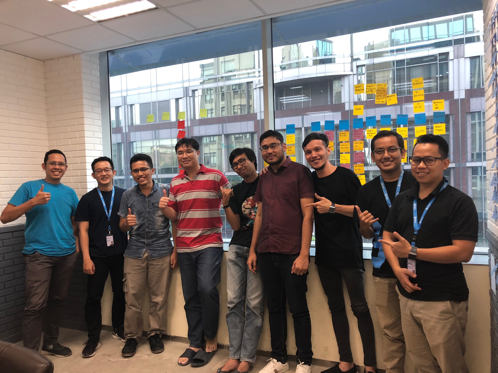
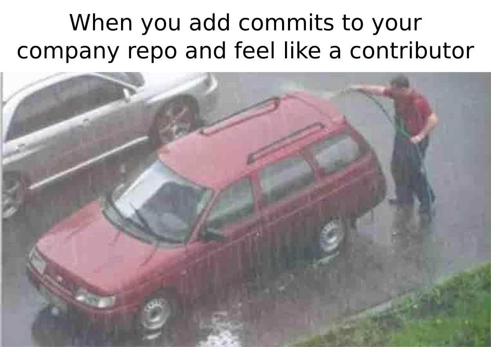
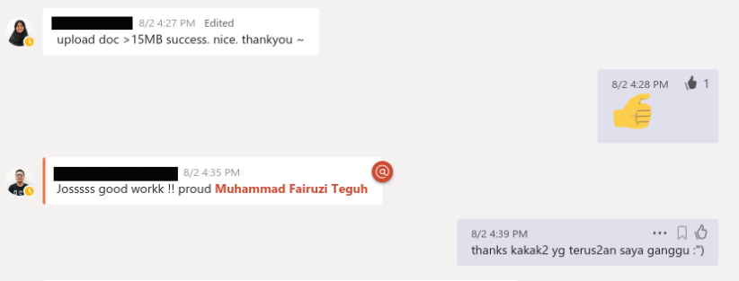
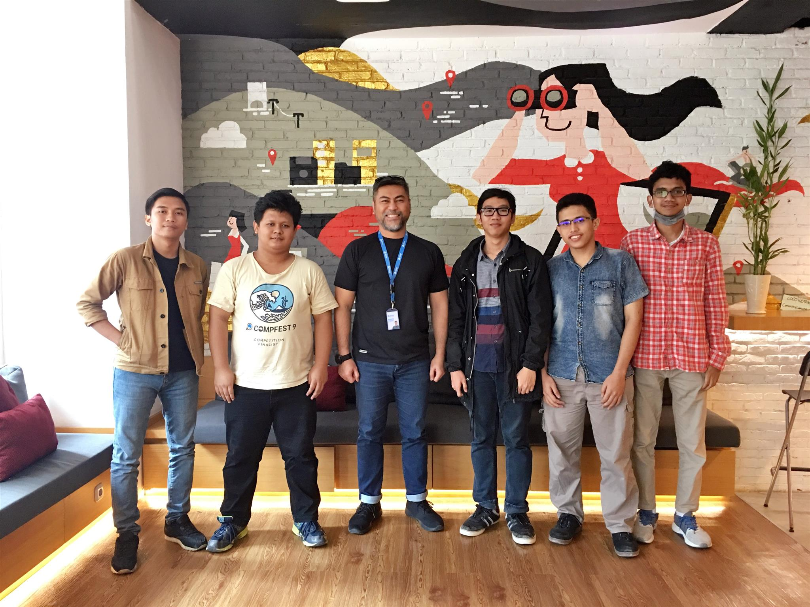
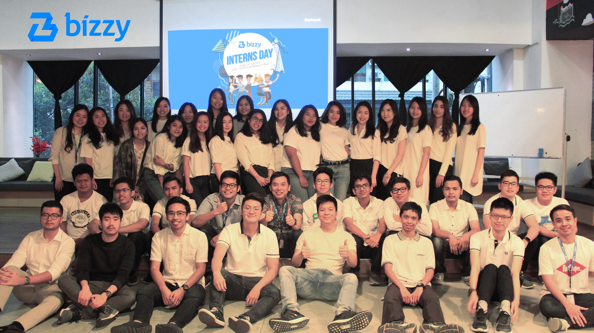
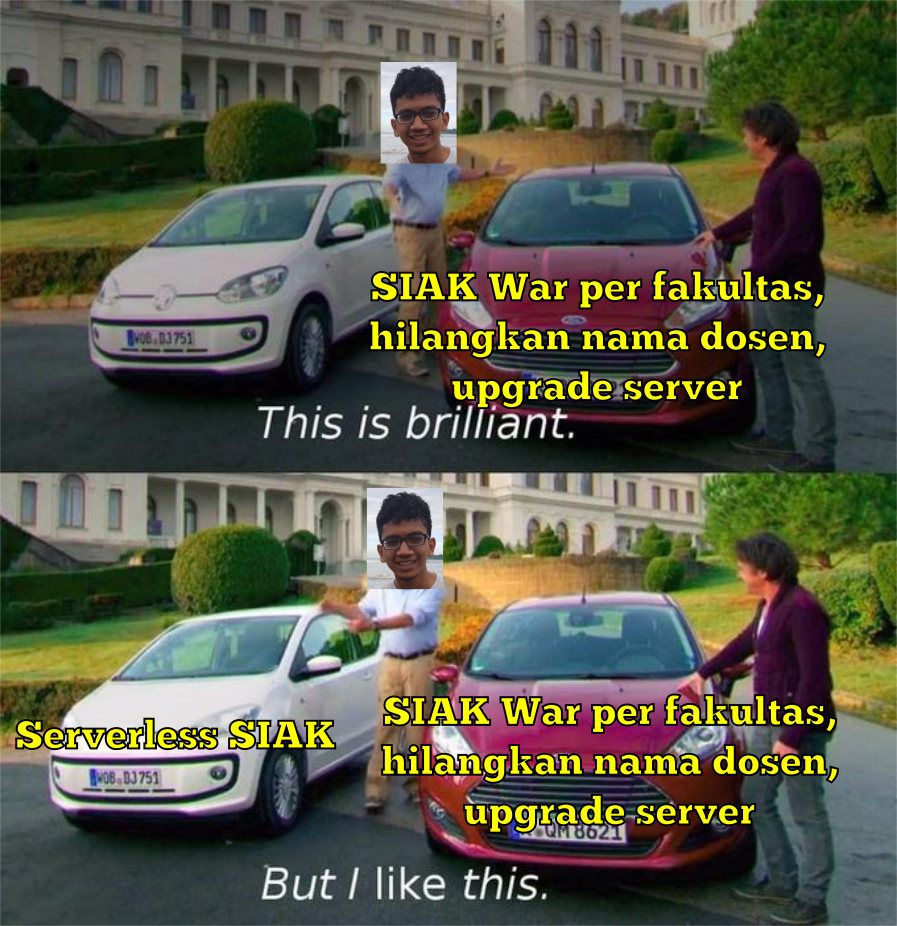
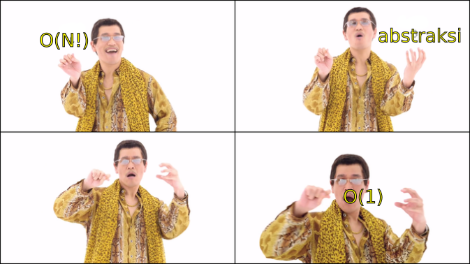

Setelah saya [mendapatkan kesempatan magang di Bizzy](https://fairuzi10.github.io/blog/mendapatkan-magang-bizzy/), tibalah waktunya untuk saya memulai kehidupan sebagai tech intern di Bizzy. Saya mulai magang pada 25 Juni dan berakhir pada 24 Agustus yang lalu, jadi sekitar dua bulan.


<figcaption class="img-caption">Bersama para dev lead setelah presentasi akhir.</figcaption>

## Mengenal Bizzy

Sebelum melangkah lebih jauh, tentu kita harus mengenal lebih dulu apa itu [Bizzy](https://bizzy.co.id). Disadur dari akun LinkedIn Bizzy,

> Bizzy.co.id is a digital, dynamic and inclusive marketplace for businesses equipped with e-procurement platform for sourcing, tactical and transactional processes.
>
> Bizzy.co.id has a mission to underpin a clean economy by powering an inclusive digital business ecosystem that enables transparent, efficient and accountable commerce for all stakeholders.

Intinya, saat ini Bizzy adalah startup yang bergerak di bidang e-Procurement dengan tujuan membebaskan bisnis dari korupsi karena semua transaksi dilakukan secara online (transparan). Bizzy sendiri merupakan sebuah platform di mana perusahaan dapat melakukan pengadaan barang dari perusahaan lain. Dengan kata lain, Bizzy adalah startup Business to Business (B2B).

## Apa yang Saya Lakukan di Bizzy

Ngapain sih kamu iz di Bizzy? Bantu-bantu fotokopi? Bikin-bikin kopi? Santai saja jika kamu berpikir seperti itu, karena ayah saya juga demikian😆. Seperti judul di atas, saya ke Bizzy sebagai tech intern yang seharusnya apa yang saya lakukan sudah bisa ditebak, ngoding. Jawaban dari semua pertanyaan Cloud, "Lo lagi apa iz hari ini?". Oh ya, Cloud adalah salah satu teman saya yang juga magang di Bizzy namun sebagai product manager, berbeda dengan saya dan tiga teman saya yang lain yaitu Indra, Ferro, dan Cahya sebagai software development engineer.

Pada minggu pertama masuk, kami dikenalkan kepada seluruh karyawan Bizzy, melakukan end to end demo produk Bizzy, dan dijelaskan tech stack yang digunakan Bizzy. Bizzy sendiri baru saja merombak arsitektur mereka dari monolitik menjadi microservice yang produknya baru saja diluncurkan versi betanya kira-kira sebulan sebelum kami masuk 😄. Secara garis besar, Bizzy menggunakan NodeJS, MongoDB, dan produk-produk AWS seperti AWS Lambda (serverless), S3, Aurora pada backend dan Vue.js pada frontend.

Setelah kira-kira seminggu dikenalkan dengan Bizzy, tentu akhirnya kami mendapat tugas. Tugas pertama saya adalah membuat mekanisme upload ke S3 yang saat ini terbatasi oleh body payload API Gateway sebesar 10MB dan Lambda sebesar 6MB. Tugas ini cukup menarik mengingat saya tidak pernah menyentuh produk AWS sebelumnya. Mau nyoba trial aja butuh credit card 😢. Butuh waktu kira-kira sebulan bagi saya untuk menyelesaikan tugas ini. Ya, sebulan. Saya sendiri tidak menyangka akan memakan waktu selama ini. Perjalanan saya menaklukkan AWS ini memang cukup unik. Walaupun AWS merupakan salah satu servis yang banyak digunakan, jumlah artikel yang ada di internet jauh lebih sedikit dibanding hal-hal lain yang pernah saya gunakan sehingga saya harus benar-benar paham sebelum memutuskan mekanisme seperti apa yang saya pakai. Selain itu, AWS sendiri tentu memiliki beberapa pilihan dalam penggunaannya (role, profile, policy, dll) sehingga saya harus mencari tahu apa saja yang telah digunakan Bizzy sebelumnya sehingga apa yang saya buat nantinya tidak akan merusak apa yang telah ada.

Tugas kedua yang saya dapat adalah menyisipkan kode pada website sehingga kita dapat mengetahui page-page apa saja yang dibuka user. Kira-kira seperti Google Analytics lah. Pekerjaannya sebenarnya cukup mudah karena hanya menyisipkan kode yang kira-kira bentuknya:
```js
const prop = {
  page: 'Login',
  time: '10:00',
};
window.analytics.log(prop);
```
Tantangan dari tugas ini adalah saya harus membaca kode orang lain yang tidak saya pahami😆. Walaupun mudah, cukup banyak kode yang harus disisipkan sehingga memakan waktu internship saya hingga selesai.

## Mengapa Bizzy?

Mungkin di antara teman-teman ada yang bertanya, mengapa Bizzy? Setelah menjalani magang di sana, saya memiliki beberapa jawaban yang mungkin dapat menjadi pertimbangan untuk memilih Bizzy sebagai tempat magang.

#### Tech Stack yang OK

Seperti yang disebutkan di atas, Bizzy menggunakan beberapa tech stack yang mantab. Dengan magang di Bizzy, setidaknya kamu dapat menguasai beberapa teknologi yang masih akan digunakan dalam beberapa tahun ke depan.

#### Hasil Kerja yang Benar-benar Digunakan

Di beberapa tempat, tugas yang diberikan kepadamu adalah produk-produk yang belum tentu dirilis/digunakan. Berbeda dengan itu, di sini, pekerjaan yang kamu lakukan akan benar-benar digunakan. Tentu mengasyikkan melihat kodingan yang kamu buat mencapai tahap demi tahap mulai dari coding, code review, QA, ready for deployment, hingga done.



#### Bisa Belajar Banyak

Jika kamu magang di perusahaan yang sudah sangat besar, kemungkinan kamu akan ditaruh di suatu proyek dan tidak mengetahui perusahaan tersebut secara keseluruhan. Di Bizzy, kamu bisa tahu segalanya. Well, setidaknya dalam hal tech jika kamu mengambil tech internship. Saya sendiri mendapat akses AWS yang cukup besar yang bisa saya gunakan untuk bermain-main (di dev tentunya). Selain itu, aturan-aturan yang ada dalam ngoding belum terlalu strict sehingga kamu dapat bebas berekspresi sehingga jika kamu melakukan kesalahan, kamu dapat membenarkannya dan tahu mengapa kodingan yang ini lebih baik dari pada yang lainnya, bukan hanya sekadar aturan.

#### Pekerjaan yang Fleksibel
Tech Bizzy memiliki kelebihan dapat kerja dengan cukup bebas. Kamu dapat datang dan pulang kapan saja. Bahkan, kamu dapat mengambil remote (kerja di rumah). Saya sendiri memanfaatkan ini untuk datang lebih siang, untuk ~~mengantar anak saya sekolah~~ menunggu kereta arah Jakarta Kota lebih manusiawi.

#### Rekan Kerja yang Menyenangkan

Sebelum magang, saya membayangkan akan bekerja dengan orang-orang yang serius, tidak begitu peduli terhadap saya, dan mayoritas pria. Setelah menjalaninya, ternyata hanya bayangan saya yang terakhir yang benar 😜. Orang-orang di sini sangat ramah, asyik diajak ngobrol dalam hal ngoding maupun lainnya. Mereka juga sering mengaperesiasi saya dan teman-teman yang lain walaupun karena hal kecil. Mereka juga peduli pada perkembangan saya terbukti pada masukan-masukan yang diberikan pada saat saya presentasi akhir guna mempersiapkan kerja praktik nantinya. Oh ya, mereka juga sangat passionate dalam koding, bahkan mungkin lebih dari saya😆 sehingga menjawab pertanyaan di benak saya "kok bisa Bizzy percaya sama orang yang kerja remote?"



#### Peduli terhadap Intern

Selain menjadi layaknya karyawan biasa, kami juga diberikan beberapa hal spesial sebagai intern. Dari tingkat Bizzy (bukan hanya tech), mereka mengadakan Bizzy Interns Day yang merupakan ajang para intern berkenalan, bercerita tentang internshipnya, dan berbincang-bincang dengan para C-level. Sebagai tech intern, kami tentu juga mendapat hal khusus dari bidang tech. Kami dapat belajar langsung dengan para pimpinan di bidangnya dan dapat ngobrol bersama Pak Norman (CTO) setiap dua minggu sekali. Saya rasa mereka sebenarnya tidak begitu mendapat keuntungan dengan melakukan hal ini karena toh hanya dua bulan kami di sana. Namun dari apa yang pernah Pak Norman sampaikan, sepertinya dia ingin membuat pengalaman internship kami ini menjadi pengalaman yang berharga dan tak terlupakan. Oh ya, Bizzy juga menawarkan beasiswa dengan kontrak kerja setelah kami lulus nanti (iya, lulus, ga DO kok).


<figcaption class="img-caption">Bersama Pak Norman.</figcaption>


<figcaption class="img-caption">Bizzy interns day.</figcaption>

## Apa yang Saya Pelajari Selama Magang

Selama magang, saya mendapat beberapa insight berharga. Beberapa di antaranya saya rasa sulit didapat tanpa magang. Berikut ini hal-hal yang saya pelajari ketika magang.

#### Membaca Kode Open Source Tidak Ada Ruginya

Pada hari kedua magang, kami dibimbing Kak Jason untuk melakukan setup dan dijelaskan mengenai kode-kode milik Bizzy. Saat itu, Kak Jason menyebut beberapa term NodeJS seperti promise, async/await, nvm, npx, dll. Uniknya, sebagian hal tersebut baru saja saya ketahui ketika membaca [kode Judgels yang baru](https://github.com/ia-toki/judgels) pada tiga hari sebelumnya. Ya, dapat dibilang saya belajar hal-hal esensial pada magang saya tiga hari sebelum mulai secara tidak sengaja.

#### Ngobrol Bisa Jadi Lebih Baik Dibanding Belajar

Di saat luang, terkadang saya mencari teman ngobrol sambil mengusir kejenuhan. Di situ, saya sering mendapat ilmu baru yang belum pernah saya dapatkan sebelumnya. Sebagai contoh, pernah suatu saat saya ngobrol tentang bot LINE dengan pembuat bot Hibiki, Ridho. Saya iseng bertanya kenapa dia menggunakan NodeJS pada botnya. Pembicaraan pun berlanjut tidak karuan hingga pada akhirnya, saya paham apa keunggulan serverless sehingga sekarang cukup banyak digunakan. Saya sendiri pernah mencoba membaca artikel yang berkaitan namun tidak pernah paham. Lucu memang, saya bermain-main dengan AWS lambda tiap hari namun baru mengerti serverless bermula karena sebuah bot. Oh ya, ngobrol/bertanya di sini bukan berarti saya bertanya "bagaimana cara melakukan X?" yang jawabannya biasanya dapat dengan mudah ditemukan lewat Google namun tentang hal-hal seperti "apa keunggulan menggunakan X?", "kapan lebih baik menggunakan X?", "kenapa menggunakan X dalam proyekmu?" dan lain sebagainya.

#### Tools Hanyalah Tools

Sebenarnya saya dari awal tidak peduli akan masalah bahasa, framework, atau apa pun itu, namun karena saya lihat masih banyak yang mengkultuskan hal ini bak "agama", saya rasa hal ini cukup OK untuk dibahas. Saat itu saya sedang ngobrol bersama Indra tentang perbedaan Vue dan React. Iseng, Indra bertanya kepada [Mas Irfan](https://mazipanneh.com) tentang pandangannya karena sepertinya dia pengguna berat Vue. Ternyata, dia sendiri [tidak terlalu mempermasalahkan](https://medium.com/mazipan-mind/fe-js-framework-sebuah-lelucon-d9d23eb88f59) hal tersebut. Jika dia memilih Vue dibanding React, itu karena pengalamannya jauh lebih banyak dengan Vue, bukan karena React jelek atau bagaimana. Dia sendiri merasa OK jika harus berpaling menggunakan React pada tempat kerjanya. Saya sendiri merasa pergantian seperti itu mudah dilakukan apalagi jika di kantor sudah ada yang paham cara kerjanya dan melakukan setupnya. Sebagai contoh, pada tugas AWS, saya memakan waktu lama salah satunya karena belum ada yang pernah mengimplementasi mekanisme upload tersebut sebelumnya sehingga saya harus pelajari secara mendalam terlebih dahulu. Bandingkan dengan tugas kedua saya yang dilakukan pada frontend yang menggunakan Vue dan saya tinggal melanjutkan. Walau saya hanya pernah menggunakan React, saya dapat langsung "menebak" apa arti kode Vue yang ada dan mengubahnya pada bagian yang diperlukan sambil membaca dokumentasi Vue jika diperlukan.

#### Memecah Repo itu Baik

Sebelum magang, keunggulan microservice yang saya pahami adalah berkurangnya ketergantungan satu service ke service lain sehingga jika suatu service down, service yang lain tidak ikut down. Tentunya itu benar, namun sebenarnya ada keunggulan lain yang tidak bisa saya pahami ketika hanya membaca-baca artikel di internet.

<blockquote class="blockquote">
  <span class="mb-0">Microservice architecture gives developers the freedom to independently develop and deploy services.</span>
  <footer class="blockquote-footer text-right"><a href="https://smartbear.com/learn/api-design/what-are-microservices/">smartbear.com</a></footer>
</blockquote>

"Emang ini penting ya? Kan kalau dijadiin satu aja juga bisa, dia cuma ubah file yang dia perlu, commit, deploy deh." pikirku saat itu. Saat magang, ketika berurusan dengan kode yang sangat besar, akhirnya saya mengerti. Ngoding di repo yang sama dengan berpuluh-puluh orang lain itu... aneh.

Berbeda dengan backend yang menggunakan microservice, frontend Bizzy saat itu masih terdiri dari satu repo besar. Saya terkadang mengalami masalah karena sangat banyak tangan yang sedang mengubah repo tersebut. Bayangkan saja, jika pull request saya telat di-merge, pasti akan ada conflict nantinya. Jika langsung di-merge? Orang lain yang akan conflict. Jika ada conflict, masalah tentunya akan menjadi lebih rumit. Saya harus memahami apa yang dia koding, mengubah kode saya agar sesuai dengan kodingannya, dan kemudian kode saya harus di-review ulang. Intinya, bekerja dalam tim besar tanpa mempengaruhi satu sama lain itu... mustahil.

Setelah saya menyadari hal ini, secara kebetulan Bizzy mulai memecah repo frontendnya. Walaupun harus menyesuaikan sedikit kode saya pasca pemecahan ini, saya merasa cukup senang. Seperti keunggulan yang saya sebutkan sebelumnya, saya dapat melihat seperti apa kode yang baik dan yang lebih penting, saya tahu mengapa yang sebelumnya lebih buruk tentu karena saya merasakannya. Oh ya, saya juga mendapat pengetahuan baru dari Mas Irfan mengenai micro frontend yang cukup menarik karena selain dapat memecah repo frontend sesuai servicenya, ia juga dapat menyatukan tiga agama besar yaitu Angular, React, dan Vue dalam satu page bersamaan😆.

#### Pentingnya Abstraksi

Apa itu abstraksi? Mudahnya, abstraksi adalah penyembunyian implementasi pada kode. Misalnya, kode untuk mendapatkan data user:

```js
const response = await axios.get(USER_ENDPOINT_HERE, {
  header: 'apalah',
  dan: 'lain-lain',
});
const user = response.data.user;
```

sebenarnya dapat diabstraksi menjadi

```js
// in blabla/user.js
export const getUser = (params) => {
  const response = await axios.get(USER_ENDPOINT_HERE, {
    header: 'apalah',
    ...params,
  });
  return response.data.user;
}

// in other file
import { getUser } from 'blabla/user.js';

const user = getUser({ other: 'params' });
```

Kita tidak peduli bagaimana getUser mendapat user, yang kita tahu cukup getUser akan me-return user. Masalah apa dia menggunakan axios atau library lain, apa saja parameter defaultnya, dan lain-lain bukan urusan pemanggil getUser. Jika kita mendapat permintaan perubahaan fitur, kita dapat lebih mudah menggantinya karena hanya mengganti di satu tempat.

Saya sangat sering membaca pernyataan seperti ini termasuk saat kuliah namun belum pernah benar-benar "sreg" dengan pernyataannya. "Iya sih jadi lebih oke, tapi apa iya sebermanfaat itu? Kan akhirnya juga menambah rumit proyek dengan menambah beberapa file".

Akhirnya, saya mengerti rasanya. Pada tugas kedua saya, saya harus memanggil kode window.analytics.log(). Pada beberapa hari pertama, saya melakukannya seperti itu saja. Setelah beberapa tiket selesai, saya ajukan pull request dan di-review. Setelahnya, ada permintaan untuk mengabstraksi analytics.log karena window sulit di-mock untuk unit test sehingga pada akhirnya, kode menjadi

```js
// in utils/analytics.js
export const log = (params) => {
  if (window && window.analytics) {
    window.analytics.log(params);
  }
}

// in other file
import { log } from 'utils/analytics';

const params = {
  isi: 'sesukamu',
}
log(params);
```

Tidak jauh berbeda kan, bahkan mungkin lebih banyak kode yang harus ditulis. Saya kemudian melanjutkannya hari demi hari, minggu demi minggu, hingga tak terasa tugas saya selesai. Hanya melakukan log memang, tapi hingga berminggu-minggu karena banyaknya. Di akhir, saya merasa mengerti mengapa abstraksi penting dan mulai membayangkan jika ada suatu perubahan requirements apakah saya dapat mengubahnya dengan cukup mudah. Dan benar saja, pada dua hari sebelum saya selesai internship, product manager (PM) saya menemukan suatu bug. Setelah diselidiki, ternyata bug tersebut disebabkan sifat asynchronous yang bodohnya tidak pernah saya pikirkan sebelumnya. Oh ya, PM saya melaporkan itu pada malam hari, artinya, saya hanya punya waktu satu hari untuk membenarkan kesalahan saya selama berminggu-minggu. Mau mati rasanya. Setelah memikirkan berbagai pilihan, saya memutuskan untuk menggunakan sistem queue untuk mengatasi masalah ini, dan ternyata cukup mudah diselesaikan! (setidaknya yang terlihat, namanya asynchronous siapa sih yang tau😆) Saya cukup mengubah implementasi log pada utils/analytics.js dalam beberapa menit dan semua kode saya berjalan seperti biasa. Bayangkan jika saya tidak membungkus sdk bawaan analytics ini dengan fungsi buatan saya, betapa banyaknya kode yang harus saya ubah dan butuh berapa hari saya melakukannya?

Dengan abstraksi ini, perubahan-perubahan baik fitur maupun bug fix yang pastinya akan sering terjadi dapat dilakukan dengan mudah. Tidak mau menambah fitur? Kan yang nentuin product manager, kamu cuma budak mz 😜. Akhirnya, saya mengerti mengapa beberapa hal kecil yang saya pelajari baik dari kuliah maupun tidak seperti setter getter sangat penting digunakan. Menurut saya, pengalaman seperti ini sulit didapat jika tidak magang/kerja secara langsung karena siapa juga yang mau bikin kode sebanyak itu untuk merasakan manfaatnya? Jadi tugas pemrograman? Aku sih skip.

## Pengalaman Menarik

Magang selama dua bulan di Bizzy tentu membuahkan beberapa pengalaman unik bagi saya. Berikut ini beberapa di antaranya.


<figcaption class="img-caption">Ferro yang memiliki ide cemerlang.</figcaption>


<figcaption class="img-caption">Jadi siapa yang ngebet ke KFC?</figcaption>


<figcaption class="img-caption">Indra dan tangan ajaibnya.</figcaption>


<figcaption class="img-caption">Menghilangkan kompleksitas.</figcaption>

<hr class="section-divider" />

Begitulah pengalaman saya magang sebagai tech intern di Bizzy. Akhir kata, ~~we are hiring!~~ terima kasih telah membaca 😄.
