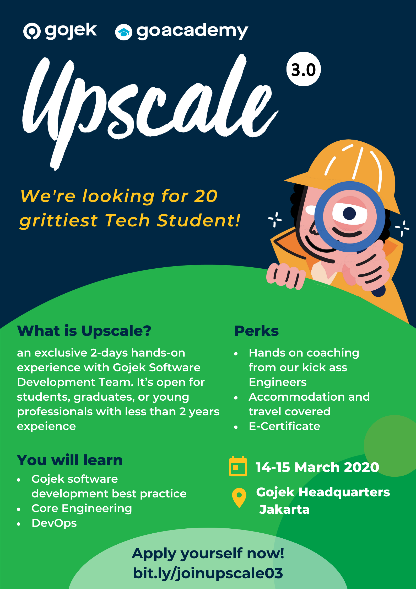
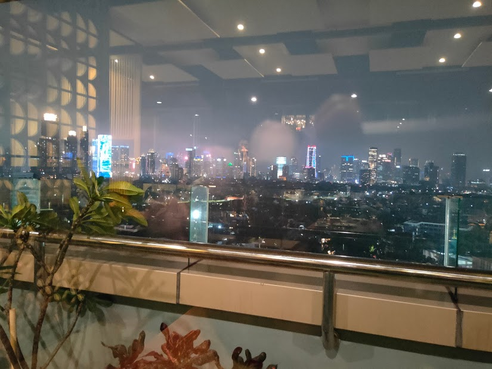
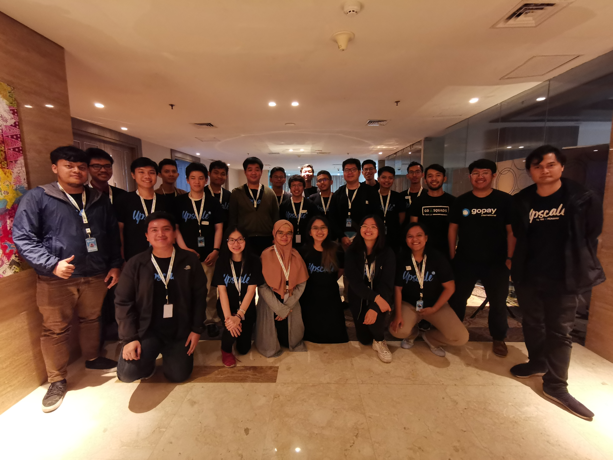

At the end of January, I randomly scrolling my social media since it's a holiday. Then, a notification popped up. I got an email from Gojek with this poster:

  

"Interesting", I thought. Anyway, I got the email since I subscribed to the GoAcademy newsletter. You should do it too if you don't want to miss interesting opportunities like this one since GoAcademy have tons of [interesting events](https://www.gojek.com/go-academy/).

It's a no-brainer decision for me to apply for this event. I went to the [registration link](https://www.kalibrr.com/c/go-jek-indonesia/jobs/148763/upscale-3-0-calling-for-tech-student), update my resume, do a few clicks, and that's it, I have registered for Upscale 3.0. I believe it should have a mini coding test but I don't need to do it anymore since I have taken that test in my internship application last year. Now I just need to wait and hope to get contacted by the GoAcademy team.

## The Interview

After a couple of days, finally, the long-awaited email arrived. I got selected for the interview! I selected one out of some given schedule and wait for the day. Then, the interview went on. It was an interesting interview experience for me. They use English for the language. The first interview where I have to use English during an interview with a company in Indonesia, so it's a unique experience. It made me realize that I need to improve my English, especially in a not-so-familiar topic. The interview itself is like many other interviews, we talk about my background, my motivation to join this event, and so on. Then, an interesting question got launched. "Let's say I'm your younger brother in grade school, how will you explain about inheritance to me?". I've coded and known inheritance for years, I have been a teaching assistant for programming course twice, and got asked something like this? I froze up. It was at this moment that I realized I can't explain it easily which means I don't really understand it. "They really get into teaching seriously," I thought. I messed up in that part but it's OK, I already learn much from the interview itself. No regret if I don't get selected for Upscale 3.0. A few days went by and things went unexpected. I got an email to let me know I got selected!

## Prologue

Before the event starts, we got a guideline that told us what needs to get done before the main, two-day event. Since we're going to use Ruby, we need to learn it from [rubymonk](https://rubymonk.com/). I'm not familiar with Ruby, but it's just a language we're going to use during the class. The other prerequisite is to install Git, Docker, Ruby, Rails, and sign up to Travis CI so we don't need to delay the class caused by the installation of these tools.

## First Day

The event starts at 9 at [Hotel Grandhika](https://grandhika-hotel.com/). The first speaker is [Kak Iqbal](https://www.linkedin.com/in/iqbal-farabi-02756923/), a system engineer at Gojek. The first thing he mentioned is we need to be active. If we don't know, ask. If we don't agree, criticize. We were given some rules before the workshop started, something like following language convention, use namespace, have a newline at the end of files, use spaces instead of tabs, etc. We then have to ask or criticize rules we didn't agree with, or we need to delete all our code later if we don't follow that convention. He called this honor as `rm -rf` which you should be familiar with if you're using Unix-like OS. Of course, some questions got thrown and Kak Iqbal answered with the reason. Why don't we use tabs? Because some tabs render differently on different editors so, for instance, you would have a hard time reading it in the server with only Vim as an editor which different from your editor in local machine. Why do we need to have a newline at the end of files? Because many tools in Unix-like OS like (grep something and then pipe it to yada yada) depends on this newline. Every rule mentioned has a logical and practical purpose.

After having an agreement with the rules, the game started. We're going to do [pair programming](https://en.wikipedia.org/wiki/Pair_programming) while solving the problem. So pair programming is a common practice in Gojek Engineering and we tried it to have a grasp of how it feels to code with pair. I got assigned with [Gery](https://www.linkedin.com/in/gery-w-47bb86102/), an ITB student.

<figcaption class="img-caption">Gery and I doing pair programming.</figcaption>

The problem seems dead simple:

<blockquote>
<i>Given two points in cartesian coordinate representing a line, get the length of the line!</i>
</blockquote>

As with any other requirements, we started asking many things to clarify the problem. After so many questions, we are asked to solve the problem using [Behavior Driven Development (BDD)](https://en.wikipedia.org/wiki/Behavior-driven_development). Before we started, he asked how long it would take us to finish this challenge. Since we thought it's an easy problem, we confidently said 30 minutes, and he laughed. Then the timer started ticking and we do the challenge with our pair. After 30 minutes, we stopped, it's time to showcase. Gery and I went to the stage to show our code to the world. Kak Iqbal inspected our code thoroughly, line by line. We then got the honor to `rm -rf` our proudly presented code since it didn't comply with some rules. So basically we got the honor to be the first to do the `rm -rf` :simple_smile:. After that, other teams presented their work as well and got `rm -rf` too. Why do we need to `rm -rf` our code? Since our code didn't comply with the rules, it's not good enough so it will be a burden and add complexity to production code. Another thing he did is removing suspicious lines in our implementation code and re-run the test. If it succeeds, then the removed line should not be added to the production code. He told us that this is what Niranjan, the CTO of Gojek, does when reviewing code. He makes sure that no unnecessary code goes to production and add more complexity. He also makes sure that everyone creates tests that cover all of their code. What if you don't create tests at all for your code? Then you get all your code deleted since the tests still pass if your code gets deleted. An interesting approach for me, I never thought putting code to production would be this hard. It makes sense now why Kak Iqbal laughed when we said 30 minutes :simple_smile:. After giving insights about building production-level code and giving another challenge, the class ended.

<figcaption class="img-caption">The first day.</figcaption>

The first day didn't end there though. We still had dinner in the same building, but on the 18th floor. The food and view were amazing.

<figcaption class="img-caption">A spectacular view but not spectacular camera.</figcaption>

We then went to our hotel, [FaveHotel Melawai](https://www.favehotels.com/en/hotel/view/25/favehotel-melawai). Yes, we're given a room in a hotel for this event. Oh, did I forget to mention that Gojek also paid the ticket of participants outside of Jabodetabek? It's unbelievable how Gojek is willing to put this much money just for us to learn. It reminds me back to the day when I participated in Olimpiade Sains Nasional where I also got the best facilities. Basically, I got paid to do what I love. Ah, what good old days.

## Second Day

Another day, another speakers come. Meet [Kak Gio](https://www.mightygio.com), [Kak Eko](https://medium.com/@ecojuntak), and [Kak Ais](https://github.com/madebyais). Today class is about the new thing in this Upscale, DevOps. What is DevOps? Well, contrary to the popular belief, [DevOps is not a role, but a culture](https://medium.com/@neonrocket/devops-is-a-culture-not-a-role-be1bed149b0)
. It's a culture that can be narrowed down to three principles:

#### 1. The First Way: Systems Thinking

What is your main goal as an engineer? One of the most important goals is to **deliver value** to the customers. You want to deliver value as fast as possible to the customers. In order to do that, you need to **improve the flow** in which deliver your code from your local machine to the customers. One way to do that is to **automate** such as using [contionus integration (CI)](https://en.wikipedia.org/wiki/Continuous_integration). What is the most important thing that enables CI? Test, the lesson we got yesterday.

#### 2. The Second Way: Amplify Feedback Loops

What is the most terrifying nightmare an engineer could have? One is their product stopped working. On a scale of Gojek, how do you know that your products are doing OK? What if your customer can't order but you don't realize it until hours later? You need to have an automated system that lets you know if something wrong happens in the system. Gojek does it by having a logging infrastructure throughout its system. They even build their own logging solution called [Barito](https://blog.gojekengineering.com/how-we-built-barito-to-enhance-logging-19f80b89496f) to incorporate their need in scale. By doing this, they will know if something goes wrong **before their customers** realize it.

#### 3. The Third Way: Culture of Continual Experimentation and Learning

You need to experiment and learn every day. This is easy to say but hard to do. One that holds ourselves back from doing it is the fear of doing it wrong. It's not a wrong feeling though, since doing experiments wrongly can result in a huge amount of money lost. So to tackle this issue, Gojek has an alpha release, a version of their app which includes experimental features. This version is used by alpha users, which are their engineers, as a famous saying: [eat your own dog food](https://en.wikipedia.org/wiki/Eating_your_own_dog_food). This way, everyone can experiment and learn without the horror of making mistakes and disappointing their customers.

Looking into these three principles, I now realize why DevOps is a new topic brought to this Upscale. It's actually an interesting and important culture that every engineer should have. Anyway, those three principles are from [The Phoenix Project](https://www.goodreads.com/book/show/17255186-the-phoenix-project), you should read it to know more about these great principles!

## Epilogue

Upscale actually was planned to finish at 7 p.m. after dinner. Unfortunately, there was an emerging issue, COVID-19, which starts just a few days before the Upscale was held. This forced us to finish early so the second day was actually quite fast. I'm a bit disappointed since this interesting event should finish early. But that's OK, what's going normal in this ongoing pandemic right? I hope Upscale 4.0 will be going normally and you can have more fun joining the event :smile:.

<figcaption class="img-caption">The last day.</figcaption>

Upscale is an interesting event where Gojek facilitates you to learn with the best engineers and fellow passionate students. Try it, you won't regret it. Hope you guys get something from this post and be ready for the next Upscale!
